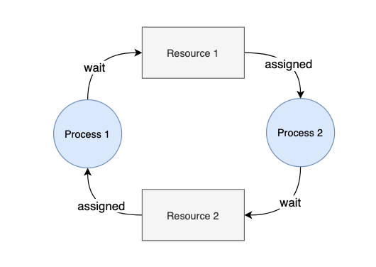

# Deadlock Livelock

## 교착 상태(Deadlock)란?

- 공유 자원에 대한 요구가 엉켜서 자원 관리를 잘못하여 **프로세스나 스레드가 자원의 락을 획득하기 위해 무한 대기 하는 것**

## 교착 상태가 발생할 수 있는 조건

아래의 **4가지를** **모두 만족**할 때 교착 상태(Deadlock)이 발생한다.

1. **상호 배제(Mutual Exclusion)**
   - 레이스 컨디션의 문제를 해결하기 위해 두 개 이상의 프로세스 혹은 스레드가 동시에 한 공유 자원에 접근할 수 없도록 하여 한 자원에 한 스레드만 접근할 수 있다.
2. **점유 상태로 대기(Hold and Wait)**
   - 공유 자원에 락을 획득하여 점유하고 있는 상태인데, 다른 자원의 락을 획득하기 위해 대기하고 있는 상황이다.
3. **비선점**(**선점 불가)(No Preemption)**
   - 다른 프로세스나 스레드가 자원을 선점하고 있어서 자원을 뺏어올 방법이 없는 것이다.
4. **순환성 대기(Circular Wait)**
   - 프로세스가 어느 자원을 점유하고 있고 다른 자원을 요청하여 대기하고 있는데 순환적으로 이러한 구조를 갖고 있는 것이다.

## 교착상태 해결 방안

### Deadlock 예방

- 교착 상태가 발생할 수 있는 조건은 4가지 모두를 만족할 경우에만 발생하기 때문에,
  **위의 조건을 각각 부정함으로써 교착상태를 예방하고자 하는 방법**이다.
- **단점**
  - 현실적으로 불가능한 방법이 많다.
  - 가능하더라도 구현이 어렵고 자원낭비가 심하다.

### Deadlock 회피

- **교착상태 발생시 피해가는 방법**이다.
- 대표적으로 자원 할당 그래프 알고리즘, \* 은행원 알고리즘이 있다.
  (\* 은행원 알고리즘이란 “**최소한 하나의 프로세스에게 할당해줄 만큼의 자원은 CPU가 보유하고 있어야 한다.**"의 개념이다.)
  - 프로세스가 자원 요청시, 자원을 할당한 후에도 안정 상태로 남는지 **사전 검사**
  - 안정할 경우 : 자원을 할당
    불안정할 경우 : 다른 프로세스가 자원을 해지할 때까지 대기
- **단점**
  - 이 방식은 자원을 요청할 때마다 시스템 상태를 검사하기에 **오버헤드가 크다.**
  - 은행원 알고리즘 같은 경우에는 전제조건이 많다.

### Deadlock 탐지 및 회복

- 교착 상태를 허용하지만 **상태를 탐지하고 회복하는 방식**
- **탐지**
  - 알고리즘을 주기적으로 실행함으로써 시스템에 발생한 Deadlock을 체크
  - 주기가 너무 짧으면 회피와 같이 오버헤드가 일어나므로 적절한 주기가 필요하다.
- **회복**
  - **프로세스 종료**
    - 교착 상태의 프로세스를 모두 중지
    - 교착 상태가 제거될 때까지 한 프로세스씩 중지
  - **자원 선점**
    - 교착 상태가 제거될 때까지 프로세스가 점유한 자원을 선점해 다른 프로세스에게 할당
    - 고려사항 : 희생자 선택, 후퇴(Rollback), 기아상태(Starvation)

### Deadlock 무시

- **교착 상태 자체를 무시**하고, 특별한 조치를 취하지 방법
- 교착 상태의 발생 확률이 낮은 상황에서 주로 사용한다.

## **라이브락(Livelock)이란?**

라이브락은 스레드들이 동시에 실행되면서 **락의 해제와 획득을 반복적으로 하면서** 정상적으로 동작하는 것처럼 보이지만 **사실상 아무것도 못하고 무한 동작중인 상황**

**Ref** :

- [https://cheetile.tistory.com/entry/OS-스레드-동기화-문제-Race-Condition-Deadlock-Starvation-Livelock](https://cheetile.tistory.com/entry/OS-%EC%8A%A4%EB%A0%88%EB%93%9C-%EB%8F%99%EA%B8%B0%ED%99%94-%EB%AC%B8%EC%A0%9C-Race-Condition-Deadlock-Starvation-Livelock)
- [https://www.baeldung.com/cs/deadlock-livelock-starvation](https://www.baeldung.com/cs/deadlock-livelock-starvation)
