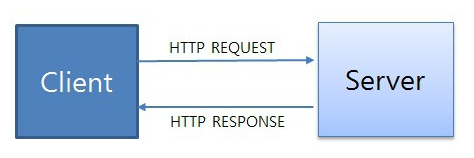

# HTTP

> 텍스트 기반의 통신 규약으로 **인터넷에서 데이터를 주고받을 수 있는 프로토콜**이다.
> 이렇게 규약을 정해두었기 때문에 모든 프로그램이 이 규약에 맞춰 개발해서 서로 정보를 교환할 수 있게 되었다.

## **HTTP 동작**

클라이언트 즉, 사용자가 브라우저를 통해서 어떠한 서비스를 url을 통하거나 다른 것을 통해서 요청(request)을 하면 서버에서는 해당 요청사항에 맞는 결과를 찾아서 사용자에게 응답(response)하는 형태로 동작한다.

- 요청 : client -> server
- 응답 : server -> client

## HTTP 특징

- HTTP 메시지는 HTTP 서버와 HTTP 클라이언트에 의해 해석이 된다.
- TCP/ IP를 이용하는 응용 프로토콜이다.
  (컴퓨터와 컴퓨터간에 데이터를 전송 할 수 있도록 하는 장치로 인터넷이라는 거대한 통신망을 통해 원하는 정보(데이터)를 주고 받는 기능을 이용하는 응용 프로토콜)
- HTTP는 연결 상태를 유지하지 않는 비연결성 프로토콜이다.
  (이러한 단점을 해결하기 위해 Cookie와 Session이 등장하였다.)
- HTTP는 연결을 유지하지 않는 프로토콜이기 때문에 요청/응답 방식으로 동작한다.

---

**비연결성 ( Connectionless )**

비연결성은 **클라이언트와 서버가 한 번 연결을 맺은 후, 클 라이언트 요청에 대해 서버가 응답을 마치면 맺었던 연결을 끊어 버리는 성질**

- **장점**
  HTTP는 인터넷 상에서 불특정 다수의 통신 환경을 기반으로 설계되었다.
  만약 서버에서 다수의 클라이언트와 연결을 계속 유지해야 한다면, 이에 따른 많은 리소스가 발생하게 된다
  따라서 **연결을 유지하기 위한 리소스를 줄이면 더 많은 연결을 할 수 있으므로** 비연결적인 특징을 갖는다.

- **단점**
  서버는 클라이언트를 기억하고 있지 않으므로 동일한 클라이언트의 모든 요청에 대해, 매번 새로운 연결을 시도/해제의 과정을 거쳐야하므로 **연결/해제에 대한 오버헤드가 발생**

---

## TCP vs UDP

### TCP (Transmission Control Protocol)

- 인터넷상에서 데이터를 메세지의 형태로 보내기 위해 IP와 함께 사용하는 프로토콜

- TCP는 애플리케이션에게 **신뢰적이고 연결지향성** 서비스를 제공한다. 일반적으로 TCP와 IP는 함께 사용되며 **IP는 배달을, TCP는 패킷의 추적 및 관리**를 하게 된다.

- TCP는 연결형 서비스로, 신뢰적인 전송을 보장하기에 handshaking하고 데이터의 흐름제어와 혼잡제어를 수행한다. 하지만 이러한 기능으로 인해 **TCP의 속도는 느리다**.

####**TCP 특징**

- 3-way handshaking과정을 통해 연결을 설정하고 4-way handshaking을 통해 해제한다.
- 흐름 제어 및 혼잡 제어.
- 높은 신뢰성을 보장한다.
- UDP보다 속도가 느리다.
- 전이중(Full-Duplex), 점대점(Point to Point) 방식.

####**TCP 구조**

1. **Source Port/ Destination Port**

   Source Port는 메시지를 보내는 측에서 통신을 위해 사용하는 Port 번호이며, Destination Port는 목적지, 즉 메시지를 받는 측의 통신 Port 번호이다.

   이와 더불어 IP 헤더에 있는 Source address/ Destination Address 를 이용하면 유일하게 식별되는 통신 연결을 만들 수 있게 된다.

2. **Sequence Number**

   TCP 세그먼트 안의 데이터의 송신 바이트 흐름의 위치를 가리킨다. 다른 호스트로 전달되는 패킷은 여러 개의 서로 다른 경로를 거치면서 전달되다 보니 패킷의 순서가 뒤바뀔 수 있다. 이를 수신 측에서는 재 조립해야 할 필요가 있는데 이 때 Sequence Number를 이용하여 조립하게 된다.

3. **Acknowledgment Number**

   다음에 받을 것으로 예상되는 데이터의 순서 번호를 나타낸다.

   Sequence Number의 확인응답으로서 데이터 전송자에게 패킷을 잘 받았으니 그 다음 패킷을 송신하라는 의미로 사용된다.

   상대방이 다음에 전송할 패킷의 Sequence Number이기도 하다.

4. **Offset**

   TCP 헤더의 전체 길이를 byte 단위로 표현

5. **Reserved**

   미래를 위해 예약된 필드로 항상 0으로 설정

6. **Flags**
   - CWR : 송신자가 자신의 윈도우 사이즈를 줄인다.
   - ECE : 혼잡 감지 시 수신자가 ECE를 설정하여 송신자에게 알린다.
     (자세한 내용 : [https://mr-zero.tistory.com/20](https://mr-zero.tistory.com/20))
   - URG : Urgent Point 필드와 함께 사용되고 플래그 설정시 TCP는 해당 세그먼트를 전송큐의 제일 앞으로 보낸다.
   - ACK : SYN에 대한 확인의 의미이다.
   - PSH : 일반적으로 모든 데이터를 전송하고 마지막에 보내는 신호로 수신측은 데이터를 즉시 전송하라는 의미이다.
   - RST : 송신자가 유효하지 않은 연결을 시도할 때 거부하는데 이용되고 통신의 연결 및 종료를 정상적으로 할 수 없을 때 사용된다
   - SYN : 통신 시작 시 연결을 요청하고 ISN(Initial Sequence Number)을 교환한다.
   - FIN : 데이터 전송을 종료한다.
7. **Window Size**

   송신 시스템에서 자신이 수용하는 한 버퍼의 크기를 byte 단위로 나타낸다.

   통신하는 동안 송수신자는 해당 필드를 통해 수신사이즈를 계속 변경한다.

8. **Checksum**

   데이터가 전송 중에 손실되지 않고 원본과 동일한지 검사한다

   (incorrect일 경우 재전송을 요구)

9. **Urgent Point**

   Urgent flag 설정 시 urgent 데이터의 마지막 byte의 일련번호를 Urgent Point 필드에 저장한다. 해당 부분까지 긴급하게 처리를 요한다는 의미이다

### **UDP(User Datagram Protocol)**

- 데이터를 데이터그램 단위로 처리하는 프로토콜

  (데이터그램이란 독립적인 관계를 지니는 패킷이라는 뜻 이다.)

- UDP는 비연결형 프로토콜이다.
  즉, 할당되는 논리적인 경로가 없고 각각의 패킷이 다른 경로로 전송되고 이 각각의 패킷은 독립적인 관계를 지니게 되는데, 이렇게 데이터를 서로 다른 경로로 독립 처리하는 프로토콜을 UDP 라고 한다.

- UDP는 연결을 설정하고 해제하는 과정이 존재하지 않는다.
  서로 다른 경로로 독립적으로 처리함에도 패킷에 순서를 부여하여 재조립하거나 흐름제어 및 혼잡제어를 수행하지 않아 속도가 빠르며 **네트워크 부하가 적다는 장점**이 있지만 **데이터 전송의 신뢰성이 낮다.**

####**UDP 특징**

- 비연결형 서비스로 데이터그램 방식을 제공한다
- 정보를 주고 받을 때 정보를 보내거나 받는다는 신호절차를 거치지 않는다.
- UDP헤더의 CheckSum 필드를 통해 최소한의 오류만 검출한다.
- **신뢰성이 낮다**
- TCP보다 **속도가 빠르다**

####**UDP 구조**

1. **Source Port/ Destination Port**

   Source Port는 메시지를 보내는 측에서 통신을 위해 사용하는 Port 번호이며, Destination Port는 목적지, 즉 메시지를 받는 측의 통신 Port 번호이다.

2. **Length**

   UDP헤더와 데이터를 포함한 전체 길이를 byte 단위로 표시

3. **Checksum**

   데이터가 전송 중에 손실되지 않고 원본과 동일한지 검사한다

---

## 흐름제어 & 혼잡제어

### **흐름제어 (Flow Control)**

- 수신측이 송신측보다 데이터 처리 속도가 빠르면 문제없지만, **송신측의 속도가 빠를 경우** 문제가 생긴다.
- 수신측에서 제한된 저장 용량을 초과한 이후에 도착하는 데이터는 손실 될 수 있으며, 만약 손실 된다면 불필요하게 응답과 데이터 전송이 송/수신 측 간에 빈번이 발생한다.
- 이러한 위험을 줄이기 위해 송신 측의 데이터 전송량을 **수신측에 따라 조절**해야한다.

**[ 해결방법 ]**

1. **Stop and Wait**

   매번 전송한 패킷에 대해 확인 응답을 받아야만 그 다음 패킷을 전송하는 방법

   

1. **Sliding Window**

   수신측에서 설정한 윈도우 크기만큼 송신측에서 확인응답없이 세그먼트를 전송할 수 있게 하여 데이터 흐름을 동적으로 조절하는 제어기법

- 최초의 윈도우 크기는 호스트들의 '3 way handshaking'을 통해 수신 측 윈도우 크기로 설정되며, 이후 수신 측의 버퍼에 남아있는 공간에 따라 변한다. 윈도우 크기는 수신 측에서 송신 측으로 확인 응답(ACK)을 보낼 때 TCP 헤더(window size)에 담아서 보낸다.

- 동작방식
  윈도우에 포함된 패킷을 계속 전송하고, 수신 측으로부터 확인 응답(ACK)이 오면 윈도우를 옆으로 옮겨 다음 패킷들을 전송한다.
  

  - 최초로 수신자는 윈도우 사이즈를 7로 정한다.
  - 송신자는 수신자의 확인 응답(ACK)을 받기 전까지 데이터를 보낸다.
  - 수신자는 확인 응답(ACK)을 송신자에게 보내면, 슬라이딩 윈도우 사이즈을 충족할 수 있게끔 윈도우를 옆으로 옮긴다
  - 이후 데이터를 다 받을 때까지 위 과정을 반복한다.

- 재전송
  송신 측은 일정 시간 동안 수신 측으로부터 확인 응답(ACK)을 받지 못하면, 패킷을 재전송한다.
  만약, 송신 측에서 재전송을 했는데 패킷이 소실된 경우가 아니라 수신 측의 버퍼에 남는 공간 없는 경우면 문제가 생긴다.
  이를 해결하기 위해 송신 측은 해결 응답(ACK)을 보내면서 남은 버퍼의 크기 (윈도우 크기)도 함께 보내 준다.

### **2. 혼잡제어 (Congestion Control)**

- 송신측의 데이터 전달과 네트워크 데이터 처리 속도를 해결하기 위한 기법
- 한 라우터에게 데이터가 몰려 모든 데이터를 처리할 수 없는 경우, 호스트들은 재전송을 하게 되고 결국 혼잡을 가중시켜 오버플로우나 데이터 손실이 발생한다.
- 이러한 **네트워크의 혼잡을 피하기 위해 송신측에서 보내는 데이터의 전송 속도를 제어**하는 것이 혼잡 제어의 개념이다.

---

### Request 구조

1. **Start Line**

   Start Line에는 HTTP 메소드, Request target, HTTP version이 있다.

- **HTTP 메소드** : 요청시 보내는 HTTP 메소드 형태이다
  - GET : 자료를 **요청**할 때 사용
  - POST : 자료의 **생성**을 요청할 때 사용
  - PUT : 자료의 **수정**을 요청할 때 사용
  - DELETE : 자료의 **삭제**를 요청할 때 사용
- **Request target** : HTTP Request가 전송되는 **목표 주소이다.**
- **HTTP version** : version에 따라 Request 메시지 구조나 데이터가 다를 수 있어서 version을 명시한다.

2. **Header**

   Header에는 HTTP Request 그 자체에 대한 정보를 담고 있으며 key : value 형태로 이루어져 있다.

- **Host** : 요청하려는 서버 호스트 이름과 포트번호
- **User-agent** : 클라이언트 프로그램 정보. 이를 통해 서버는 클라이언트 프로그램(브라우저)에 맞는 최적의 데이터를 보내줄 수 있다.
- **Referer** : 바로 직전에 머물렀던 웹 링크 주소
- **Accept** : 클라이언트가 처리 가능한 미디어 타입 종류 나열
- **If-Modified-Since** : 여기에 쓰여진 시간 이후로 변경된 리소스 취득. 페이지가 수정되었으면 최신 페이지로 교체한다.
- **Authorization** : 인증 토큰을 서버로 보낼 때 쓰이는 Header
- **Origin** : 서버로 Post 요청을 보낼 때 요청이 어느 주소에 시작되었는지 나타내는 값. 이 값으로 요청을 보낸 주소와 받는 주소가 다르면 CORS(Cross-Origin Resource Sharing) 에러가 발생한다.
- **Cookie** : 쿠키 값이 key-value로 표현된다.

3. **Body**

- HTTP Request가 전송하는 데이터를 담고 있는 부분이다.

- 전송하는 데이터가 없다면 Body 부분은 비어있다.(GET의 경우 대부분)

- 보통 POST 요청일 경우, HTML 폼 데이터가 포함되어 있다.

### Response 구조

1. **Start Line**

   Response의 Start Line에는 HTTP version, Status Code, Status Text가 있다.

- **HTTP version**
- **Staus Code** : Response 상태를 나타내는 코드
  - 1XX (조건부 응답) : 요청을 받았으며 작업을 계속한다.
  - 2XX (성공) : 클라이언트가 요청한 동작을 수신하여 이해했고 승낙했으며 성공적으로 처리했음을 가리킨다.
  - 3XX (리다이렉션 완료) : 클라이언트는 요청을 마치기 위해 추가 동작을 취해야 한다.
  - 4XX (요청 오류) : 클라이언트에 오류가 있음을 나타낸다.
  - 5XX (서버 오류) : 서버가 유효한 요청을 명백하게 수행하지 못했음을 나타낸다.
    (mdn status : [https://developer.mozilla.org/ko/docs/Web/HTTP/Status](https://developer.mozilla.org/ko/docs/Web/HTTP/Status))
- **Status Text** : Response 상태를 간략하게 글로 설명해 준다

2. **Header**

- **Location** : 301, 302 상태코드일 때만 볼 수 있는 Header로 서버의 응답이 다른 곳에 있다고 알려주면서 해당 위치(URI)를 지정합니다.
- **Server** : 웹 서버의 종류
- **Age** : max-age 시간내에서 얼마나 흘렀는지 초 단위로 알려주는 값
- **Referrer-policy** : 서버 referrer 정책을 알려주는 값 ex) origin, no-referrer, unsafe-url
- **WWW-Authenticate** : 사용자 인증이 필요한 자원을 요구할 시 , 서버가 제공하는 인증 방식
- **Proxy-Authenticate** : 요청한 서버가 프록시 서버인 경우 유저 인증을 위한 값

3. **Body**

- HTTP Request 메시지의 Body와 동일하다.

- 마찬가지로 전송하는 데이터가 없으면 비어있다.

### **공통 Header**

- **Date** : 현재시간

- **Cache-Control** : 캐시 제어

- **+ no-store** : 캐시를 저장하지 않겠다

- **+ no-cache** : 모든 캐시를 쓰기 전에 서버에 해당 캐시를 사용해도 되는지 확인하겠다

- **+ must-revalidate** : 만료된 캐시만 서버에 확인하겠다.

- **+ public** : 공유 캐시에 저장해도 된다.

- **+ private** : '브라우저' 같은 특정 사용자 환경에만 저장하겠다.

- **+ max-age** : 캐시의 유효시간을 명시하겠다.

- **Transfer-Encoding** : Body 내용 자체 압축 방식을 지정

- **Content-Encoding** : Body의 리소스 압축 방식 (Transfer-Encoding은 Body 자체이므로 다름)

- **Content-type** : Body의 미디어 타입 ex) application/json, text/html

- **Content-Length** : Body의 길이

- **Content-language** : Body를 이해하는데 가장 적절한 언어 ex) ko

- **Connection** : 클라이언트와 서버의 연결 방식 설정. HTTP/1.1은 keep-alive로 연결 유지하는게 디폴트이다.
