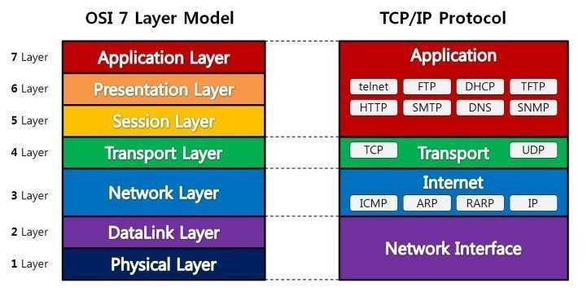

# OSI 7 Layers

**OSI(Open System Interconnection)** : 개방형 시스템 상호 연결

 
 

## **OSI 7계층이란?**

- 네트워크에서 통신이 일어나는 과정을 7단계로 나눈것

 
 

## **OSI 7계층을 만든 이유**

- 다양한 네트워크 연결 방식에 대한 호환성 문제를 해결하기 위해
- 데이터의 흐름이 한눈에 보인다. (데이터가 어떻게 날아가는지 볼 수 있음)
- 문제 해결이 편리 (어떤 계층에서 문제가 발생했는지 파악이 가능하므로)

 
 

## **각 계층의 역할**

### **1. 물리 계층 (Physical Layer)**

- 7계층 중 최하위 계층
- 주로 전기적, 기계적, 기능적인 특성을 이용해 데이터를 전송
- 데이터는 0과 1의 비트열, 즉 On, Off의 전기적 신호 상태로 이루어져 해당 계층은 단지 데이터를 전달
- 단지 데이터 전달의 역할을 할 뿐이라 알고리즘, 오류제어 기능이 없음
- 장비로는 케이블, 리피터, 허브가 있음

 

### **2. 데이터 링크 계층 (DataLink Layer)**

- 물리적인 연결을 통하여 인접한 두 장치 간의 신뢰성 있는 정보 전송을 담당(Point-To-Point 전송)
- 안전한 정보의 전달이라는 것은 오류나 재전송하는 기능이 존재
- MAC 주소를 통해서 통신
- 데이터 링크 계층에서 데이터 단위는 프레임(Frame)
- 장비로는 브리지, 스위치가 있음

 

### **3. 네트워크 계층 (Network Layer)**

- 중계 노드를 통하여 전송하는 경우 어떻게 중계할 것인가를 규정
- 라우팅 기능을 맡고 있는 계층으로 목적지까지 가장 안전하고 빠르게 데이터를 보내는 기능을 가지고 있음(최적의 경로를 설정가능)
- 컴퓨터에게 데이터를 전송할지 주소를 갖고 있어서 통신가능
  (= IP 주소가 바로 네트워크 계층 헤더에 속한다)
- 네트워크 계층에서 데이터 단위는 패킷(Packet)
- 장비로는 라우터, L3 스위치가 있음

 

### **4. 전송 계층 (Transport Layer)**

- 종단 간 신뢰성 있고 정확한 데이터 전송을 담당
- 송신자와 수신자 간의 신뢰성있고 효율적인 데이터를 전송하기 위하여 오류검출 및 복구, 흐름제어와 중복검사 등을 수행
- 데이터 전송을 위해서 Port 번호를 사용함.(대표적인 프로토콜로 TCP와 UDP가 있음)
- 전송 계층에서 데이터 단위는 세그먼트(Segment)

 

### **5. 세션 계층 (Session Layer)**

- 통신 장치 간 상호작용 및 동기화를 제공
- 연결 세션에서 데이터 교환과 에러 발생 시의 복구를 관리

 

### **6. 표현 계층 (Presentation Layer)**

- 데이터를 어떻게 표현할지 정하는 역할을 하는 계층
- 표현 계층은 세가지의 기능을 갖고 있습니다.
  1.  송신자에서 온 데이터를 해석하기 위한 응용계층 데이터 부호화, 변화
  2.  수신자에서 데이터의 압축을 풀수 있는 방식으로 된 데이터 압축
  3.  데이터의 암호화와 복호화(MIME 인코딩이나 암호화 등의 동작이 표현계층에서 이루어짐. EBCDIC로 인코딩된 파일을 ASCII 로 인코딩된 파일로 바꿔주는 것이 한가지 예)

 

### **7. 응용 계층 (Application Layer)**

- 사용자와 가장 밀접한 계층으로 인터페이스 역할
- 응용 프로세스 간의 정보 교환을 담당
- ex) 전자메일, 인터넷, 동영상 플레이어 등
   
   
   

- **Transport Layer**

  ⇒ TCP인지 UDP 방식인지 / 출발지 도착지의 정보를 헤더에 붙인다 (결과물 : 세그먼트)

- **Network Layer**

  ⇒ 출발지와 도착지에 대한 IP 정보를 헤더에 붙인다(결과물 : 패킷)

- **Data Layer**

  ⇒ 출발지의 MAC주소와 맥 주소와 가장 가까운 라우터 MAC 주소를 붙인다.(결과물 : 프레임)

  또한 오류가 발생했는지 알기위해서 트레일러도 붙인다.

 
 
 
 
 
 

Ref :

[https://shlee0882.tistory.com/110](https://shlee0882.tistory.com/110)

[http://wiki.hash.kr/index.php/OSI*7*계층](http://wiki.hash.kr/index.php/OSI_7_%EA%B3%84%EC%B8%B5)

[https://velog.io/@cgotjh/네트워크-OSI-7-계층-OSI-7-LAYER-기본-개념-각-계층-설명](https://velog.io/@cgotjh/%EB%84%A4%ED%8A%B8%EC%9B%8C%ED%81%AC-OSI-7-%EA%B3%84%EC%B8%B5-OSI-7-LAYER-%EA%B8%B0%EB%B3%B8-%EA%B0%9C%EB%85%90-%EA%B0%81-%EA%B3%84%EC%B8%B5-%EC%84%A4%EB%AA%85)
