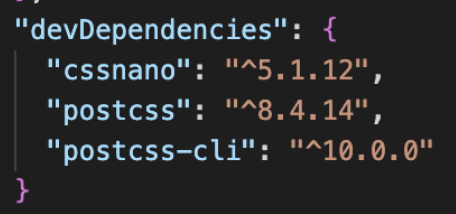

# Postcss

# Postcss란?

- Postcss는 우리의 css를 조금 더 현대적으로 바꿔주는 플러그인이다.
- 즉, Postcss는 js 플러그인을 사용하여 CSS를 변환시키는 Tool이다.
- 플러그인을 사용하여 lint, 변수, minin을 사용하거나 미래의 css 문법을 사용할 수 있다.
- Postcss는 언어가 아니라 자동으로 신기술 CSS를 호환가능하도록 변환시켜주는 플러그인일 뿐이다.
- 기능
  - 문법오류를 잡아준다.
  - 발전중인 CSS의 현대기술들을 브라우저에 호환되도록 자동 변환해준다.

# Postcss 사용해보기 (CLI 환경)

## 폴더 생성

```
mkdir Practices && $_
```

- Practices 폴더를 만들고 그 폴더로 들어간다
- 이 형식을 이용하여 폴더 구조를 만든다.

## 파일 생성

```
touch src/index.html src/css/index.css
```

- src 폴더안에 index.html을 src/css 폴더에 index.css 파일을 만든다.

## 기본 package.json 파일 생성

```
npm init -y
```

- -y는 모든 물음에 y한다는 뜻
- touch 명령어를 이용하여 수동으로 `package.json` 파일을 만들어도 되지만 기본구조를 따로 작성해야 한다.

## 기본 postcss.config.js 파일 생성

```
npx tailwindcss init -p
```

- 이 명령어 입력시 `postcss.config.js` , `tailwind.config.json` 파일을 만들어주는데 `tailwind.config.json` 파일은 필요없으니 삭제한다.
- 이 것 또한 touch 명령어를 이용하여 수동으로 만들어도 되지만 기본구조를 따로 작성해야 한다.

## Postcss 다운 ( 디렉토리 root 위치에 받아야 한다)

```
npm i -D postcss postcss-cli cssnano
```

- `i` : install
- `-D` : Dev(개발자)모드로
- `postcss` , `postcss-cli` , `cssnano` 를 받아보았다.

  - 정상적으로 설치가 됐다면 package.json 파일에 다음과 같이 `플러그인이름 : 버전` 형태로 나온다

    

- 이 작업이 완료되면 root 위치에 `node_modules` 파일이 생성된다

## 플러그인 설정


- `postcss.config` 파일에 들어가 다운 받은 플러그인을 위와 같이 작성해준다.
- 만약 postcss pxtorem라는 플러그인을 추가적으로 설치(`npm i -D postcss-pxtorem`) 했을 경우에는 위과 같이 추가해주면 된다.

## 명령어 설정


- script 객체 안에 `key : value` 형식으로 `"명령어" : "명령내용"` 을 작성한다.
  - `“build” : “postcss src/css/index.css -o src/css/main.css”`
    - build명령을 실행했을 경우 postcss로 src/css/index.css 파일(input)을 src/css/main.css 파일(output)에 변환한다는 뜻이다.
  - 실행 명령 : `npm run build`

## 유용한 플러그인

[https://www.postcss.parts/](https://www.postcss.parts/)

### cssnano

- css 코드를 한 줄로 변환해주는 플러그인이다
  [https://github.com/cssnano/cssnano](https://github.com/cssnano/cssnano)

### combine-media-query

- 반응형 `@media` 속성을 합쳐주는 플러그인이다.

  

  [https://github.com/SassNinja/postcss-combine-media-query](https://github.com/SassNinja/postcss-combine-media-query)

### pxtorem

- px 단위를 자동으로 rem 단위로 바꿔준다.
  [https://github.com/cuth/postcss-pxtorem](https://github.com/cuth/postcss-pxtorem)

### import

- `@import` 를 더욱 쉽게 사용할 수 있다.
  `@import url(./css/reset.css)` ⇒ `@import "./css/reset.css"`
  [postcss-import](https://www.npmjs.com/package/postcss-import)

### postcss-preset-env

[PostCSS Preset Env - CSSTools](https://preset-env.cssdb.org/)

- 오른쪽 위 Feature 항목에 들어가면 stage 별 다양한 기능을 사용할 수 있다.
- 설치하고 다음과 같이 플러그인 작성해주어야 한다.

  

## 플러그인을 받았을 때의 파일 내용 예시


- 플러그인에 작성된 플러그인들이 `npm run build` 명령시 적용된다
