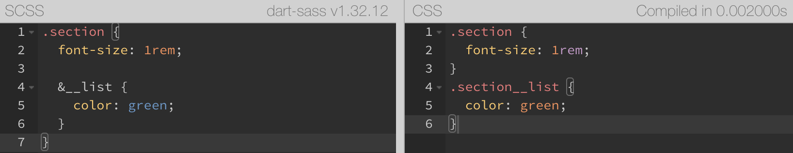

# Sass

- Sass는 native가 아니다. 즉, 브라우저가 이해 못한다. 그렇기 때문에 CSS 작성하듯이 Sass 사용하면 안된다.
- 즉, Sass로 CSS를 작성하는 것이다.
- Sass를 사용하면 CSS로 한 노가다 작업을 쉽게 할 수 있다.
- 문법 자체가 Nesting 구조이다.
- SCSS도 문법이 다른거지 Sass에 속한다.
- 현재는 계속 버전업 중인 dart-sass를 사용중이다. (script 구문을 원한다면 dart-sass)
  - 그냥 Sass 깔면 dart-sass라 보면된다.
  - node가 붙으면 node-sass
    [Dart Sass Command-Line Interface](https://sass-lang.com/documentation/cli/dart-sass#one-to-one-mode)
- Scss → CSS 변환예시
  

## 폴더 생성

```css
mkdir src src/css
```

- 현재 디렉토리에서 src폴더와 src폴더에 css폴더를 생성한다.

## Sass 설치

```css
npm i -D sass
```

- 해당 루트 폴더에 Sass를 설치하니 자동으로 `package-lock.json`, `package.json` 파일이 생김

## 설정


- `"sass" : "sass src/scss/index.scss src/css/index.css"`
  - `npm run sass` 명령 시 src/scss/index.scss 파일을 src/css/index.css 파일로 sass 변환한다.
- `"nosource" : "sass src/scss/index.scss src/css/index.css --no-source-map"`
  === `"nosource" : "npm run sass -- --no-source-map"`
  - Sass 명령 뒤에 `—no-source-map` 을 붙여준 형태이다.
  - `npm run nosource` 명령 시 `index.css.map` 파일을 만들지 않는다.
  - .map 파일은 해당 css코드가 scss파일의 어디에 있는지 보여주는데 배포하는 경우에는 필요 없기 때문에 필요한 기능이다.
- `"watch" : "sass src/scss/index.scss src/css/index.css --watch"`
  === `"watch" : "npm run sass -- --watch"`
  - Sass 명령 뒤에 —watch를 붙여준 형태이다.
  - 일일히 npm run sass 할 필요없이 저장(Ctrl+S)시 자동으로 sass가 적용되는 것이다.
- `"serve": "live-server ./src"`
  - `npm run serve` 명령 시 ./src 에 라이브 서버를 구동한다.
- `"start" : "run-p watch serve"`
  - start는 유일하게 run을 붙이지 않아도 된다 ⇒ 명령어 : `npm start`
  - run-p는 npm-run-all을 다운받아야 가능한 기능으로 병렬로 실행할 수 있다.
  - `npm start` = `npm run watch` + `npm run serve`

### 추가적으로 rimraf(css 파일 쉽게 지우는 명령)

- 결국 원본인 Sass 파일만 있으면 되기 때문에 css파일을 삭제하는 경우가 많다.
  그렇기 때문에 rimraf를 이용하여 css 파일을 쉽게 삭제 할 수 있다.
