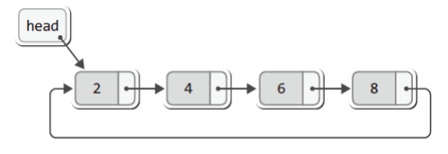

# Circular Linked List

- 노드 : 데이터 저장단위(데이터값, 포인터)로 구성

  - Data : 해당 주소의 Data를 담는 공간
  - Next : 각 노드안에서 다음 주소를 가지고 있는 공간

- **특징**

  **마지막 노드가** Null을 가르키는게 아닌 **첫번째 노드를 가리킨다.**

- **장점**

  단순 연결 리스트처럼 머리와 꼬리를 가리키는 포인터 변수를 각각 두지 않아도,

  하나의 포인터 변수만 있어도 머리 또는 꼬리에 노드를 간단히 추가할 수 있다.

- **구현해보기**

  [구현 with JavaScript]()

**Ref :**

- [https://velog.io/@mmindoong/자료구조-원형-연결-리스트-Circular-Linked-List](https://velog.io/@mmindoong/%EC%9E%90%EB%A3%8C%EA%B5%AC%EC%A1%B0-%EC%9B%90%ED%98%95-%EC%97%B0%EA%B2%B0-%EB%A6%AC%EC%8A%A4%ED%8A%B8-Circular-Linked-List)
