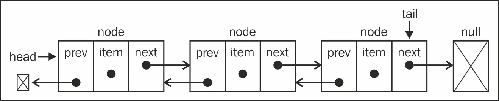

# Double Linked List

- 노드 : 데이터 저장단위(데이터값, 포인터 2개)로 구성

  - Data : 해당 주소의 Data를 담는 공간
  - Prev : 각 노드안에서 이전 주소를 가지고 있는 공간
  - Next : 각 노드안에서 다음 주소를 가지고 있는 공간

- **사용하는 이유**

  단일 연결리스트의 단점이 데이터 탐색에 있어서 찾고자하는 데이터가 어디에 있는간에 처음인 HEAD부터 차례차례 찾아가야 하기에 배열에 비해 탐색이 오래 걸리며 O(n)의 시간복잡도를 갖는다. 이를 줄이고자 맨 뒤에 TAIL을 만들어 뒤에서부터도 탐색이 가능하도록 한다.

- **장점**

1. 노드를 찾을 때는 단일 연결리스트에 비해 시간을 절반으로 줄일 수 있다.

- **단점**

1. 추가 포인터 때문에 더 많은 메모리가 필요

- **시간 복잡도**

  탐색 : 정확하게 O(n/2)이지만, Big O에 의하면 여전히 O(n)

  이 외의 이중 연결 리스트의 시간복잡도는 단일 연결 리스트의 성능과 동일

- **구현해보기**

  [구현 with JavaScript](https://github.com/SleeplessN/TIL/blob/main/DataStructure/Linear/Linked%20List/Double%20Linked%20List/Double-Linked-List.js)

**Ref :**

- [https://subscription.packtpub.com/book/web-development/9781785285493/5/ch05lvl1sec41/doubly-linked-lists](https://subscription.packtpub.com/book/web-development/9781785285493/5/ch05lvl1sec41/doubly-linked-lists)

- [https://www.geeksforgeeks.org/doubly-linked-list/](https://www.geeksforgeeks.org/doubly-linked-list/)
