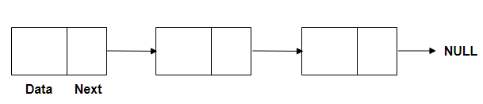

# Linked List

> 연결 리스트(Linked List)는 **각 노드가 데이터와 포인터를 가지고 한 줄로 연결되어 있는 방식**
> 으로 데이터를 저장하는 자료 구조이다.
> 이름에서 말하듯이 데이터를 담고 있는 노드들이 연결되어 있는데, **노드의 포인터가 다음이나 이전의 노드와의 연결을 담당**하게 된다.

- 노드 : 데이터 저장단위(데이터값, 포인터)로 구성

  - Data : 해당 주소의 Data를 담는 공간
  - Next : 각 노드안에서 다음 주소를 가지고 있는 공간

- **사용하는 이유**

  배열은 비슷한 유형의 선형 데이터를 저장하는데 사용하지만 다음과 같은 제한사항이 존재

  1. 배열의 크기가 고정되어 있어 미리 요소의 수에 대해 할당을 받아야 한다
  2. 새로운 요소를 삽입하는 것은 비용이 많이 듬 (공간을 만들고, 기존 요소 전부 이동)

- **장점**

1. 동적 크기
2. 삽입/삭제 용이
3. 리스트 내에서 자료의 이동이 필요하지 않다
4. 사용 후 기억 장소의 재사용이 가능하다.

- **단점**

1. 포인터의 사용으로 인해 저장 공간의 낭비가 있다.
2. 조회 속도가 느리다. (매번 Head부터 탐색하기 때문)

- **시간 복잡도**

  - 탐색 : O(n)
  - 추가, 삭제 : O(1) 이지만 검색을 통해 찾아가므로 O(n)

---

❗ **Array vs Linked List 시간복잡도**

|           | Array               | Linked List         |
| --------- | ------------------- | ------------------- |
| 탐색      | O(1)                | O(n)                |
| 추가/삭제 | O(n) (맨 뒤 : O(1)) | O(n) (맨 앞 : O(1)) |

- Array의 경우 (맨 뒤를 제외)

  추가 : 추가하고 그 뒤의 값들은 그만큼 뒤로 미뤄지기에 O(n)

  삭제 : 삭제하고 그 뒤의 값들은 그만큼 앞으로 당겨지기에 O(n)

- inked List의 경우 (맨 앞을 제외)

  추가 : 추가하려는 위치의 이전 노드를 먼저 조회한 뒤에 작업이 이루어지기 때문에 O(n)

  삭제 : 결국 제거를 할 때는 그 이전 노드를 건드려야하는데, 단일 연결 리스트에서는 이전 노드로 가는 포인터가 없기 때문에 결국 제거하려는 위치를 알아도 O(n)

---

- **구현해보기**

  [구현 with JavaScript](https://github.com/SleeplessN/TIL/blob/main/DataStructure/Linear/Linked%20List/Linked%20List/Linked-List.js)

**Ref :**

- [https://medium.com/@carocontrerasissa/introduction-to-linked-lists-7e948ae75d99](https://medium.com/@carocontrerasissa/introduction-to-linked-lists-7e948ae75d99)

- [https://www.nextree.co.kr/p6506/](https://www.nextree.co.kr/p6506/)

- [https://velog.io/@gillog/연결-리스트Linked-List](https://velog.io/@gillog/%EC%97%B0%EA%B2%B0-%EB%A6%AC%EC%8A%A4%ED%8A%B8Linked-List)
