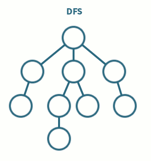

# DFS

> 그래프를 탐색하는 방법 중에 하나인 DFS이다.
> DFS의 기본 원리는 갈 수 있는 만큼 최대한 깊이가고, 더이상 갈곳이 없으면 이전 정점으로 돌아간다는 것이다.
> 쉽게 말해서 그냥 세로로 한줄씩 읽어 내려간다고 생각하면 된다.

- **장점**
  - 현 경로상의 노드들만 기억하면 되므로 저장공간 수요가 비교적 적다.
  - 목표 노드가 깊은 단계에 있을 경우 해를 빨리 구할 수 있다.
- **단점**

  - 해가 없는 경로가 깊을 경우 탐색시간이 오래 걸릴 수 있다.
  - 얻어진 해가 최단 경로가 된다는 보장이 없다.
  - 깊이가 무한히 깊어지면 스택오버플로우가 날 위험이 있다. (깊이 제한을 두는 방법으로 해결가능)

- **시간복잡도**
  - 인접 행렬로 구현했을 경우
    DFS 하나당 N번의 loop를 돌게 되므로 O(n)의 시간복잡도를 가진다.
    그런데 N개의 정점을 모두 방문 해야하므로n\*O(n)이므로 **O(n^2)**의 시간복잡도를 가지게 된다.
  - 인접 리스트로 구현했을 경우
    DFS가 총 N번 호출되긴 하지만 인접행렬과 달리 인접 리스트로 구현하게 되면 DFS하나당 각 정점에 연결되어 있는 간선의 개수만큼 탐색을 하게 되므로 예측이 불가능 하다. 하지만 DFS가 다 끝난 후를 생각하면, 모든 정점을 한번씩 다 방문하고, 모든 간선을 한번씩 모두 검사했다고 할 수 있으므로 O(n+e)의 시간이 걸렸다고 할 수 있다.
    따라서 시간복잡도는 **O(n+e)**이다.
- **구현해보기** (재귀함수로 구현 & Stack으로 구현)
  - [구현 with JavaScript]()

**Ref :**

- [https://currygamedev.tistory.com/10](https://currygamedev.tistory.com/10)
- [https://ko.wikipedia.org/wiki/깊이*우선*탐색](https://ko.wikipedia.org/wiki/%EA%B9%8A%EC%9D%B4_%EC%9A%B0%EC%84%A0_%ED%83%90%EC%83%89)
