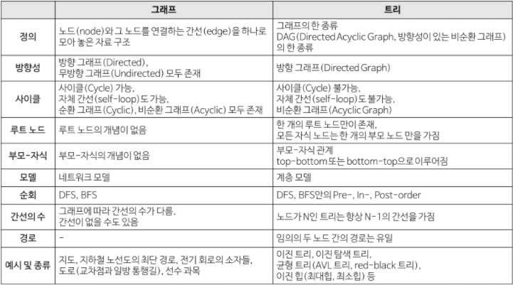

# Graph

> 그래프는 **정점(Vertex)**과 **간선(Edge)**으로 이루어진 자료구조이다.
>
> 정확히는 **정점(Vertex)간의 관계를 표현하는 조직도**라고 볼 수 있다.

## 그래프와 트리 비교

트리는 그래프의 일종인 셈이다.

하지만 그래프는 트리와는 달리 정점마다 간선이 있을 수도 있고 없을 수도 있으며,

루트노드와 부모와 자식이라는 개념이 존재하지 않는다.

## 그래프 구조

- **정점 (vertex)**
  - 노드(node)라고도 하며 데이터가 저장되는 그래프의 기본 원소이다.
- **간선 (edge)**
  - 링크(link)라고도 하며 정점 간의 관계를 나타낸다.
- **인접 정점 (adjacent vertex)**
  - 하나의 정점에서 간선에 의해 직접 연결되어 있는 정점을 뜻한다.
  - 위 그래프에서 정점 `C`의 인접 정점은 `A`, `D` 이다.
- **차수(degree)**
  - 정점에 연결된 간선의 수를 말한다.
  - 위 그래프에서 정점 `A`의 차수는 3이고, 모든 정점의 차수를 합하면 8이다.
  - 무방향 그래프에서 하나의 간선은 두 개의 정점에 인접하기 때문에 간선 수에 2배를 해주면 된다.
  - 방향 그래프의 경우 외부에서 오는 간선의 수를 **진입 차수(in-degree)**라고 하며, 외부로 향하는 간선의 수를 **진출 차수(out-degree)**라고 한다.
- **경로 (path)**
  - 간선을 따라갈 수 있는 길을 말하며, 정점을 나열하여 표시한다.정점 `s`로부터 정점 `e`까지의 경로는 `s, v₁, v₂ ... e`로 표현하며, 반드시 정점들 간의 간선이 존재해야 한다.
  - 너무나도 당연하게도 간선이 존재하지 않는 길은 경로가 될 수 없다.
- **경로의 길이 (length)**
  - 경로를 구성하는 데 사용된 간선의 수를 뜻한다.
- **단순 경로 (simple path)**
  - 경로 중에서 반복되는 간선이 없는 경로이다.
- **사이클 (cycle)**
  - 시작 정점과 종료 정점이 같은 단순 경로를 뜻한다.
  - 위 그래프에서 `A, C, D, A` 경로를 사이클이라고 한다.

## 종류

- **무방향 그래프 (Undirected Graph)**

무방향 그래프는 두 정점을 연결하는 **간선에 방향이 없는 그래프**이다.

- **방향 그래프 (Directed Graph)**

방향 그래프는 두 정점을 연결하는 **간선에 방향이 존재하는 그래프**이다.

간선의 방향으로만 이동할 수 있다.

- **가중치 그래프(Weighted Graph)**

가중치 그래프는 **간선에 가중치(비용)가 할당된 그래**프로, 두 정점을 이동할 때 비용이 드는 그래프이다.

- **연결 그래프(Connected Graph)**

무방향 그래프에 있는 **모든 정점 쌍에 대해서 항상 경로가 존재하는 그래프**

즉, 노드들이 하나도 빠짐없이 간선에 의해 연결되어 있는 그래프로 트리(Tree)가 대표적인 예이다.

- **비연결 그래프(Disconnected Graph)**

무방향 그래프에서 **특정 정점 사이에 경로가 존재하지 않는 그래프**

즉, 노드들 중 간선에 의해 연결되어 있지 않은 그래프이다.

- **완전 그래프(Complete graph)**

그래프의 **모든 정점이 서로 연결되어 있는 그래프**이다. (인접 연결)

- **순환그래프(Cycle)**

단순 경로에서 **시작 정점과 도착 정점이 동일한 그래프**이다. (A에서 시작-> A에서 끝 가능)

- **비순환그래프(Acyclic Graph)**

사이클 그래프를 제외한 그래프로, **사이클이 없는 그래프**이다.

## 그래프 표현방법

1. **인접 리스트**

   인접리스트는 **그래프의 노드를 리스트로 표현**한 것

   주로 정점의 리스트 배열을 만들어 관계를 설정하며 노드들 간에 직접 연결이 되어있으면 해당 노드의 인덱스에 그 노드를 삽입해주면 된다.

   

   - **장점**
     1. 정점들의 연결 정보를 탐색할 때 O(n) 시간이면 가능하다.
     2. 필요한 만큼의 공간만 사용하기 때문에 공간의 낭비가 적다.
   - **단점**
     1. 특정 두 점이 연결되었는지 확인하려면 인접행렬에 비해 시간이 오래걸린다. (O(E) 시간 소요. E는 간선의 개수)
     2. 구현이 비교적 어렵다.

2. **인접 행렬**

   인접행렬은 **그래프의 노드를 2차원 배열로 만든 것**이다.

   노드들 간에 직접 연결이 되어있으면 1을, 아니면 0을 넣어서 행렬을 완성시킨 것이다.

   

   - **장점**
     - 2차원 배열 안에 모든 정점들의 간선 정보가 담겨있기 때문에 **두 정점에 대한 연결 정보를 조회할 때 O(1) 의 시간복잡도**면 가능하다.
     - 인접리스트에 비해 **구현이 쉽다.**
   - **단점**
     - 모든 정점에 대해 간선 정보를 대입해야 하므로 O(n^2)의 시간복잡도가 소요된다.
     - 무조건 2차원 배열이 필요하기 때문에 필요 이상의 공간이 낭비된다.

- **구현해보기 ( 인접 리스트 )**

**Ref :**

- [https://hongcoding.tistory.com/78](https://hongcoding.tistory.com/78)
- [https://suyeon96.tistory.com/32](https://suyeon96.tistory.com/32)
