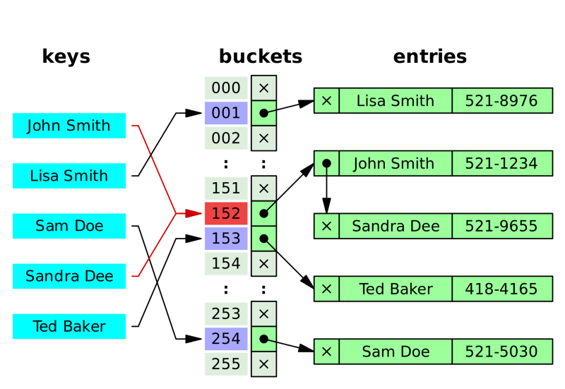

# Hash Collision(해시 충돌)

> 서로 다른 key가 hashing 후 같은 hash값이 나오는 경우가 있다.
> 이를 **해시충돌**이라고 부른다.

같은 키 값을 가지는 데이터가 생기는 것은 특정 키의 버켓에 데이터가 집중된다는 뜻

너무 많은 해시 충돌은 해시 테이블의 성능을 떨어뜨린다

- 해시함수의 입력값은 무한하지만 출력값의 가짓수는 유한하므로 해시충돌은 반드시 발생 (\*비둘기집 원리)
- 클러스터링(Clustering) : 연속된 레코드에 데이터가 몰리는 현상
- 오버플로우(Overflow) : 해시 충돌이 버킷에 할당된 슬롯 수보다 많이 발생하면 더 이상 버킷에 값을 넣을 수 없는 현상

( \* 비둘기집 원리 : n+1개의 물건을 n개의 상자에 넣은 경우, 최소한 한 상자에는 그 물건이 반드시 두 개 이상 존재)

## 해결방법

### 1. Chaining(체이닝)

체이닝은 저장소(Bucket)에서 충돌이 일어나면 기존 값과 새로운 값을 연결리스트로 연결하는 방법이다.

- **장점**

  미리 충돌을 대비해서 공간을 많이 잡아놓을 필요가 없다.

  (충돌이 나면 그때 공간을 만들어서 연결만 해주면 된다.)

- **단점**

  같은 hash에 자료들이 많이 연결되면 검색시 효율이 낮아진다.

### 2. **Open Addressing(개방주소법)**

개방 주소법은 충돌이 일어나면 비어있는 hash에 데이터를 저장하는 방법이다.

개방주소법의 해시 테이블은 hash와 value가 1:1관계를 유지한다.

- 위의 그림에서 John과 Sandra의 hash가 동일해 충돌이 일어난다.

- 이 때 Sandra는 바로 그 다음 비어있던 153 hash에 값을 저장한다.

- 그 다음 Ted가 테이블에 저장을 하려 했으나 본인의 hash에 이미 Sandra로 채워져 있다

- Ted도 Sandra처럼 바로 다음 비어있던 154 hash에 값을 저장한다.

이런 식으로 충돌이 발생할 경우 비어있는 hash를 찾아 저장하는 방법이 개방주소법이다.

이 때, 비어있는 hash를 찾아가는 방법은 여러가지가 있다.

a. **선형 탐색**

해시 충돌시 다음 버킷, 혹은 몇 개를 건너뛰어 데이터를 삽입

- 장점 : 구조가 간단하고 캐시의 효율이 높음
- 단점 : 최악의 경우 해시테이블 전체를 검색해야 하는 상황이 발생, 데이터의 클러스터링에 가장 취약

b. **2차 검색법**

원래 저장할 위치로부터 떨어진 영역을 차례대로 검색하여 첫번째 빈 영역에 키를 저장하는 방법

- 선형 검색법에서 발생하는 제1 밀집문제를 제거하는 방법
- 같은 해시값을 갖는 키에 대해서는 제 2 밀집 발생
- 캐시 효율과 클러스터링 방지 측면에서 선형 검색법과 2중해싱의 중간정도의 성능

c. **이중 해시**

해시 충돌시 다른 함수를 한번 더 적용한 결과를 이용

- 캐시 효율은 떨어지지만 클러스터링에 영향을 거의 받지 않음
- 가장 많은 연산량을 요구

**체이닝과 선형 탐색의 비교**

**체이닝**

- 연결 리스트를 사용하여 복잡한 계산식을 개방주소법에 비해 적게 사용
- 해시테이블이 채워질수록 성능 저하가 선형적으로 발생
- **구현해보기** (체이닝)
  [구현 with JavaScript]()

**개방주소법**

- 포인터가 필요 없고 지정한 메모리 외 추가적인 저장공간도 필요 없음
- 삽입, 삭제시 오버헤드가 적고, 저장할 데이터가 적을 때 더 유리
- **구현해보기** (선형 탐색)
  [구현 with JavaScript]()

**Ref :**

- [https://ko.wikipedia.org/wiki/해시\_충돌](https://ko.wikipedia.org/wiki/%ED%95%B4%EC%8B%9C_%EC%B6%A9%EB%8F%8C)

- [https://go-coding.tistory.com/30](https://go-coding.tistory.com/30)

- [https://j3sung.tistory.com/759](https://j3sung.tistory.com/759)
