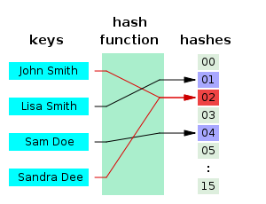

# Hash

> **해시함수(hash function)**란 데이터의 효율적 관리를 목적으로 임의의 길이의 데이터를 고정된 길이의 데이터로 매핑하는 함수이다.
> 이 때 매핑 전 원래 데이터의 값을 **키(key)**, 매핑 후 데이터의 값을 **해시값(hash value)**, 매핑하는 과정 자체를 **해싱(hashing)**이라고 한다

- key
  - 고유한 값, hash function의 Input이 된다.
  - key값을 고정된 길이의 해시로 변경한다.
- hash function
  - key를 **고정된 길이**의 hash로 변경해주는 역할
- value
  - 저장소(버킷,슬롯)에 최종적으로 저장되는 값으로, hash와 매칭되어 저장되어진다.

- hash table

  - 해시함수를 사용하여 키를 해시값으로 매핑하고, 이 해시값을 주소또는 색인 삼아 데이터(value)를 key와 함께 저장하는 자료구조이다.
  - 데이터가 저장되는 곳을 버킷, 슬롯이라고 한다.

- **장점**

1. O(1)의 시간복잡도
2. 어떤 항목과 다른 항목의 관계를 모형화하는데 좋음
3. 무한한 데이터를 유한한 키값으로 관리할 수 있음

- **단점**

1. 해시 충돌이 발생(개방 주소법, 체이닝 과 같은 기법으로 해결해 줘야 한다.)
2. 순서/관계가 있는 배열에는 어울리지 않는다.
3. 공간 효율성이 떨어진다. 데이터가 저장되기 전에 저장공간을 미리 만들어놔야한다. 공간을 만들었지만 공간에 채워지지 않는 경우가 발생한다.
4. hash function의 의존도가 높다. 해시함수가 복잡하다면 hash를 만들어 내는데 오래 걸릴 것이다.

- **시간복잡도**

  해시테이블은 key-value가 1:1로 매핑되어 있기 때문에 삽입, 삭제, 검색의 과정에서 모두 평균적으로 O(1)의 시간복잡도를 가진다

- **구현해보기** (hash function 중 **djb2**을 이용)

  [구현 with JavaScript](https://github.com/SleeplessN/TIL/blob/main/DataStructure/NonLinear/Hash/Hash.js)

 
 

[해시충돌](https://github.com/SleeplessN/TIL/blob/main/DataStructure/NonLinear/Hash/Hash%20Collision/Hash%20Collision.md)

**Ref :**

- [https://ko.wikipedia.org/wiki/해시\_함수](https://ko.wikipedia.org/wiki/%ED%95%B4%EC%8B%9C_%ED%95%A8%EC%88%98)

- [https://go-coding.tistory.com/30](https://go-coding.tistory.com/30)

- [https://j3sung.tistory.com/759](https://j3sung.tistory.com/759)
