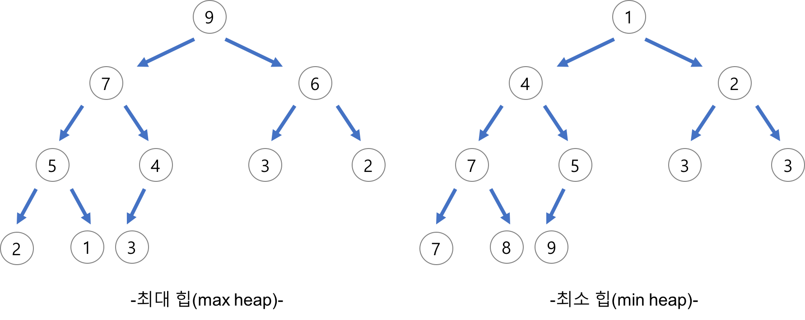

# Heap

> 힙 자료구조는 **완전 이진 트리**를 기초로 하는 자료구조이다.
> 완전 이진트리는 **마지막을 제외한 모든 노드에서 자식들이 꽉 채워진 이진트리**
> 를 말한다.

## 특징

- **완전 이진 트리의 일종**으로 우선순위 큐를 위하여 만들어진 자료구조이다.
- 여러 개의 값들 중에서 **최댓값이나 최솟값을 빠르게 찾아내도록 만들어진 자료구조**이다.
- 힙은 일종의 **반정렬 상태(느슨한 정렬 상태) 를 유지**한다.
  - 큰 값이 상위 레벨에 있고 작은 값이 하위 레벨에 있다는 정도
  - 간단히 말하면 부모 노드의 키 값이 자식 노드의 키 값보다 항상 큰(작은) 이진 트리를 말한다.
- 힙 트리에서는 **중복된 값을 허용**한다. (이진 탐색 트리에서는 중복된 값을 허용하지 않는다.

## 종류

- **최대힙**
  - 부모 노드의 키 값이 자식 노드의 키 값보다 크거나 같은 완전 이진 트리
  - key(부모 노드) >= key(자식 노드)
- **최소힙**
  - 부모 노드의 키 값이 자식 노드의 키 값보다 작거나 같은 완전 이진 트리
  - key(부모 노드) <= key(자식 노드)

## 구현

힙은 대체적으로 배열로 구현된다.

- 아래 그림과 같이 루트노드를 배열의 0번 index에 저장
- 각 노드를 기점으로 **왼쪽 자식노드는 *a*[*i*∗2+1], 오른쪽 자식노드는 *a*[*i*∗2+2]**의 index에 저장
- 특정 index의 노드에서 **부모노드는 *a*[(*i*−1)//2]**로 찾을 수 있다.

- **시간복잡도**
  삽입과 삭제의 경우 모두 <b>연산자체는 O(1)</b>로 작동하지만
  heapify의 과정을 거치기 때문에 **_O_(_logn_)의 시간복잡도**를 가지게 된다

### 삽입과 삭제 (최대힙 기준)

- 최대힙의 경우 부모노드는 항상 자식노드의 값보다 크다는 조건을 가지고 있다.
- 하지만 힙에서 **삽입** 또는 **삭제**가 일어나게 되면 경우에 따라 **최대힙의 조건이 깨질 수 있다.**
- 이러한 경우에 최대힙의 조건을 만족할 수 있게 노드들의 위치를 바꿔가며 힙을 **재구조화(heapify)** 해주어야 한다.

1. **삽입 구현과정**

2. **삭제 구현과정**

- **구현해보기**
  - [최소힙 구현 with Javascript](https://github.com/SleeplessN/TIL/blob/main/DataStructure/NonLinear/Heap/MinHeap.js)
  - [최대힙 구현 with Javascript](https://github.com/SleeplessN/TIL/blob/main/DataStructure/NonLinear/Heap/MaxHeap.js)

**Ref :**

- [https://ko.wikipedia.org/wiki/힙*(자료*구조)](<https://ko.wikipedia.org/wiki/%ED%9E%99_(%EC%9E%90%EB%A3%8C_%EA%B5%AC%EC%A1%B0)>)
- [https://velog.io/@emplam27/자료구조-그림으로-알아보는-힙Heap](https://velog.io/@emplam27/%EC%9E%90%EB%A3%8C%EA%B5%AC%EC%A1%B0-%EA%B7%B8%EB%A6%BC%EC%9C%BC%EB%A1%9C-%EC%95%8C%EC%95%84%EB%B3%B4%EB%8A%94-%ED%9E%99Heap)
- [https://velog.io/@yanghl98/자료구조-Heap힙-개념-종류-활용-예시-구현](https://velog.io/@yanghl98/%EC%9E%90%EB%A3%8C%EA%B5%AC%EC%A1%B0-Heap%ED%9E%99-%EA%B0%9C%EB%85%90-%EC%A2%85%EB%A5%98-%ED%99%9C%EC%9A%A9-%EC%98%88%EC%8B%9C-%EA%B5%AC%ED%98%84)
