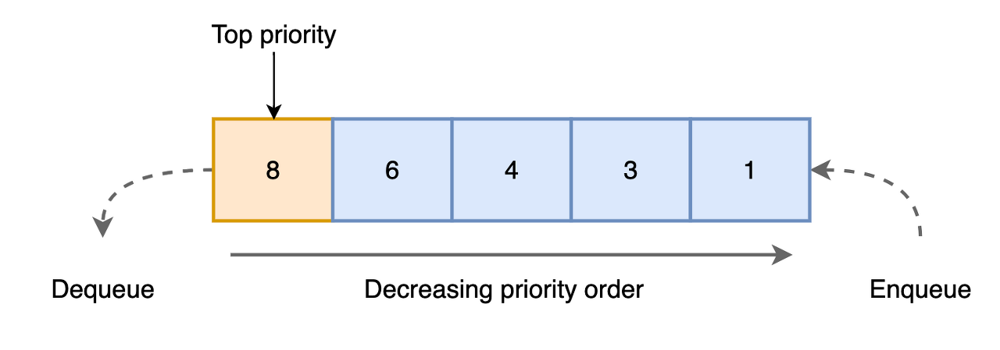

# Priority Queue

> 일반적인 큐(Queue)는 먼저 집어넣은 데이터가 먼저 나오는 FIFO (First In First Out) 구조로 저장하는 선형 자료구조이다.
> 하지만 우선순위 큐(Priority Queue)는 들어간 순서에 상관없이 우선순위가 높은 데이터가 먼저 나오는 것을 말한다.



- Element : 데이터 저장단위(Data, Priority)로 구성

  - Data : Data를 담는 공간
  - Priority : 해당 Element의 우선순위를 담는 공간

- **특징**

1. 모든 항목에는 우선순위가 있다.
2. 우선 순위가 높은 요소는 우선 순위가 낮은 요소보다 먼저 queue에서 제외된다.
3. 두 요소의 우선 순위가 같으면 queue의 순서에 따라 제공된다.

- **시간복잡도**

  구현 방법에 따라 다른 시간복잡도를 갖는다

  

- **구현해보기**
  <details>
  <summary>구현 with JavaScript</summary>

  ```jsx
  // Element() : 데이터와 우선순위를 저장하기 위한 생성자 함수
  function Element(data, priority) {
    this.data = data;
    this.priority = priority;
  }

  // PriorityQueue() : Element 관리를 위한 생성자 함수
  function PriorityQueue() {
    this.array = [];
  }

  // getBuffet() : 객체 내 데이터 셋 반환
  PriorityQueue.prototype.getBuffer = function () {
    return this.array.map((element) => element.data);
  };

  // isEmpty() : 객체 내 데이터 존재 여부 파악
  PriorityQueue.prototype.isEmpty = function () {
    return this.array.length === 0;
  };

  // enqueue() : 데이터 추가
  PriorityQueue.prototype.enqueue = function (data, priority) {
    let element = new Element(data, priority);
    let added = false;

    for (let i = 0; i < this.array.length; i++) {
      if (element.priority < this.array[i].priority) {
        this.array.splice(i, 0, element);
        added = true;
        break;
      }
    }

    if (!added) {
      this.array.push(element);
    }

    return this.array.length;
  };

  // dequeue() : 데이터 삭제
  PriorityQueue.prototype.dequeue = function () {
    return this.array.shift();
  };

  // front() : 가장 첫 데이터 반환
  PriorityQueue.prototype.front = function () {
    return this.array.length == 0 ? undefined : this.array[0].data;
  };

  // size() : 큐 내 데이터 개수 반환
  PriorityQueue.prototype.size = function () {
    return this.array.length;
  };

  // clear() : 큐 초기화
  PriorityQueue.prototype.clear = function () {
    this.array = [];
  };
  ```

    </details>

**Ref :**

- [https://yoongrammer.tistory.com/81](https://yoongrammer.tistory.com/81)

- [https://suyeon96.tistory.com/31](https://suyeon96.tistory.com/31)
