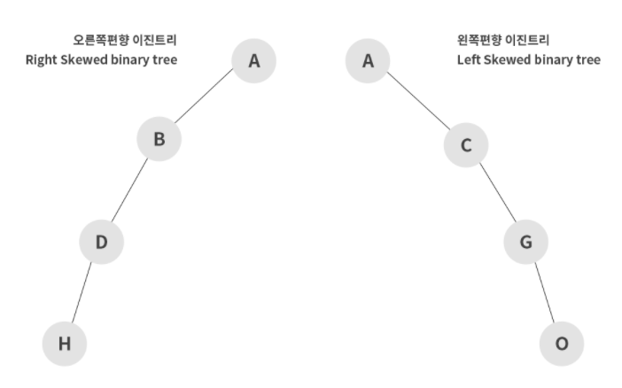

# Binary Tree (이진 트리)

> 이진트리(Binary tree)란 트리의 자료 구조 중 가장 기본이 되는 트리로,
> **모든 노드들이 둘 이하의 자식 노드를 가진 트리**이다.

2개의 자식노드 중에서 **왼쪽의 노드를 `Left Node`**라고 하고, **오른쪽의 노드를 `Right Node`**라 한다.

## 이진 트리의 종류

1. 편향 이진 트리 (Skewed Binary Tree)



- 편향 이진 트리는 **하나의 차수로만 이루어져 있는 경우를 의미**한다.
- Leaf Node(가장 아래쪽에 위치한 노드) 탐색 시 모든 데이터를 전부 탐색해야 한다(**효율적이지 못하다**)는 단점이 있다.

1. 포화 이진 트리 (Perfect Binary Tree)


- 포화 이진 트리는 **'Leaf Node'를 제외한 모든 노드의 차수가 2개로 이루어져 있는 경우를 의미**
  한다.
- 해당 차수에 몇 개의 노드가 존재하는지 바로 알 수 있으므로 **노드의 개수를 파악할 때 용이**하다.

1. 완전 이진 트리 (Complete Binary Tree)


- 포화 이진 트리와 같은 개념으로 트리를 생성하지만, **모든 노드가 왼쪽부터 차근차근 생성되는 이진 트리를 의미**한다.
- 힙(Heap)은 완전 이진 트리의 일종이다.

1. 전 이진 트리 (Full Binary Tree)


- 전 이진트리는 **모든 노드가 0개 또는 2개의 자식 노드를 갖는 트리**이다.

1. 균형 이진 트리 (Balanced Binary Tree)


- 균형 이진 트리는 각자의 모든 노드가 가지는 Child Node 의 **Depth가 1 이상 차이 나지 않는 이진 트리를 의미**한다

## 이진 탐색 트리 **(Binary Search Tree)**

> 이진 탐색 트리는 탐색을 위한 이진 트리 기반의 자료구조이다.

- 특징
  - **left node에는 부모노드보다 작은 값이 저장**된다.
  - **right node에는 부모노드와 값이 같거나 큰 값이 저장**된다.
  - 모든 노드는 중복된 값을 가지지 않는다.
- 장점

1. 데이터를 효율적으로 검색(탐색)할 수 있다

   (**원하는 값을 찾을 때까지 현재의 노드값보다 찾고자하는 값이 작으면 왼쪽으로 움직이고, 크면 오른쪽으로 움직인다.** 이렇게 원하는 값을 더 빠르게 찾을 수 있게 된다.)

- 예시
  [21, 28, 14, 32, 25, 18, 11, 30, 19, 15]를 이진 트리로 저장하면 다음과 같다.
  

  원하는 값을 탐색하는 과정은 다음과 같다.
  

- 시간복잡도
  이진 탐색 트리의 검색 : O(log N)
  (리스트의 검색 시간복잡도는 O(N)이며, 따라서 리스트보다 효율적이다)
- 구현해보기
  <details>

  <summary> 구현 with JavaScript</summary>

  ```jsx
  // Node() : value와 left, right node 저장을 위한 생성자
  function Node(value) {
    this.value = value;
    this.left = null;
    this.right = null;
  }

  // BinarySearchTree() : 시작 노드인 root를 저장하기 위한 생성자
  function BinarySearchTree() {
    this.root = null;
  }

  // _inOrderTraverseNode() : 재귀로 트리를 순회하며 중위 순회 (내부 사용)
  BinarySearchTree.prototype._inOrderTraverseNode = function (node, callback) {
    if (node === null) {
      return;
    }

    this._inOrderTraverseNode(node.left, callback);
    callback(node);
    this._inOrderTraverseNode(node.right, callback);
  };

  // inOrderTraverse() : 중위 순회하며 노드 출력
  BinarySearchTree.prototype.inOrderTraverse = function (callback) {
    this._inOrderTraverseNode(this.root, callback);
    console.log("end");
  };

  // _insertNode() : 재귀로 트리를 순회하며 노드 추가 (내부 사용)
  BinarySearchTree.prototype._insertNode = function (node, value) {
    // 현재값과 비교
    // 작으면 왼쪽, 크면 오른쪽
    // 왼쪽, 오른쪽에 left, right pointer 비어있다면 추가할 노드를 연결
    // 비어있지 않다면 하위 노드에서 다시 비교하도록 넘겨준다

    if (node === null) {
      node = new Node(value);
    } else if (value < node.value) {
      node.left = this._insertNode(node.left, value);
    } else if (value > node.value) {
      node.right = this._insertNode(node.right, value);
    }

    return node;
  };

  // insert() : 노드 추가
  BinarySearchTree.prototype.insert = function (value) {
    this.root = this._insertNode(this.root, value);
  };

  // _minNode() : 반복문으로 트리를 순회하며 최솟값 노드 탐색
  BinarySearchTree.prototype._minNode = function (node) {
    if (node === null) {
      return null;
    }

    while (node && node.left !== null) {
      node = node.left;
    }

    return node.value;
  };

  // _maxNode() : 반복문으로 트리를 순회하며 최댓값 노드 탐색
  BinarySearchTree.prototype._maxNode = function (node) {
    if (node === null) {
      return null;
    }

    while (node && node.right !== null) {
      node = node.right;
    }

    return node.value;
  };

  // min() : 최솟값 노드 탐색
  BinarySearchTree.prototype.min = function () {
    return this._minNode(this.root);
  };

  // max() : 최댓값 노드 탐색
  BinarySearchTree.prototype.max = function () {
    return this._maxNode(this.root);
  };

  // _ search() : 재귀로 트리를 순회하며 값을 만족하는 노드 탐색
  BinarySearchTree.prototype._searchNode = function (node, value) {
    if (node === null) {
      return false;
    }

    if (node.value === value) {
      return true;
    } else if (node.value > value) {
      return this._searchNode(node.left, value);
    } else if (node.value < value) {
      return this._searchNode(node.right, value);
    }
  };

  // search() : value 노드 탐색
  BinarySearchTree.prototype.search = function (value) {
    return this._searchNode(this.root, value);
  };

  // _findMinNode() : 반복문으로 트리를 순회하며 최솟값을 보유한 노드 탐색/반환
  BinarySearchTree.prototype._findMinNode = function (node) {
    while (node && node.left !== null) {
      node = node.left;
    }
    return node;
  };

  // _removeNode() : 재귀로 트리를 순회하며 값을 만족하는 노드를 찾고 삭제
  BinarySearchTree.prototype._removeNode = function (node, value) {
    if (node === null) {
      return null;
    }

    if (node.value === value) {
      // case 1 : 0 child node (leaf node)
      if (node.left === null && node.right === null) {
        node = null;
      }

      // case 2 : 1 child node
      else if (node.left === null) {
        node = node.right;
      } else if (node.right === null) {
        node = node.left;
      }

      // case 3 : 2 child node
      else {
        let aux = this._findMinNode(node.right);
        node.value = aux.value;
        node.right = this._removeNode(node.right, aux.value);
      }
    } else if (node.value > value) {
      node.left = this._removeNode(node.left, value);
    } else if (node.value < value) {
      node.right = this._removeNode(node.right, value);
    }

    return node;
  };

  // remove() : 노드 삭제
  BinarySearchTree.prototype.remove = function (value) {
    this.root = this._removeNode(this.root, value);
  };
  ```

    </details>

**Ref :**

- [https://velog.io/@taeha7b/datastructure-tree](https://velog.io/@taeha7b/datastructure-tree)
- [https://velog.io/@kimdukbae/자료구조-트리-Tree](https://velog.io/@kimdukbae/%EC%9E%90%EB%A3%8C%EA%B5%AC%EC%A1%B0-%ED%8A%B8%EB%A6%AC-Tree)
- [https://yoongrammer.tistory.com/68](https://yoongrammer.tistory.com/68)
