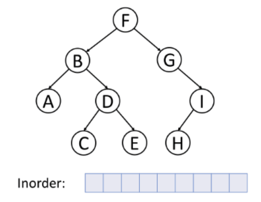

# Tree

> 트리는 **그래프의 일종으로 정점과 간선을 이용하여 데이터의 배치 형태를 추상화한 자료구조**이다.
> **서로 다른 두 노드를 연결하는 길이 하나뿐인 그래프**를 트리라고 부른다.


- **노드 (Node)**
  - 트리를 구성하고 있는 기본 요소
  - 노드에는 키 또는 값과 하위 노드에 대한 포인터를 가지고 있음
  - A, B, C, D, E, F, G, H, I, J
- **간선 (Edge)**
  - 두 노드를 연결하는 선
- **루트 노드 (Root Node)**
  - 트리 구조에서 부모가 없는 최상위 노드
  - root node : A
- **단말 노드 (Leaf Node)**
  - 자식이 없는 노드
  - H, I, J, F, G
- **부모 노드 (Parent Node)**
  - 특정 Sub-Tree내에서의 상위 노드 (자식 노드를 가진 노드)
  - H, I의 부모 노드는 D
- **자식 노드 (Child Node)**
  - 특정 Sub-Tree내에서의 하위 노드 (부모 노드의 하위 노드)
  - D의 자식 노드는 H, I
- **형제 노드 (Sibling Node)**
  - 같은 부모를 가지는 노드
  - H, I는 같은 부모를 가지는 형제 노드
- **깊이 (depth)**
  - 루트에서 어떤 노드까지의 간선(Edge) 수
  - 루트 노드의 깊이 : 0
  - D의 깊이 : 2
- **높이 (height)**
  - 어떤 노드에서 리프 노드까지 가장 긴 경로의 간선(Edge) 수
  - 리프 노드의 높이 : 0
  - A 노드의 높이 : 3
- **Size**
  - **자신을 포함한** 자손의 노드 수
  - 노드 B의 size : 6
- **Degree**
  - 노드의 자식 수
  - Leaf node의 degree : 0 / A의 degree : 2
- **Level**
  - 루트에서 어떤 노드까지의 간선(Edge) 수

## 특징

- 트리 자료구조는 일반적으로 대상정보의 각 항목들을 **계층적으로 구조화 할때 사용하는 비선형 자료구조**이다.
- Tree 구조는 데이터의 '저장'의 의미 보다는 저장된 데이터를 **더 효과적으로 '탐색'** 하기 위해서 사용된다.
- 리스트와 다르게 데이터가 단순히 나열되는 구조가 아니라, **부모(parent)와 자식(child)의 계층적인 관계로 표현**된다.
- 트리는 그래프(Graph)의 한 종류이며, **사이클이 없다.**
- 트리에서 Root Node를 제외한 모든 노드는 **단 하나의 부모노드를 가진다.**

## Tree 순회

트리의 순회란 트리의 각 노드를 체계적인 방법으로 탐색하는 과정을 의미한다.

노드를 탐색하는 순서에 따라 **전위 순회, 중위 순회, 후위 순회** 세가지로 나뉜다.

1. **전위 순회 (Preorder)**

**루트노드** → **왼쪽 서브트리** → **오른쪽 서브트리** 의 순서로 순회하는 방식이다.

‘**깊이 우선 순회’** 라고도 불린다.


2. **중위 순회 (Inorder)**



**왼쪽 서브트리** → **노드** → **오른쪽 서브트리**  의 순서로 순회하는 방식이다.

‘**대칭 순회**’라고도 불린다.

3. **후위 순회 (Postorder)**


**왼쪽 서브트리** → **오른쪽 서브트리** → **노드** 의 순서로 순회하는 방식이다.

- 구현해보기 (이진트리 기준)
  <details>
  <summary>구현 with JavaScript</summary>
    
    ```jsx
    /* Queue 객체 추가 */
    function Queue(array) {
      this.array = array ? array : [];
    }
    
    Queue.prototype.isEmpty = function () {
      return this.array.length === 0;
    };
    Queue.prototype.enqueue = function (element) {
      return this.array.push(element);
    };
    Queue.prototype.dequeue = function () {
      return this.array.shift();
    };
    
    // Node() : value와 left, right node 저장을 위한 생성자
    function Node(value) {
      this.value = value;
      this.left = null;
      this.right = null;
    }
    
    // BinaryTree() : 시작 노드인 root를 저장하기 위한 생성자
    function BinaryTree() {
      this.root = null;
    }
    
    // _insertNode() : 재귀로 트리를 순회하며 노드 추가 (내부 사용)
    BinaryTree.prototype._insertNode = function (node, value) {
      // 현재값과 비교
      // 작으면 왼쪽, 크면 오른쪽
      // 왼쪽, 오른쪽에 left, right pointer 비어있다면 추가할 노드를 연결
      // 비어있지 않다면 하위 노드에서 다시 비교하도록 넘겨준다
    
      if (node === null) {
        node = new Node(value);
      } else if (value < node.value) {
        node.left = this._insertNode(node.left, value);
      } else if (value > node.value) {
        node.right = this._insertNode(node.right, value);
      }
    
      return node;
    };
    
    // insert() : 노드 추가
    BinaryTree.prototype.insert = function (value) {
      this.root = this._insertNode(this.root, value);
    };
    
    // _preOrderTraverseNode() : 재귀로 트리를 순회하며 전위 순회 (내부 사용)
    BinaryTree.prototype._preOrderTraverseNode = function (node, callback) {
      if (node === null) {
        return;
      }
    
      callback(node);
      this._preOrderTraverseNode(node.left, callback);
      this._preOrderTraverseNode(node.right, callback);
    };
    
    // preOrderTraverse() : 전위 순회하며 노드 출력
    BinaryTree.prototype.preOrderTraverse = function (callback) {
      this._preOrderTraverseNode(this.root, callback);
    };
    
    // _inOrderTraverseNode() : 재귀로 트리를 순회하며 중위 순회 (내부 사용)
    BinaryTree.prototype._inOrderTraverseNode = function (node, callback) {
      if (node === null) {
        return;
      }
    
      this._inOrderTraverseNode(node.left, callback);
      callback(node);
      this._inOrderTraverseNode(node.right, callback);
    };
    
    // inOrderTraverse() : 중위 순회하며 노드 출력
    BinaryTree.prototype.inOrderTraverse = function (callback) {
      this._inOrderTraverseNode(this.root, callback);
    };
    
    // _postOrderTraverseNode() : 재귀로 트리를 순회하며 후위 순회 (내부 사용)
    BinaryTree.prototype._postOrderTraverseNode = function (node, callback) {
      if (node === null) {
        return;
      }
    
      this._postOrderTraverseNode(node.left, callback);
      this._postOrderTraverseNode(node.right, callback);
      callback(node);
    };
    
    // postOrderTraverse() : 후위 순회하며 노드 출력
    BinaryTree.prototype.postOrderTraverse = function (callback) {
      this._postOrderTraverseNode(this.root, callback);
    };
    
    // levelOrderTraverse() : 층별 순회하며 노드 출력
    BinaryTree.prototype.levelOrderTraverse = function (callback) {
      let q = new Queue();
      let node;
    
      q.enqueue(this.root);
      while (!q.isEmpty()) {
        node = q.dequeue();
        callback(node);
        if (node.left !== null) q.enqueue(node.left);
        if (node.right !== null) q.enqueue(node.right);
      }
    };
    ```

  </details>

## 사용 사례

- **계층 적 데이터 저장**
  - 트리는 데이터를 계층 구조로 저장하는 데 사용된다.
  - 예를 들어 파일 및 폴더는 계층적 트리 형태로 저장된다.
- **효율적인 검색 속도**
  - 효율적인 삽입, 삭제 및 검색을 위해 트리 구조를 사용한다.
- **힙(Heap)**
  - 힙도 트리로 된 자료 구조이다.
- **데이터 베이스 인덱싱**
  - 데이터베이스 인덱싱을 구현하는데 트리를 사용한다.
  - 예) B-Tree, B+Tree, AVL-Tree..
- **Trie**
  - 사전을 저장하는 데 사용되는 특별한 종류의 트리이다.

[Binary Tree (이진 트리)](<https://github.com/SleeplessN/TIL/blob/main/DataStructure/NonLinear/Tree/Tree/Binary%20Tree/Binary%20Tree%20(%EC%9D%B4%EC%A7%84%20%ED%8A%B8%EB%A6%AC).md>)

**Ref :**

- [https://velog.io/@taeha7b/datastructure-tree](https://velog.io/@taeha7b/datastructure-tree)
- [https://velog.io/@kimdukbae/자료구조-트리-Tree](https://velog.io/@kimdukbae/%EC%9E%90%EB%A3%8C%EA%B5%AC%EC%A1%B0-%ED%8A%B8%EB%A6%AC-Tree)
- [https://yoongrammer.tistory.com/68](https://yoongrammer.tistory.com/68)
