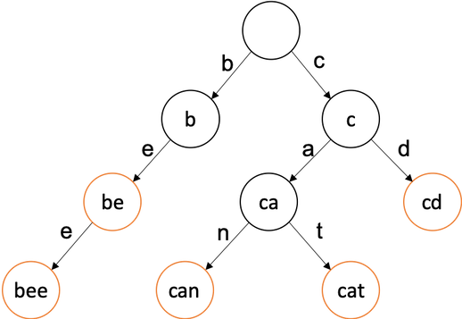

# Trie

> 트라이는 **문자열을 저장하고 효율적으로 탐색하기 위한 트리 형태의 자료구조**이다.
> 우리가 검색할 때 볼 수 있는 **자동완성 기능, 사전 검색 등 문자열을 탐색하는데 특화되어있는 자료구조**이다.

- 한 문자열에서 **다음에 나오는 문자가 현재 문자의 자식 노드가 된다.**
- **주황색 나타낸 노드는 문자열의 끝을 의미**한다
- 이 구조에서는 총 be, bee, can, cat, cd 5가지가 저장되어 있다.
- 만약 ‘cane’를 추가하고 싶다면 can 뒤에 e만 추가해주고 문자 끝 표시만 해주면 된다.

---

- **장점**

  - `트라이(Trie)`는 문자열 검색을 빠르게 한다.
  - 문자열을 탐색할 때, 하나하나씩 전부 비교하면서 탐색을 하는 것보다 **시간 복잡도 측면에서 훨씬 더 효율적**이다.

- **단점**

  - 각 노드에서 자식들에 대한 포인터들을 배열로 모두 저장하고 있다는 점에서 저장 공간의 크기가 크다. (메모리 측면에서 비효율적일 수 있다)

- **시간복잡도**

  제일 긴 문자열의 길이를 `L` 총 문자열들의 수를 `M`이라 할 때 시간복잡도

  - **생성**시 시간복잡도 : `O(M*L)`
    - 모든 문자열들을 넣어야하니 `M`개에 대해서 트라이 자료구조에 넣는건 가장 긴 문자열 길이만큼 걸리니 `L`만큼 걸려서 `O(M*L)`만큼 걸린다.
      물론 삽입 자체만은 `O(L)`만큼 걸린다.
  - **탐색**시 시간복잡도 : `O(L)`
    - 트리를 타고 들어가도 가장 긴 문자열의 길이만큼만 탐색하기 때문에 `O(L)`만큼 걸린다.

- **구현해보기**
  [구현 with JavaScript](https://github.com/SleeplessN/TIL/blob/main/DataStructure/NonLinear/Trie/Trie.js)

**Ref** :

- [https://ko.wikipedia.org/wiki/트라이\_(컴퓨팅)](<https://ko.wikipedia.org/wiki/%ED%8A%B8%EB%9D%BC%EC%9D%B4_(%EC%BB%B4%ED%93%A8%ED%8C%85)>)
- [https://twpower.github.io/187-trie-concept-and-basic-problem](https://twpower.github.io/187-trie-concept-and-basic-problem)
- [https://velog.io/@kimdukbae/자료구조-트라이-Trie](https://velog.io/@kimdukbae/%EC%9E%90%EB%A3%8C%EA%B5%AC%EC%A1%B0-%ED%8A%B8%EB%9D%BC%EC%9D%B4-Trie)
