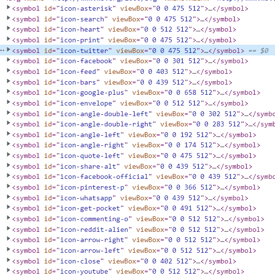

# SVG 파일도 sprite로 사용할 수 있을까?

## SVG sprite의 형태

- svg sprite의 경우 다음과 같이 `svg` 태그 안에 여러 개의 `symbol` 태그로 구성되어 있다.
    
    
    
    ```html
    <svg xmlns="http://www.w3.org/2000/svg" xmlns:xlink="http://www.w3.org/1999/xlink">
      <!-- ViewBox and Polygon taken from "Star.svg" -->
      <symbol id="icon-star" viewBox="0 0 95 95">
        <polygon points="47.5 0 62.18 31.27 95 36.29 71.25 60.63 76.86 95 47.5 78.77 18.14 95 23.75 60.63 0 36.29 32.82 31.27 47.5 0"/>
      </symbol>
    
      <!-- ViewBox and Polygon taken from "Flower.svg" -->
      <symbol id="icon-flower" viewBox="0 0 95 95">
        <path class="cls-1" d="M96.9,36.75A14.87,14.87,0,0,0,85.62,26.54a14.39,14.39,0,0,0-5.57-14A15.44,15.44,0,0,0,63.68,11.2a15.27,15.27,0,0,0-27-1,15.47,15.47,0,0,0-15.36,1.3A14.43,14.43,0,0,0,15.16,25.2,14.93,14.93,0,0,0,3.48,35a14.29,14.29,0,0,0,3.3,14.62A14.3,14.3,0,0,0,3.19,64.15a14.89,14.89,0,0,0,11.48,10A14.41,14.41,0,0,0,20.52,88a15.42,15.42,0,0,0,15.34,1.59,15.28,15.28,0,0,0,26.49.51,15.42,15.42,0,0,0,15.38-1,14.43,14.43,0,0,0,6.41-13.61A15,15,0,0,0,96,65.92a14.31,14.31,0,0,0-3-14.69A14.31,14.31,0,0,0,96.9,36.75" transform="translate(-2.5 -2.5)"/>
      </symbol>
    
      <!-- ViewBox and Polygon taken from "8 Point Star.svg" -->
      <symbol id="icon-8pt-star" viewBox="0 0 95 95">
        <path class="cls-1" d="M83.59,63.91,97.5,50,83.59,36.09V16.41H63.91L50,2.5,36.09,16.41H16.41V36.09L2.5,50,16.41,63.91V83.59H36.09L50,97.5,63.91,83.59H83.59Z" transform="translate(-2.5 -2.5)"/>
      </symbol>
    </svg>
    ```

- **여기서 icon-star를 사용하여 빨간색 별을 화면에 출력하려고 한다**

## 1. HTML내에 정의하여 사용

### 설정

- HTML 내에 필요한 부분을 작성한다.
  ```html
  <svg xmlns="http://www.w3.org/2000/svg" display="none">
    <symbol id="icon-star" viewBox="0 0 95 95">
      <polygon
        points="47.5 0 62.18 31.27 95 36.29 71.25 60.63 76.86 95 47.5 78.77 18.14 95 23.75 60.63 0 36.29 32.82 31.27 47.5 0"
      />
    </symbol>
  </svg>
  ```
  - svg에 `display="none"`이 없을 경우 그만큼 svg가 빈 공간을 차지한다

### 사용법

- 아래와 같이 해당 svg의 id값을 가져온다.
  ```html
  <svg>
    <use href="#icon-star" fill="blue" x="10" y="" width="30" height="30"></use>
  </svg>
  ```
  - `href` : 해당 아이콘의 id 값
  - `fill` : 해당 아이콘의 채울 색
  - `x` : 가로방향으로 움직일 수 있다. (음수 : 왼쪽 / 양수 : 오른쪽)
  - `y` : 세로방향으로 움직일 수 있다. (음수 : 위쪽 / 양수 : 아래쪽)
    - 예시) `x="10" y="-10"` ⇒ 오른쪽으로 10, 위로 10만큼 이동
  - `width` : 너비 설정
  - `height` : 높이 설정

### 결과 화면


## 2. `.svg` 파일 불러오기

### 설정

- 같은 root 디렉토리에 `.svg` 파일을 넣어준다.
  !

### 사용법

- 아래와 같이 경로를 설정한다.
  ```html
  <svg>
    <use
      href="./sample.svg#icon-star"
      fill="red"
      x=""
      y=""
      width="50"
      height="50"
    ></use>
  </svg>
  ```
  - `href` : 해당 아이콘의 `id` 값
  - `fill` : 해당 아이콘의 채울 색
  - `x` : 가로방향으로 움직일 수 있다. (음수 : 왼쪽 / 양수 : 오른쪽)
  - `y` : 세로방향으로 움직일 수 있다. (음수 : 위쪽 / 양수 : 아래쪽)
    - 예시) `x="10" y="-10"` ⇒ 오른쪽으로 10, 위로 10만큼 이동
  - `width` : 너비 설정
  - `height` : 높이 설정

### 결과 화면


