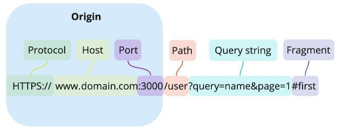

# CORS

## 출처(Origin)란?

URL의 구성

출처란 `Protocol`과 `Host` 그리고 `Port`까지 모두 합친 것을 의미한다.

## SOP (Same-Origin Policy)

“같은 출처에서만 리소스를 공유할 수 있다”라는 규칙을 가진 정책

같은 출처 조건 : `Protocol` , `Host` ,`Port` 이 동일

⇒ `Protocol` , `Host` ,`Port` 중 하나라도 일치하지 않으면 **Cross Origin**이라 한다

이 출처를 비교하는 로직은 서버에 구현된 것이 아니라 **브라우저에 구현된 스펙**이다.

(만약 CORS정책을 위반하는 요청에 서버가 정상적으로 응답을 하더라도

브라우저가 이 응답을 분석해서 CORS정책에 위반되면 그 응답은 처리하지 않게 된다.)

## CORS(Cross-Origin Resource Sharing)

교차 출처 리소스 공유(Cross-Origin Resource Sharing, CORS)는,

추가 HTTP 헤더를 사용하여, 한 출처에서 실행 중인 웹 애플리케이션이 **다른 출처의 선택한 자원에 접근할 수 있는 권한을 부여**하도록 브라우저에 알려주는 체제다.

### CORS의 동작 방식

1. **클라이언트에서 HTTP요청의 헤더에 Origin을 담아서 보낸다.**

1. **서버는 응답헤더에 Access-Control-Allow-Origin을 담아 클라이언트에게 전달한다**.

1. **클라이언트에서 자신이 보냈던 요청의 Origin과 서버가 보내준 Access-Control-Allow-Origin을 비교하여 결정한다**

---

❗ **서버 응답은 CORS정책 위반 여부에 관여하지 않는다.**

CORS 정책에 의해 Origin을 비교하는 로직은 브라우저에 구현되어 있다.
그래서 서버에서 정상적인 응답을 하여 상태코드가 200이 나오더라도,
브라우저가 응답을 CORS정책 위반이라고 분석하면 그 응답은 사용하지 않는다.

브라우저가 CORS정책 위반을 분석하는 시간은 서버의 응답이 도착한 **이 후**이다.

---

### 1. Prefilght Request

`프리플라이트(Prefilght)` 시나리오에 해당하는 상황일 때 브라우저는 요청을 한번에 보내지 않고 **예비 요청과 본 요청으로 나누어서 서버로 전송한다.**

이 때 브라우저가 예비요청을 보내는 것을 `Preflight`라고 부르며 예비요청은 `OPTIONS` 메소드를 사용한다.

예비요청의 역할 : 본 요청을 보내기전 브라우저가 요청을 보내는 것이 안전한지 확인하는 것

1. 자바스크립트의 fetch API를 통해 브라우저에게 리소스를 받아오려고 한다.
2. 브라우저는 서버로 예비요청을 먼저 보낸다.
3. 서버는 이 예비요청에 대한 응답으로 어떤 것을 허용하고 어떤것을 금지하고 있는지에 대한 정보를 담아서 브라우저로 다시 보내준다.
4. 이 후 브라우저는 보낸 요청과 서버가 응답해준 정책을 비교하여 해당 요청이 안전한지 확인하고 본 요청을 보내게 된다.
5. 이 후 서버가 본 요청에 대한 응답을 하면 최종적으로 이 응답 데이터를 자바스립트로 넘겨준다.

예비 요청은 보통 `PUT` , `DELETE` 같은 요청을 보낼떄 이용된다.
PUT이나 DELETE는 서버의 데이터를 변경해 버리는 요청이기 때문에, 코드가 돌아가게 하는 요청을 보내기전에 예비 요청을 보내서 우선 인증부터하고 본 요청을 받아 서버에서 코드가 돌아가게 하는 원리이다.

### 2. Simple Request

단순요청은 예비 요청(Prefilght)을 보내지 않고 바로 서버에 본 요청을 한 후, 서버가 이에 대한 응답의 헤더에 Access-Control-Allow-Origin과 같은 값을 보내주면 브라우저가 CORS정책 위반여부를 검사하는 방식이다.

단순요청은 특정한 조건을 만족하는 경우에만 성립할 수 있다.

1. 요청의 메소드는 `GET`, `HEAD`, `POST` 중 하나여야 한다.
2. 유저 에이전트가 자동으로 설정한 헤더외에, 수동으로 설정할 수 있는 헤더는 Fetch 명세에서 "[CORS-safelisted request-header](https://fetch.spec.whatwg.org/#cors-safelisted-request-header)"로 정의한 헤더만 사용할 수 있다.
   - `Accept`
   - `Accept-Language`
   - `Content-Language`
   - `Content-Type`
   - `DPR`
   - `Downlink`
   - `Save-Data`
   - `Viewport-Width`
   - `Width`
3. `Content-Type` 을 사용하는 경우에는 다음의 값들만 허용된다.
   - `application/x-www-form-urlencoded`
   - `multipart/form-data`
   - `text/plain`

위 조건과 같이 다소 까다로운 조건들이 많기 때문에 위 조건을 모두 만족시키는 상황을 만드는것은 쉽지 않다.

### 3. **Credentialed Request**

다른 출처간 통신에서 좀 더 보안을 강화하고 싶을 때 사용한다.

기본적으로 제공하는 리소스 요청 API인 `XMLHttpRequest` 또는 `fetch`는 별도의 옵션 없이 브라우저의 쿠키 정보나 인증과 관련된 헤더를 함부로 요청에 담지 않는다.

이 때 요청에 인증과 관련되 정보를 담을 수 있게 해주는 옵션이 `credentials`옵션이다.

이 옵션은 총 3가지 값을 사용할 수 있다.

| 옵션값              | 설명                                           |
| ------------------- | ---------------------------------------------- |
| same-origin(기본값) | 같은 출처간 요청에만 인증 정보를 담을 수 있다. |
| include             | 모든 요청에 인증 정보를 담을 수 있다.          |
| omit                | 모든 요청에 인증 정보를 담지 않는다.           |

만약 `same-origin` 이나 `include`와 같은 옵션을 사용하여 리소스 요청에 인증 정보가 포함된다면, 브라우저는 다른 출처의 리소스를 요청할 때 `Access-Control-Allow-Origin`만 확인하는 것이 아니라 **다른 조건을 추가로 검사**한다.

요청에 인증정보가 담겨있는 상태에서 다른 출처의 리소스를 요청하게 되면 브라우저는 `CORS`정책 위반 여부를 검사하는 룰에 다음 두가지를 추가하게 된다.

1. `Access-Control-Allow-Origin` 에는 모든 요청을 허용하는 `*`을 사용할 수 없으며, 명시적인 URL이어야 한다.
2. 응답 헤더에는 반드시 `Access-Control-Allow-Credentials:true`가 존재해야 한다

### CORS 해결 방법

**Access-Control-Allow-Origin 세팅하기**

CORS 정책 위반으로 인한 문제를 해결하는 가장 대표적인 방법은, 그냥 정석대로 서버에서 **`Access-Control-Allow-Origin`** 헤더에 알맞은 값을 세팅해주는 것이다.

이때 와일드카드인 **`*`**을 사용하여 이 헤더를 세팅하게 되면 모든 출처에서 오는 요청을 받겠다는 의미이므로 당장은 편할 수 있겠지만, 바꿔서 생각하면 정체도 모르는 이상한 출처에서 오는 요청까지 모두 받겠다는 것과 다름 없으므로 보안적으로 심각한 이슈가 발생할 수도 있다.

그러니 가급적이면 귀찮더라도 **`Access-Control-Allow-Origin: https://foo.example`**와 같이 **출처를 명시**

Ref :

- [https://developer.mozilla.org/ko/docs/Web/HTTP/CORS](https://developer.mozilla.org/ko/docs/Web/HTTP/CORS)
- [https://inpa.tistory.com/entry/WEB-📚-CORS-💯-정리-해결-방법-👏](https://inpa.tistory.com/entry/WEB-%F0%9F%93%9A-CORS-%F0%9F%92%AF-%EC%A0%95%EB%A6%AC-%ED%95%B4%EA%B2%B0-%EB%B0%A9%EB%B2%95-%F0%9F%91%8F)
- [https://velog.io/@jimmy0417/WEB-CORS-개념과-적용-방법](https://velog.io/@jimmy0417/WEB-CORS-%EA%B0%9C%EB%85%90%EA%B3%BC-%EC%A0%81%EC%9A%A9-%EB%B0%A9%EB%B2%95)
- [https://evan-moon.github.io/2020/05/21/about-cors/](https://evan-moon.github.io/2020/05/21/about-cors/)
- [https://wnsdufdl.tistory.com/231](https://wnsdufdl.tistory.com/231)
