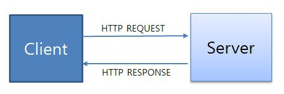

# HTTP

> 텍스트 기반의 통신 규약으로 **인터넷에서 데이터를 주고받을 수 있는 프로토콜**이다.
> 이렇게 규약을 정해두었기 때문에 모든 프로그램이 이 규약에 맞춰 개발해서 서로 정보를 교환할 수 있게 되었다.

## **HTTP 동작**

클라이언트 즉, 사용자가 브라우저를 통해서 어떠한 서비스를 url을 통하거나 다른 것을 통해서 요청(request)을 하면 서버에서는 해당 요청사항에 맞는 결과를 찾아서 사용자에게 응답(response)하는 형태로 동작한다.

- 요청 : client -> server
- 응답 : server -> client

## HTTP 특징

- HTTP 메시지는 HTTP 서버와 HTTP 클라이언트에 의해 해석이 된다.
- TCP/ IP를 이용하는 응용 프로토콜이다.
  (컴퓨터와 컴퓨터간에 데이터를 전송 할 수 있도록 하는 장치로 인터넷이라는 거대한 통신망을 통해 원하는 정보(데이터)를 주고 받는 기능을 이용하는 응용 프로토콜)
- HTTP는 연결 상태를 유지하지 않는 **\* 비연결성** 프로토콜이다.
  (이러한 단점을 해결하기 위해 Cookie와 Session이 등장하였다.)
- HTTP는 연결을 유지하지 않는 프로토콜이기 때문에 요청/응답 방식으로 동작한다.

---

**\* 비연결성 ( Connectionless )**

비연결성은 **클라이언트와 서버가 한 번 연결을 맺은 후, 클 라이언트 요청에 대해 서버가 응답을 마치면 맺었던 연결을 끊어 버리는 성질**

- **장점**
  HTTP는 인터넷 상에서 불특정 다수의 통신 환경을 기반으로 설계되었다.
  만약 서버에서 다수의 클라이언트와 연결을 계속 유지해야 한다면, 이에 따른 많은 리소스가 발생하게 된다
  따라서 **연결을 유지하기 위한 리소스를 줄이면 더 많은 연결을 할 수 있으므로** 비연결적인 특징을 갖는다.

- **단점**
  서버는 클라이언트를 기억하고 있지 않으므로 동일한 클라이언트의 모든 요청에 대해, 매번 새로운 연결을 시도/해제의 과정을 거쳐야하므로 **연결/해제에 대한 오버헤드가 발생**

---

### Request 구조

1. **Start Line**

   Start Line에는 HTTP 메소드, Request target, HTTP version이 있다.

- **HTTP 메소드** : 요청시 보내는 HTTP 메소드 형태이다
  - GET : 자료를 **요청**할 때 사용
  - POST : 자료의 **생성**을 요청할 때 사용
  - PUT : 자료의 **수정**을 요청할 때 사용
  - DELETE : 자료의 **삭제**를 요청할 때 사용
- **Request target** : HTTP Request가 전송되는 **목표 주소이다.**
- **HTTP version** : version에 따라 Request 메시지 구조나 데이터가 다를 수 있어서 version을 명시한다.

2. **Header**

   Header에는 HTTP Request 그 자체에 대한 정보를 담고 있으며 key : value 형태로 이루어져 있다.

- **Host** : 요청하려는 서버 호스트 이름과 포트번호
- **User-agent** : 클라이언트 프로그램 정보. 이를 통해 서버는 클라이언트 프로그램(브라우저)에 맞는 최적의 데이터를 보내줄 수 있다.
- **Referer** : 바로 직전에 머물렀던 웹 링크 주소
- **Accept** : 클라이언트가 처리 가능한 미디어 타입 종류 나열
- **If-Modified-Since** : 여기에 쓰여진 시간 이후로 변경된 리소스 취득. 페이지가 수정되었으면 최신 페이지로 교체한다.
- **Authorization** : 인증 토큰을 서버로 보낼 때 쓰이는 Header
- **Origin** : 서버로 Post 요청을 보낼 때 요청이 어느 주소에 시작되었는지 나타내는 값. 이 값으로 요청을 보낸 주소와 받는 주소가 다르면 CORS(Cross-Origin Resource Sharing) 에러가 발생한다.
- **Cookie** : 쿠키 값이 key-value로 표현된다.

3. **Body**

- HTTP Request가 전송하는 데이터를 담고 있는 부분이다.

- 전송하는 데이터가 없다면 Body 부분은 비어있다.(GET의 경우 대부분)

- 보통 POST 요청일 경우, HTML 폼 데이터가 포함되어 있다.

### Response 구조

1. **Start Line**

   Response의 Start Line에는 HTTP version, Status Code, Status Text가 있다.

- **HTTP version**
- **Staus Code** : Response 상태를 나타내는 코드
  - 1XX (조건부 응답) : 요청을 받았으며 작업을 계속한다.
  - 2XX (성공) : 클라이언트가 요청한 동작을 수신하여 이해했고 승낙했으며 성공적으로 처리했음을 가리킨다.
  - 3XX (리다이렉션 완료) : 클라이언트는 요청을 마치기 위해 추가 동작을 취해야 한다.
  - 4XX (요청 오류) : 클라이언트에 오류가 있음을 나타낸다.
  - 5XX (서버 오류) : 서버가 유효한 요청을 명백하게 수행하지 못했음을 나타낸다.
    (mdn status : [https://developer.mozilla.org/ko/docs/Web/HTTP/Status](https://developer.mozilla.org/ko/docs/Web/HTTP/Status))
- **Status Text** : Response 상태를 간략하게 글로 설명해 준다

2. **Header**

- **Location** : 301, 302 상태코드일 때만 볼 수 있는 Header로 서버의 응답이 다른 곳에 있다고 알려주면서 해당 위치(URI)를 지정합니다.
- **Server** : 웹 서버의 종류
- **Age** : max-age 시간내에서 얼마나 흘렀는지 초 단위로 알려주는 값
- **Referrer-policy** : 서버 referrer 정책을 알려주는 값 ex) origin, no-referrer, unsafe-url
- **WWW-Authenticate** : 사용자 인증이 필요한 자원을 요구할 시 , 서버가 제공하는 인증 방식
- **Proxy-Authenticate** : 요청한 서버가 프록시 서버인 경우 유저 인증을 위한 값

3. **Body**

- HTTP Request 메시지의 Body와 동일하다.

- 마찬가지로 전송하는 데이터가 없으면 비어있다.

### **공통 Header**

- **Date** : 현재시간

- **Cache-Control** : 캐시 제어

- **+ no-store** : 캐시를 저장하지 않겠다

- **+ no-cache** : 모든 캐시를 쓰기 전에 서버에 해당 캐시를 사용해도 되는지 확인하겠다

- **+ must-revalidate** : 만료된 캐시만 서버에 확인하겠다.

- **+ public** : 공유 캐시에 저장해도 된다.

- **+ private** : '브라우저' 같은 특정 사용자 환경에만 저장하겠다.

- **+ max-age** : 캐시의 유효시간을 명시하겠다.

- **Transfer-Encoding** : Body 내용 자체 압축 방식을 지정

- **Content-Encoding** : Body의 리소스 압축 방식 (Transfer-Encoding은 Body 자체이므로 다름)

- **Content-type** : Body의 미디어 타입 ex) application/json, text/html

- **Content-Length** : Body의 길이

- **Content-language** : Body를 이해하는데 가장 적절한 언어 ex) ko

- **Connection** : 클라이언트와 서버의 연결 방식 설정. HTTP/1.1은 keep-alive로 연결 유지하는게 디폴트이다.
