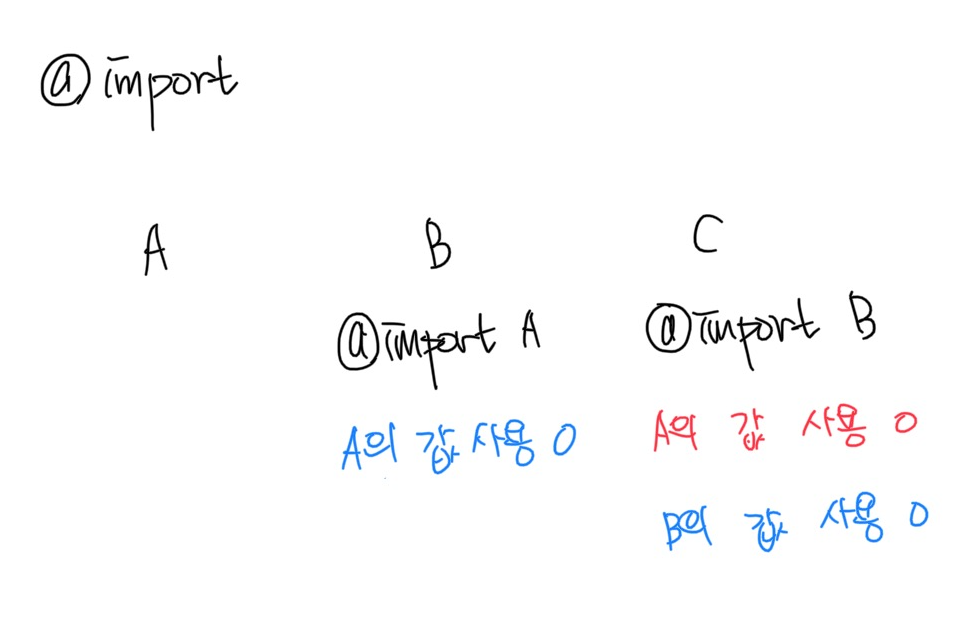

# 2022/07/27

## 오늘 알게된 내용

### `@import` vs `@use` vs `@forward`

1. `@import`

   

- `@import`로 가져온 변수(mixin, function 포함) 현재파일이 덮어쓴다.
- 이는 여러 파일에 `@import`될 경우 변수가 중복적으로 저장, 덮어 씌워질 위험이 있다.
- 사용안하는 것을 권장
- 이를 위해서 나온 것이 `@use,` `@forward` 이다.

2. `@use`

   

- `@use`로 가져온 값을 사용하지만 저장하진 않는다
- 해당 파일 안에서만 유효하다
- `@use "variable"` 입력 후 변수 사용하면 name space 설정해야함 (객체처럼)
  - `$w` 로 변수 설정해놓았다면 `var.$w` 와 같이 작성하여 사용해야함
- 일일이 `var.` 붙이기 귀찮아짐
  ⇒ `@use “variable” as *` 와 같이 입력하면 그냥 변수만 작성해도 된다.
- @use의 순서도 중요하다
- 다음과 같이 사용 (utils에 있는 파일들을 사용하겠다는 의미)
  ```scss
  @use "./../utils" as *;
  ```

3. `@forward`

  

- `@forward`를 사용하면 값은 덮어쓰지만 사용은 할 수 없다.
  - 만약 사용하고 싶으면 `@use`를 사용하면 된다.
- `@forward`를 가지고 있는 파일을 다른 곳에서 `@use`할 경우 `@forward` 값들을 모두 사용할 수 있다.
- 다음과 같이 사용

  ```scss
  @forward "./a11y";
  @forward "./color";
  @forward "./variable";
  @forward "./media-query";
  @forward "./flexbox";
  @forward "./unit";
  @forward "./mixin";
  @forward "./sprites";
  ```

- 보통 같은 폴더의 \_index.scss 파일에 `@forward`로 묶고 다른 곳에서 값을 가져올 때 `@use`로 \_index.scss 파일을 가져온다
  

### sass의 꽃 `@mixin`

- 재사용을 위한 코드 조각
- 자주 사용하는 것을 `@mixin 변수명` 으로 만들고 `@include 변수명` 으로 사용
- `@media` 의 연산기호 사용할 경우엔 ()로 구분
  - `($break-1)` ❌
  - `($break -1)` ❌
  - `($break - 1)` ⭕️
- `@media` 의 경우 내부에 코드를 작성해야 하니 내부에 `@content` 를 넣어야 한다
- 설정예시

  ```scss
  $break: 768px;

  @mixin mobile {
    @media (max-width: ($break - 1)) {
      @content;
    }
  }

  @mixin desktop {
    @media (min-width: $break) {
      @content;
    }
  }
  ```

- 선택자 안에 `@media` 를 작성해야 component 단위로 유지보수하기 좋다.
  - 나쁜 사용예시
  ```css
  @include mobile {
  	.appFooter{
  		background: yellow;
  }
  @include desktop {
  	.appFooter{
  		background: skyblue;
  }
  ```
  - 좋은 사용예시
  ```scss
  .appFooter {
    @include mobile {
      background: yellow;
    }
    @include desktop {
      background: skyblue;
    }
  }
  ```

### sass의 map형식

- map형식으로 작성할 순 있지만 map의 function을 사용하기 위해서는 `@use "sass:map"` 작성 필수!!

  ```scss
  @use "sass:map";

  $breakpoints: (
    sm: 576px,
    md: 768px,
    lg: 992px,
    xl: 1200px,
    xxl: 1400px,
  );
  ```

- 입력한 map에 해당 키 값이 있는지 확인
  `map.has-key(map-name, key)` : map-name에 key값이 있는지 확인
- 해당 값 가져오기
  `map.get(map-name, key)` : map-name의 key값의 value 값을 가져온다
  ```scss
  @mixin respond-from($breakpoint) {
    // 만약 breakpoints에 $breakpoint가 존재한다면
    @if map.has-key($breakpoints, $breakpoint) {
      // breakpoints의 breakpoint의 value값을 가져와서 $breakpoint-value 값에 넣는다
      $breakpoint-value: map.get($breakpoints, $breakpoint);
      // $breakpoint-value 값을 min-width 값에 넣는다. (반응형)
      @media (min-width: $breakpoint-value) {
        @content;
      }
    } @else {
      @error errorMessage($breakpoint);
    }
  }
  ```

### sass의 @each 구문

- 작성하면 바로 css에 적용된다.
- 작성 예시

  ```scss
  $colors: (
    "Book": var.$green,
    "News": var.$yellow,
    "Board": var.$brown,
    "Favorite": var.$orange,
    "Twitter": var.$blue,
  );

  @each $color, $color-value in $colors {
    .accent#{$color} {
      color: $color-value;
    }
  }
  ```

- 예시 결과

  ```css
  .accentBook {
    color: #abd375;
  }

  .accentNews {
    color: #e8ca58;
  }

  .accentBoard {
    color: #988574;
  }

  .accentFavorite {
    color: #eea60a;
  }

  .accentTwitter {
    color: #6aaee6;
  }
  ```

### @at-root

- 선택자 앞에 선언하면 부모요소와의 중첩관계에 상관없이 전역으로 스타일링을 관리할 수 있다.
- 하지만 너무 남용하는 것은 가독성에 좋지 않아 지양해야 하고, 중첩 구조가 복잡해서 헷갈릴 때 사용하는 것이 좋다

## 헷갈리는 부분

- sass의 곱하기 나누기 부분.
  [Numeric Operators](https://sass-lang.com/documentation/operators/numeric)

## 오늘 풀어본 알고리즘 문제

- leetcode
  [2351. First Letter to Appear Twice](https://github.com/SleeplessN/problem-solving/blob/main/leetcode/2351.%20First%20Letter%20to%20Appear%20Twice.js)
  [283. Move Zeroes](https://github.com/SleeplessN/problem-solving/blob/main/leetcode/283.%20Move%20Zeroes.js)
  [315. Count of Smaller Numbers After Self](https://github.com/SleeplessN/problem-solving/blob/main/leetcode/315.%20Count%20of%20Smaller%20Numbers%20After%20Self.js)

## 느낀점

css만을 사용하였을 경우에는 반응형까지 구현하면 한 파일이 너무 길어서 검색을 하더라도 찾기가 어려웠다. 하지만 폴더 구조를 잘 잡고, sass를 사용하였을 경우에는 component 단위로 파일만 찾으면 되기 때문에 유지보수 부분에서도 더 좋다고 느껴졌다. 하지만 실습을하며 아직까지도 CSS부분에서 부족함을 느꼈고, 이를 보완해야 그만큼 sass나 Postcss를 잘 사용할 수 있을 거란 생각이 들었다.

## 참고사항

[Sass 믹스인 라이브러리](https://yamoo9.gitbook.io/scss-mixins/)

프로젝트 때 사용해보면 좋을 것 같고, 그 프로젝트 만의 @mixin을 잘 만드는 것이 중요하다!
