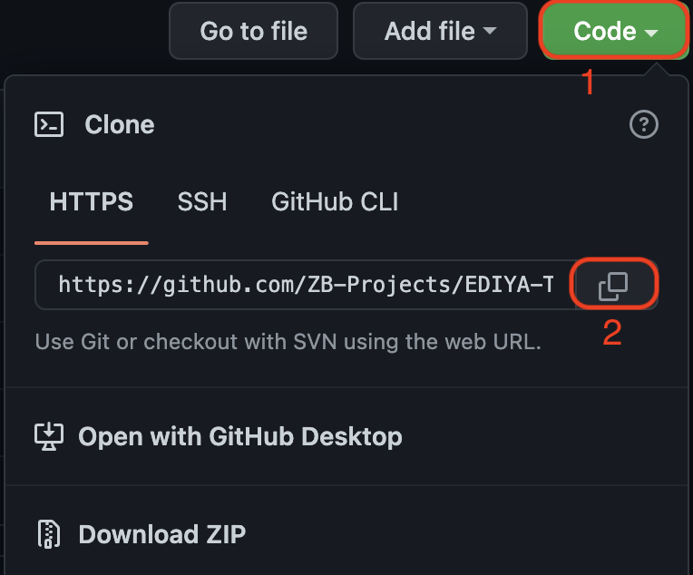

# 2022/07/28

## 오늘 알게된 내용

- 프로젝트 관련 git 사용법

  - git clone

    

    ```
    git clone <위의 복사한 주소>
    ```

    - git branch

      - 브랜치(branch)란 여러 개발자들이 동시에 다양한 작업을 할 수 있게 만들어 주는 기능
      - 각자 독립적인 작업 영역(저장소) 안에서 마음대로 소스코드를 변경할 수 있다.

      1. 브런치 생성

         ```
         git branch <new-branch-name>
         ```

      2. 브런치 이동

         ```
         git switch <branch-name>
         ```

         > `checkout` ?

      3. 브랜치 이동 ⇒ `switch`
      4. 작업 중인 트리의 파일을 복원 ⇒ `restore`
         으로 명령이 분리 되었다
         >

    - 본인의 브런치(branch)로 이동한 상태에서 작업을 시작하고 평소처럼 `git add` ⇒ `git commit` ⇒ `git push` 하면 된다.
    - 최종적으로 github 해당 organization에 들어가서 다음 버튼을 눌러주면 된다.
      

    - 가져오기 할 경우 `git switch main` 으로 main으로 돌아와서 `git pull`을 하면 된다.
    - 다시 작업할 때는 나의 브랜치로 이동하는 것을 잊어버리면 안된다!

- svg viewer
  - 오늘 svg 파일을 사용할 일이 많았는데 svg 파일은 코드로 이루어져있길래 필요한 이미지를 찾기가 어려웠다.
  - 처음에는 하나하나 다 입력해보며 원하는 이미지를 찾았고, 다음에 내가 만들 경우에는 파일 이름을 잘 작성하여 쉽게 찾으면 된다고 생각했다.
  - 하지만, 추가적으로 검색을 해보니 svg 뷰어 익스텐션이 존재했다!
    [svg viewer](https://github.com/tibold/svg-explorer-extension/releases)

## 부족한 부분

- git 사용법
- sass 활용 부족
- 파일 구조 만들기

## 느낀점

- 오늘은 EDIYA 실습 프로젝트가 나와서 어제 저녁부터 시작을 하였다. 먼저 같은 내용의 구조를 짜더라도 사람마다 생각이 다르다는 점에서 ‘아 저렇게도 생각할 수 있구나'라고 생각의 범위를 넓힐 수 있는 기회였다. 하지만 맞춰가는 것도 중요하지만 나의 의견을 납득시키는 것도 중요하다고 느껴졌다.
- git은 아직도 어렵다고 느껴졌다. 사실 EDIYA 들어가기전 git 설정하는데만 1시간 넘게 걸린 것 같고, 덕분에 다음 프로젝트부터는 이 시간을 줄일 수 있다고 생각됐다.
- sass 관련 실습이 였지만 sass `@mixin`을 많이 활용하지 못한 것 같아 아쉬웠다.

## 참고사항

- figma tailwind
- svg viewer
