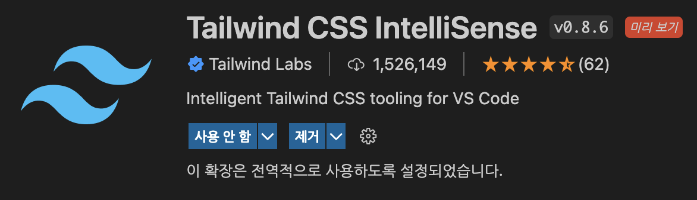

# 2022/07/29

## 오늘 알게된 내용

## tailwindcss

- 기본 컬러 이름 앞부분 소문자(ex.red)이기 때문에 이름 만들 때 앞을 대문자(ex.Red)로 해주는 것이 좋다.
- 그룹 컬러로 셋팅해주는 것이 좋다 (ex. Red-100 , Red-200 … )
- 필요한 부분을 export한 theme.js를 루트 폴더의 module.exports에 넣어주어야 한다.
- 디자인 할 때 커스텀으로 중단점(breakpoint)를 잡아주면 좋다. (반응형 디자인)
- tailwind는 정해진 규격으로만 만들 수 있는데 jit모드라는 것이 있지만 성능이 좋지 않은 편이다.
- 색맹 테스트 프로그램 ⇒ color oracle

### tailwind 시작하기

1. 폴더구조 생성
2. 패키지 다운

   ```jsx
   // tailwind 사용하기 위함
   npm install -D tailwindcss@latest postcss@latest autoprefixer@latest

   // 기타 라이브 서버, watch와 라이브 서버 병렬 실행, postcss
   npm i -D live-server npm-run-all postcss-cli@latest
   ```

3. `tailwind.config.js` , `postcss.config.js` 파일 생성

   ```jsx
   npx tailwindcss init -p
   ```

   3-1 `tailwind.config.js` 파일 내용

   content 괄호 안에 다음과 같이 `"./src/**/*.{html,js}"` 추가

   ```json
   /** @type {import('tailwindcss').Config} */
   module.exports = {
     content: ["./src/**/*.{html,js}"],
     theme: {
       extend: {},
     },
     plugins: [],
   };
   ```

4. package.json에 명령어 설정

   ```json
   "scripts": {
     "start": "run-p server watch",
     "tailwindcss": "tailwindcss -i ./src/css/input.css -o ./src/css/output.css",
     "watch": "npm run tailwindcss -- --watch",
     "server": "live-server ./src/"
   },
   ```

   - tailwindcss 사용시 input.css를 output.css로 변환

5. input.css 파일

   ```css
   @tailwind base;
   @tailwind components;
   @tailwind utilities;
   ```

6. VSCode Extenstion 설치

   

   6-1 extension 깔았다고 적용되는 것이 아닌, `setting.json`에 다음을 입력해주어야 한다.
   

   ```json
   "files.associations": {
     "*.css": "tailwindcss"
   }
   "editor.quickSuggestions": {
     "strings": true
   },
   "tailwindCSS.includeLanguages": {
     "plaintext": "html"
   }
   ```

### tailwindcss 실습

```jsx
<picture>
  <!-- 운영체제 테마 전환 모드 -->
  <source srcset="./images/fastcampus-logo-dark.png"
          media="(prefers-color-scheme: dark)" />
  <source srcset="./images/fastcampus-logo.png"
          media="(prefers-color-scheme: light)" />
  <!-- 커스텀 테마 전환 모드 -->
  
</picture>
```

- media 옵션(`prefers-color-scheme`) 으로 라이트모드, 다크모드 감지도 가능하다
- `picture` 태그의 경우 `img` 태그가 필수이다 (source 태그를 지원하지 않을 경우)

- `w-[200px]` 속성값으로 들어가기 때문에 대괄호 안에 작성한다

     

- `@apply` 적용

  - @mixin 처럼 자주 사용하는 스타일 모음을 작성하고 사용할 수 있다

  ```css
  .input {
    @apply w-full border rounded-md border-gray5 p-4 outline-none dark:text-black;
  }
  ```

  ```html
  <!-- @apply 적용 전 -->
  <input
    id="userId"
    name="userId"
    type="text"
    placeholder="아이디"
    required
    class="w-full border rounded-md border-gray5 p-4 outline-none dark:text-black"
  />

  <!-- @apply 적용 후-->
  <input
    id="userId"
    name="userId"
    type="text"
    placeholder="아이디"
    required
    class="input"
  />
  ```

## 부족한 부분

- 오늘 EDIYA 내가 맡은 뉴스 부분을 마무리 하면서, 내가 원하는 코드를 바로바로 찾지 못하는 것을 보니 아직까지도 코드가 정갈하지 않다고 느껴졌다.
- EDIYA 프로젝트에 너무 각자의 부분에만 집중해서 소통 부분이 아쉬웠다.

## 느낀점

- tailwindcss의 Utility-First 방식을 사용하니 클래스명을 지을 필요가 없고, 클래스명을 확인하면서 CSS코드를 짤 필요가 없어서 편리하다고 느껴졌다. 하지만 HTML 태그 안에 클래스명을 줄줄이 적다보니 코드가 이쁘지 않았으며, 이렇게 클래스 명으로 스타일링을 한다면 Javascript의 선택자 부분은 어떻게 되는지 또 궁금해졌다.
- EDIYA 프로젝트에서 각자의 부분을 맡아 진행을 하였는데, 주어진 시간이 한정되었다보니 너무 각자의 부분을 완성시키는데에만 몰두하느라 소통 부분에서 아쉬웠다. 각자 맡은 부분에서 디테일 말고 대략적인 레이아웃만 잡고 서로간에 코드리뷰를 더 했으면 좋지 않을까 생각이 들었다.
