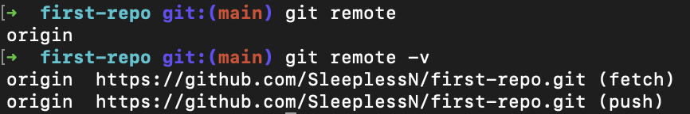

# 2022/08/01

## 오늘 알게된 내용

## 터미널

- [https://github.com/ulgoon/connect-to-git](https://github.com/ulgoon/connect-to-git)
- Shell : kennel과 사용자를 이어주는 소프트웨어
- 터미널에서 특수문자가 보이면 사용자의 명령을 받을 준비가 되었다는 뜻
- `~` (틸드) : 현재 유저가 권한 없이 사용할 수 있는 최상위 폴더
- 명령어
  - `.` : 현재 디렉토리
  - `pwd`(print working directory) : 나의 현재 작업중인 디렉토리
  - `ls`(list segment) : 현재 디렉토리 내의 디렉토리 출력
  - `ls -a` : 숨김파일까지 출력 (`-` : option flag) (파일 이름 앞에 `.` 붙이면 숨김파일 처리)
  - `ls -l` : 한줄로 상세정보 출력 (line by line)
  - `ls -al`: 숨김파일까지 상세정보 출력
  - `cd <폴더명>` (change directory) : 해당 폴더로 이동
  - `mkdir <폴더명>` : 폴더 생성
  - `touch <파일명>` : 파일 생성
  - `mv <파일명> <폴더명>` : 폴더로 파일을 옮기기
    ```json
    // index.html을 static 파일로 "옮기기"
    mv index.html static
    // 상위 폴더에 있는 style.css, main.js를 .(현재디렉토리)로 "가져오기"
    mv ../style.css .
    mv ../main.js .
    ```
  - `cp <파일명> <폴더명>` : 해당 폴더에 파일 사본 생성
    ```json
    // 상위 폴더에 index.html 사본 생성
    cp index.html ..
    // hello.txt를 현재 폴더에 hello-copy.txt라는 이름으로 사본 생성
    cp hello.txt hello-copy.txt
    // hello.txt를 static 폴더에 bye.txt라는 이름으로 사본 생성
    cp hello.txt static/bye.txt
    ```
  - `rm <파일명>` : 파일명 삭제 (`*` : 와일드 카드)
    ```json
    // 현재 폴더의 bye.txt를 삭제
    rm bye.txt
    // server의 이름을 가진 파일 모두 삭제
    rm server.*
    // .txt의 확장자를 가진 파일 모두 삭제
    rm *.txt
    // static 폴더 삭제
    rm -r static
    ```
  - `mv <파일명> <파일명>` : 이름 변경
    ```json
    // index.html을 navbar.html로 이름 변경
    mv index.html navbar.html
    ```

## Markdown

- 문단 나눌 때는 enter 두번
- 코드 작성시 backquote 세번에 해당 언어 이름 작성하면 그에 맞는 syntax로

  ````json
  ```javascript
  console.log('hello')
  ````

- 이미지
  ```json
  
  ```
- 링크
  ```json
  [link text](hypertext ref)
  ```
- 테이블
  ```json
  |No|Name|
  |:--:|:--:|
  |1|John Doe|
  |2|Jane Doe|
  |3|Lorem ipsum|
  ```
- 추가적으로 다음과 같이 HTML과 CSS 사용가능 (script는 보안상의 이유로 안된다)

  ```json
  <style>
  .little-container{
    width: 200px;
    height: 200px;
    background-color: #ff0000;
  }
  </style>

  <div class="little-container">

  </div>
  ```

- 나갈 때 `:q` 치면 되지만 `:w` 로 저장하고 나가야 한다. 만약 저장안하고 나가고 싶으면 `:q!` 를 치면된다.
  처음할 때 하는 실수) 저장 안하고 터미널을 닫아버리면 저장 안한 기록이 남아서 들어올 때 마다 물어본다.
- 추가적인 Vim command
  ```json
  h j k l - left, down, up, right
  i - insert mode
  v - visual mode
  ESC - back to normal mode
  d - delete
  dd - delete a line
  y - yank
  yy - yank a line
  p - paste
  u - undo
  a - append
  A - append from end of line
  o - open line(under)
  O - open line(upper)
  H - move to the top of the screen
  L - move to the bottom of the screen
  :q - quit
  :q! - quit discarding all changes
  :w - write
  :wq - write and quit
  :{number} - jump to {number}th line.
  ```

## Git

- 특징
  - 빠른 속도, 단순한 구조
  - 분산형 저장소 지원
  - 비선형적 개발(수천개의 브랜치) 가능
- 장점
  - 효율적인 개발 (변경 이력이 많더라도 변경된 내용만 처리)
  - 수정 내용 commit 단위로 관리하여 배포 뿐만 아니라 원하는 시점으로 Checkout 가능
  - Branch로 개발하여 분산적인 개발이 가능하고 나중에 Merge하여 반영할 수 있다.
  - 인터넷이 연결되지 않아도 개발할 수 있음
- git object
  - Blob: 파일 하나의 내용에 대한 정보
  - Tree: blob나 subtree의 메타데이터(디렉토리 위치, 속성, 이름 등)
  - Commit: 커밋 순간의 스냅샷 (blob + tree)

### git clone

- `git clone <repository url>`

- origin

  

- 푸쉬 막기 (고전적인 방법)
  ```json
  git remote add upstream <url>
  git remote set-url upsetream —push no-push
  ```

### git commit

- 개발 작업 단위를 구분하기 위해서 staging area 존재 (git add)
  - 이미 알고 있던 파일 : modified로 나옴 / 새로 추가한 파일 : untracked(추적하지 않는 파일) 이라고 뜸
- 수정한 순서(시간 순서)대로 add하여 commit 하는 것이 일반적이다.
- commit 작성 유의할 점

  - commit **제목은 간결**하게 , **추가적인 내용은 Description에 작성**하도록 한다.
  - **prefix는 꼭 작성**해 준다. (코딩 컨벤션)
  - **영어로 작성**하도록 한다.
  - 다른 사람이 봐도 이해할 수 있도록 작성하도록 한다.

- README.md 작성 유의할 점 (README.md도 컨벤션이 존재한다)
  - 처음에 어떤 프로젝트인지 한 줄로 표현해 주어야 한다.

### .gitignore

- git이 파일을 추적할 때, 원하지 않는 파일을 추적하지 않도록 명시하도록 작성
- [toptal.com/developers/gitignore/](http://toptal.com/developers/gitignore/)

  

  - 올라가기 원하지 않는 키워드 작성 후(1) 생성된 파일(2) 내용 복사 후 .gitignore 파일에 붙여넣기
  - .gitignore 커밋은 `conf:` 로 시작한다

### LICENSE

- License는 내가 오픈 프로젝트를 만들때나, 배포할 때 가장 신경써야 하는 일 중 하나이다.
- MIT License는 신경 쓰지 않아도 된다. (저작권에 자유롭다)
- MIT License를 사용하다 GPL License이 적용된 소스코드 사용하면 GPL License로 전환된다 (비용을 지불해야한다) GPL을 가장 조심해야한다!

## Git blog

- [hexo](https://hexo.io/ko/)를 사용한다

### Hexo

1. 설치

   ```json
   $ npm install -g hexo-cli
   ```

   - 권한이 없다고 ERR가 뜨는 경우 앞에 `sudo`를 붙여주도록 한다

2. 초기 설정

   ```json
   $ hexo init <폴더명>

   // 예시) hexo init blog
   ```

   - 작성한 폴더명을 초기화 하여 시작한다 (해당 폴더가 없으면 생성된다)

3. 새 글 생성

   ```json
   $ hexo new [layout] <title>

   // 예시) hexo new post "My new hexo blog"
   ```

   3-1 글 수정

   ```json
   $ vi source/_posts/My-new-hexo-blog.md
   ```

   3-2 적용 (html 등 각종 파일이 만들어진다)

   ```json
   $ hexo generate
   ```

4. 라이브 서버 보기

   ```json
   $ hexo server
   ```

5. deploy 설정

   ```json
   // 설치
   $ npm install hexo-deployer-git --save
   // 적용
   $ vi _config.yml 수정 => $ hexo clean && hexo generate
   // 마무리
   $ hexo deploy
   ```

   - 적용 부분(`vi .config.yml`) - 제일 마지막 줄

     ```json
     deploy:
       type: git
       repo: <repository url> # https://bitbucket.org/JohnSmith/johnsmith.bitbucket.io
       branch: [branch]
       message: [message]

     // 다음과 같이 작성 (제일 마지막 줄)
     # Deployment
     ## Docs: https://hexo.io/docs/one-command-deployment
     deploy:
       type: git
       repo: https://github.com/SleeplessN/SleeplessN.github.io.git
       branch: main
     ```

       

### 설정이 끝난 후 블로그 글 작성

1. 파일 생성 : `hexo new post <글 제목>`
2. 파일 내용 수정 : `vi source/_posts/<글 제목>.md`
3. 해당 html 생성: `hexo clean && hexo generate`
4. 블로그에 배포 : `hexo deploy`

### 추가) 테마 바꾸기

[헥소 페이지의 Themes](https://hexo.io/themes/)로 들어가서 원하는 테마 선택 후 Docs로 들어간다

NEXT의 경우

- 설치 : `npm install hexo-theme-next`
- 적용 : `vi _config.yml` ⇒ 100번째 줄(:100)을 `theme : next` 로 바꿔준다
- 마지막으로, `hexo clean && hexo generate`

## 부족한 부분

- CLI 환경

## 느낀점

- 평소 commit을 영어로 작성하고 신경써서 작성하고 있다고 생각했지만, 오늘 git 강의를 듣고나니 사실 **나만을 위한** commit이 아니였나 생각이 들었다. 예를 들면, commit convention에서 prefix 부분이나, 자세한 내용은 Description에 작성하는 부분에서 그러한 점이 느껴졌다. 앞으로 팀 단위로 프로젝트를 할 일이 많을텐데 commit 작성에 있어서 오늘 느꼈던 부족한 부분을 채워나가야겠다.
- 평소 tistory나 velog보다는 git 블로그를 만들고 싶었던 나에게 오늘 git blog 강의는 매우 유익했다. 이제 나만의 블로그가 생기니 TIL도 매일 작성하고, 일주일에 한 가지씩 주제를 정해서 작성해나가야겠다.

## 참고사항

- [Hexo 사이트](https://hexo.io/ko/) / [Hexo Themes](https://hexo.io/themes/)
