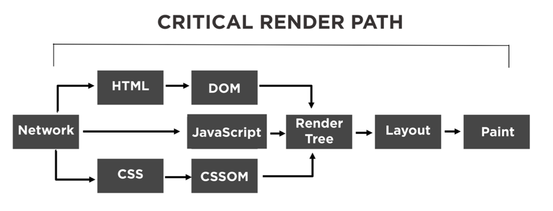

# 2022/08/02

## 오늘 알게된 내용

### 브라우저 렌더링

- 네트워크로 받은 HTML을 한 줄 한 줄 읽는다. (HTML Parsing)
- 파싱하다 css `<link>` 태그와 `<script>` 태그를 만났을 시 파싱을 멈추고 css, javascript 를 다운받고 읽는다.
- 읽은 내용으로부터 HTML → DOM / CSS → CSSOM 을 형성
- DOM, CSSOM 으로부터 Render Tree 생성
- Render Tree 부터 위치, 크기로 화면의 Layout을 형성
- 마지막으로 글, 그림 등으로 레이아웃의 화면을 그린다.

### SPA vs MPA

1. **MPA (Multi Page Application)**

- 여러 페이지로 구성된 웹 어플리케이션
- 사용자의 클릭과 같이 인터렉션이 발생할 때마다 서버로부터 새로운 html을 받아와서 해당 링크로 이동하여 페이지 전체를 새로 렌더링하는 전통적인 웹 페이지 구성 방식이다.

2. **SPA (Single Page Application)**

- 하나의 페이지로 구성된 웹 어플리케이션
- 브라우저에 최초에 한번 페이지 전체를 로드하고, 이후부터는 특정 부분만 Ajax를 통해 데이터를 바인딩하는 방식이다.
- 단일 페이지 어플리케이션(SPA)는 현재 웹개발의 트랜드로 볼 수 있고, 우리가 배운 react와 vue, 앵귤러와 같은 자바스크립트 프레임워크등이 spa의 방식을 가지고 있다.

    

### SSR vs CSR

1. **SSR (Single Side Rendering)**

- **서버로부터 완전하게 만들어진 html 파일을 받아와 페이지 전체를 렌더링 하는 방식**
- 서버는 화면에 표시하는데 필요한 데이터를 얻어와 모두 삽입하고 css 까지 모두 적용해서 렌더링 준비를 마친 HTML과 JS코드를 브라우저에 응답으로 전달한다

    

- 해당 페이지 필요한 부분의 파일만 받아오기 때문에, 첫 페이지 로딩이 빠르다. 하지만 나머지 페이지 경우에도 계속해서 필요한 부분의 파일을 받고 렌더링해야 하므로 느린 편이다.
- 사용권장
  - 네트워크가 느릴 때
  - SEO(serach engine optimization : 검색 엔진 최적화)가 필요할 때
  - 최초 로딩이 빨라야하는 사이트를 개발 할 때
  - 메인 스크립트가 크고 로딩이 매우 느릴 때CSR은 메인스크립트가 로딩이 끝나면 API로 데이터 요청을 보낸다. 하지만 SSR은 한번의 요청에 아예 렌더가 가능한 페이지가 돌아온다.
  - 웹 사이트가 상호작용이 별로 없을 때

2. **CSR (Client Side Rendering)**

- **클라이언트 사이드 렌더링 이란 사용자의 요청에 따라 필요한 부분만 응답 받아 렌더링 하는 방식**
- **클라이언트에서 초기화면을 로드하기 위해 서버에 요청을 보낸다**
  ⇒그럼 **서버 는 화면에 표시하는 데 필요한 완전한 리소스의 응답**한다.
  
- 서버로부터 모든 파일을 받아오기 때문에 첫 페이지 로딩 속도는 느린 편이지만, 이미 모든 파일을 받았기 때문에 나머지 페이지 로딩 속도는 빠르다.
- 사용권장
  - 네트워크가 빠를 때
  - 서버의 성능이 좋지 않을 때
  - 사용자에게 보여줘야 하는 데이터의 양이 많을 때
  - 메인 스크립트가 가벼울 때
  - SEO 관심 없을 때
  - 웹 어플리케이션에 사용자와 상호작용할 것들이 많을 때

3. 장 단점 비교

   |                         | SSR    | CSR    |
   | ----------------------- | ------ | ------ |
   | 첫 페이지 로딩 속도     | 빠르다 | 느리다 |
   | 나머지 페이지 로딩 속도 | 느리다 | 빠르다 |
   | SEO                     | 좋다   | 안좋다 |
   | 서버 자원               | 많다   | 적다   |

## 부족한 부분

- **Web Vitals** 부분이 제대로 기억나지 않았고, 설명하지 못했다.
- **Javascript 부분 이론이 부족**하다

## 느낀점

- 평소 모른다는 이유로 프론트엔드 면접 관련 질문에 대해 나도 모르게 멀리하고 있었는데, 이번 기술 면접을 통해서 싹 훑어볼 수 있어서 좋았다.
- 물론 디테일하진 않았지만…. 어떠한 부분을 위주로 공부해야하는지 알 수 있었던 좋은 기회였던 것 같다.
- 확실히 모르는 문제에 대해서는 자신감이 없었고, 아는 내용은 나름대로 말한 것 같다. 확실히 Javascript 부분은 약하다고 느껴졌다.
- 아무래도 정확히 몰라서 자신감이 없는 경향이 없지 않은데 정확히 알면 그만큼 자신감이 생길것 같다. 열심히 한다면 이는 충분히 채워질 것 같다.

## 참고사항

- [Web vitals](https://web.dev/i18n/ko/vitals/)
- [Javascript Closure](https://developer.mozilla.org/ko/docs/Web/JavaScript/Closures)
