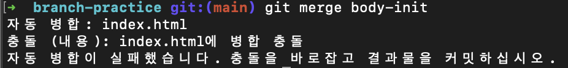

# 2022/08/03

## 오늘 알게된 내용

## branch

- 분기점을 생성하여 독립적으로 코드를 변경할 수 있도록 도와주는 모델

### 명령어

- git branch 목록 보기

  ```
  // branch 목록 보기
  $ git branch
  // remote branch 보기
  $ git branch -r
  // branch 전체 보기
  $ git branch -a
  ```

  - HEAD → 가장 최근의 상태

- git branch 생성
  ```
  $ git branch <branch name>
  ```
- git branch 변경
  ```
  $ git switch <branch name>
  ```
  - checkout 명령어도 있지만 switch를 사용하도록 한다.
- git 병합

  ```
  // 다시 main으로 돌아와서
  $ git switch main
  // 병합
  $ git merge <병합하려는 branch name>
  ```

- git branch 삭제
  - 병합 후에는 삭제 해주어야 한다
  ```
  $ git branch -D <branch name>
  ```
- 파일 작성 기록 (해당 줄을 누가 작성한지 다 나온다)
  ```
  $ git blame <파일명>
  ```
- `$ git status -uall` : 세부항목까지 알려준다

### merge-conflict 해결 (main branch에서 head부분을, body-init branch에서 body부분을 작업)

- merge 하기
  
- git status를 확인해 보면 다음과 같이 양쪽에서 수정되었다고 나온다
  

- 이를 해결하기 위해서는 저 파일을 확인해야 한다 (`$ vi index.html`)
  

- 필요한 부분 필요없는 부분 삭제 하고 저장
- 똑같이 add ⇒ commit (이 경우 제목이 작성되어 있다.)
  

- 수정된 사항 push (첫 브랜치 push에는 upstream 을 붙여 주어야 한다)
  ```
  $ git push -u origin <branch 이름>
  ```

## git flow


### branching models

1. git flow (가장 많이 사용)

   (hotfix) - `master` - (release) - `develop` - feature

2. github flow

   `master` - feature

3. gitlab flow

### git flow

1. `git flow init`
2. `git flow feature start <feature name>`
3. feature에서 작업 후 `git add`, `git commit` 작성
4. `git flow feature finish <feature name>`

   <<<<feature 가 여러 번이면 2~4 항목 반복>>>>

5. git flow release start `<version name>`
6. 작업 할 것이 있으면 작업
7. `git flow release finish <version name>`
8. `git push -u origin develop` (처음 push 하는 경우에만 upstream 붙이기)
9. main branch로 돌아가서 (`git switch main`) ⇒ `git push origin main`
10. `git push —tags` (태그도 푸쉬해 주어야 한다.)

### git flow 협업

- 권한을 주는 방법 (안전하지 않음)
- 안전하게 협업 하는 방법 (Fork and Merge)
  - 팀장이나 단체의 repo 사본을 fork 떠서 내 로컬에 클론을 하고 작업
    (클론 한 사본은 자유롭게 push 가능)
  - 이 사본을 요청한다 (pull request)

### 팀장 Part

1. 팀장이 팀 Repository를 생성한다.
2. 팀장 레포지토리 클론 후 `git flow init` (develop branch이 생기면서 이동 됨)
3. develop에서 프로젝트의 큰 맥락의 파일 생성
4. git push -u origin develop으로 리모트 저장소에도 develop 생성(팀원들 Full Request 용도)
5. 팀장의 레포에서 issues 를 활용하여 해야할 일을 리스트업

### 팀원 Part

1. 팀장이 만든 레포지토리 포크를 뜬다 (나에게 사본 레포 추가 copy to main branch only 체크 해제)
2. 포크해온 사본을 나의 로컬에서 클론
3. repository에 다음과 같이 issue 작성

   ```
   ## 설명

   ## 할 일
   - [ ] task1
   - [ ] task2
   ```

4. `git flow init`
5. `git flow feature start <name>` 후 issue 내용에 따라 수행
6. `git flow feature finish <name>`
7. `git push -u origin develop` (사본의 develop 브랜치로) →
8. pull request로 사본의 develop 에서 팀장의 develop으로 요청

   (제목이 릴리즈 태그의 내용으로 들어간다. (커밋 메세지 내부에 resolve #1, fixes #1, close #1) 을 이용해 issues와 연결 가능 )

9. 팀장은 요청 확인 후 리뷰, 리뷰 후 변경 요구가 있을 경우 팀원에게 리뷰에 남긴다.
10. 팀원은 리뷰를 확인하고 해당 요구사항을 develop 브랜치 자체에서 처리 (요구단위로 커밋 남기기)
11. `git push origin develop`으로 변경사항 push (바로 pull request로 반영) 팀장급의 관리 필요
12. 다른 팀원들의 정보를 반영하기 위해 `git remote add upstream [원본의 주소]` 로 원본 등록
13. `git pull upstream develop`으로 원본의 develop 내용으로 업데이트 ( 충돌 해결 후 push )

### 나머지 팀원

- `git remote add upstream <주소>`
- `git pull upstream develop`

## 부족한 부분

- git flow(fork and merge) 순서 미숙

## 느낀점

- git flow 과정이 처음에는 그냥 피곤한 작업이라 생각했었는데, 실제로 배우고 실습([실습 주소](https://github.com/jiseung-kang/PigGame/tree/develop)) 해보니 왜 이러한 과정이 필요한지 알 수 있었다. 실습해보니 내가 어느정도 이해한지 느껴지는데 계속해서 사용해보며 익숙해지도록 노력해야겠다.

## 참고사항

- [https://web.dev/](https://web.dev/)
