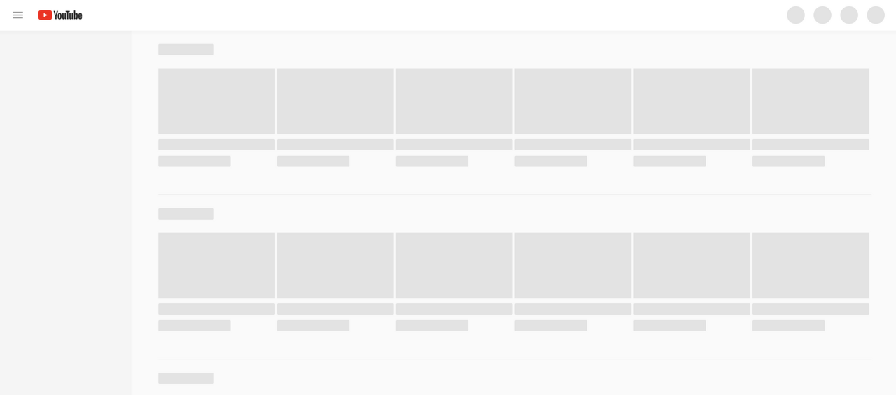

# 2022/08/04

## 오늘 공부한 내용

### Mutex vs Semaphore

### **임계 구역(Critical Section)**

- 여러 프로세스가 데이터를 공유하며 수행될 때, 각 프로세스에서 공유 데이터를 접근하는 프로그램 코드 부분
- 공유 데이터를 여러 프로세스가 동시에 접근할 때 잘못된 결과를 만들 수 있기 때문에,
  한 프로세스가 임계 구역을 수행할 때는 다른 프로세스가 접근하지 못하도록 해야 한다.

### **뮤텍스(Mutex)**

- 여러 스레드를 사용하는 환경에서 자원에 대한 접근을 강제하기 위한 동기화 매커니즘
- Boolean 타입의 Lock 변수를 사용한다.
- 공유자원을 사용중인 스레드가 있을 때, 다른 스레드가 공유자원에 접근한다면 Blocking 후 대기 큐로 보낸다.
- Lock을 건 스레드만 Lock을 해제할 수 있다.

### 스핀락(SpinLock)

- 기본적으로 뮤텍스와 유사
- Busy-waiting 하며 대기 큐를 갖지 않는다.
- Mutex-nonblocking 모델로 볼 수 있다.
- CPU를 낭비한다.
- 하지만 멀티코어 환경이고, critical section에서의 작업이 컨텍스트 스위칭보다 빨리 끝난다면 Mutex보다 더 좋다

### 세마포어(Sepahore)

- 세마포어 변수를 통해 wait, signal을 관리한다. 세마포어 변수는 0이상의 정수형 변수를 갖는다.
- 계수 세마포어로 사용할 수 있으며, 접근 가능한 공유 자원의 수가 1개일 때는 이진 세마포어로 뮤텍스처럼 사용할 수 있다.
- Lock을 걸지않은 스레드로 Signal을 보내 Lock을 해제할 수 있다.

### 뮤텍스와 세마포어의 차이

- 세마포어 : 공유 자원에 세마포어의 변수만큼의 프로세스(또는 쓰레드)가 접근할 수 있다.
  뮤텍스 : 오직 1개만의 프로세스(또는 쓰레드)만 접근할 수 있다.
- 세마포어 : 현재 수행중인 프로세스가 아닌 다른 프로세스가 세마포어를 해제할 수 있다.
  뮤텍스 : 락(lock)을 획득한 프로세스가 반드시 그 락을 해제해야 한다.

### Skeleton UI

- **스켈레톤 UI는 실제 데이터가 렌더링 되기 전, 보일 화면의 윤곽을 먼저 그려주는 로딩 애니메이션**이다.
- 사용자에게 ‘**어떤 것들이 보여질 것이다**’라고 알려주는 화면의 예고편이라 할 수 있다.
- 장점
  - 로딩이 완료되면 윤곽에 데이터가 대체되어 화면이 부드럽게 전환되기 때문에 체감 로딩 시간이 짧다.
- 단점
  - 새로운 스켈레톤 UI를 적용해야 하므로 시간과 비용이 많이 든다.
- 예시
  - YouTube
    
  - Linked in
    

## 부족한 부분

- javascript 모달 팝업, 캐러셀 만드는 부분

## 느낀점

- HTML/CSS 최종 프로젝트 전 날이라 프로젝트 마무리 및 발표 준비를 하였다. 우리 조는 지금처럼 넷플릭스나 이디야 같이 준비된 시안을 가지고 개선하는 것 보다는, 실제로 완전 **백지 상태에서** 기획부터 시작하는 것을 경험하고 싶었다. 약 일주일간의 한정적인 시간내에서 기획, 구현, 발표까지 진행하려니 쉽진 않았지만 클론코딩이 아닌 실제로 기획부터 시작하는 경험을 가져봤다는 점에서 너무 좋았다.

## 내일 공부할 내용

- 자바스크립트 Deep Dive
