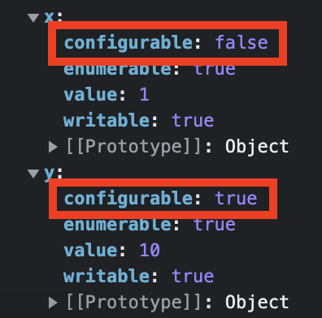

# 2022/08/12

## 오늘 공부한 내용

### 스코프

- 스코프란?
  - 모든 식별자는 자신이 선언된 위치에 의해 다른 코드가 식별자 자신을 참조할 수 있는 유효 범위가 결정되는데 이를 스코프라 한다 (식별자가 유효한 범위)
  - 식별자를 검색할 때 사용되는 규칙
  - 스코프는 네임스페이스다
    ```jsx
    function add(x, y) {
      console.log(x, y); // 2,5
      return x + y;
    }

    add(2, 5);

    console.log(x, y); // ReferenceError
    ```
- 스코프의 종류
  - 전역 스코프
    - 전역에서 선언된 변수는 전역 스코프를 가진다
    - 전역 변수는 어디서든지 참조할 수 있다
  - 지역 스코프
    - 지역에서 선언된 변수는 지역 스코프를 가진다
    - 지역 변수는 자신의 지역 스코프와 하위 지역 스코프에서 유효하다.
- 스코프 체인

  - 스코프가 함수의 중첩에 의해 계층적 구조를 갖는다
    ```jsx
    var x = "global x";
    var y = "global y";

    function outer() {
      var z = "outer's local z";

      console.log(x); // global x
      console.log(y); // global y
      console.log(z); // outer's local z

      function inner() {
        var x = "inner's local x";

        console.log(x); // inner's local x
        console.log(y); // global y
        console.log(z); // outer's local z
      }

      inner();
    }

    outer();

    console.log(x); // global x
    console.log(z); // ReferenceError
    ```
    - `inner 지역 스코프 → outer 지역 스코프 → 전역 스코프`와 같이 스코프가 계층적으로 연결된 것을 스코프 체인이라고 한다.
    - 변수를 참조할 때 자바스크립트 엔진은 스코프 체인을 통해 `변수를 참조하는 코드의 스코프에서 시작하여 상위 스코프 방향으로 이동하며 선언된 변수를 검색`한다
    - 하위 스코프에서는 상위 스코프를 자유롭게 참조할 수 있지만 상위 스코프에서 하위 스코프는 참조할 수 없다.
    ```jsx
    // 전역 함수
    function foo() {
      console.log("global function foo");
    }

    function bar() {
      // 중첩 함수
      function foo() {
        console.log("local function foo");
      }
      foo();
    }

    bar();
    ```

- 함수 레벨 스코프
  - 코드 블록이 아닌 함수에 의해서만 지역 스코프가 생성된다.
  - 코드 블록(함수, if, for, while, try/catch)에 함수의 코드 블록이 포함되는데 var키워드의 경우에는 함수의 코드 블록만을 지역 스코프로 인정한다
  ```jsx
  var x = 1;
  if (true) {
    var x = 10;
  }
  console.log(x); // 10
  ```
  ```jsx
  var i = 10;

  for (var i = 0; i < 5; i++) {
    console.log(i); // 0 1 2 3 4
  }

  console.log(i); // 5
  ```
- 렉시컬 스코프(Lexical scope)
  ```jsx
  var x = 1;

  function foo() {
    var x = 10;
    bar();
  }

  function foo() {
    var x = 5;
    function baz() {
      var x = 10;
      bar();
    }
    foo();
  }

  function bar() {
    console.log(x);
  }

  foo(); // 1
  bar(); // 1
  ```
  1. **함수를 어디서 호출**하였는지에 따라 상위 스코프를 결정
  2. **함수를 어디서 정의**했는지에 따라 함수의 상위 스코프를 결정
  - 1번의 경우 함수가 호출되는 곳에 따라 스코프가 달라지므로 동적 스코프라 한다
  - 2번의 경우 함수가 정의된 곳은 고정이기 때문에 정적 스코프(렉시컬 스코프)라고 한다
  - 자바스크립트의 경우 2번이다.

### 전역 변수의 문제점

- 지역 변수의 생명 주기

  - **변수**는 `선언`에 의해 생성되고 `할당`을 통해 값을 갖는다. 변수는 생성되고 소멸되는 `생명 주기`가 있다.
  - 변수는 자신이 선언된 위치에서 생성되고 소멸한다. 그러므로 전역 변수의 생명 주기는 애플리케이션의 생명 주기와 같다.
  - 함수 내부에서 선언된 지역 변수는 함수가 호출되면 생성되고 함수가 종료하면 소멸된다.
    ```jsx
    function foo() {
      var x = "local";
      console.log(x); // local
      return x;
    }
    foo();
    console.log(x); // ReferenceError: x is not defined
    ```
  - 지역 변수 `x`는 foo 함수가 호출되면서 생성되고, foo 함수가 종료될 때 소멸되어 생명 주기가 종료된다.
  - 즉, 함수 내부에서 선언된 지역 변수의 생명 주기는 함수의 생명 주기와 일치한다.
  - **변수의 생명 주기**
    그 메모리 공간이 **확보**된 시점부터 메모리 공간이 **해제**되어 가용 메모리 풀에 반환되는 시점까지이다.
  - 함수 내부에서 선언된 **지역 변수**는
    - 함수가 생성한 스코프에 등록된다.
      - 함수가 생성한 스코프는 렉시컬 환경이라 부르는 물리적 실체가 있다.
    - **변수는 자신이 등록된 스코프가 소멸(메모리 해제)될 때까지 유효하다.**
      - 할당된 메모리 공간은 더 이상 누구도 참조하지 않을 때 가비지 콜렉터에 의해 해제되어 가용 메모리 풀에 반환된다. (스코프도 마찬가지)
    ```jsx
    var x = "global";

    function foo() {
      console.log(x); // undefined
      var x = "local";
    }
    foo();
    console.log(x); // global
    ```
    > 호이스팅은 스코프를 단위로 동작한다.

- 전역 변수의 생명 주기

  - `전역 변수의 생명 주기 === 전역 객체의 생명 주기`
  - **전역 코드**
    - 명시적인 호출이나 특별한 진입점 없이 곧바로 해석되고 시작된다.
    - 더 이상 행할 문이 없을 때 종료된다.
  - **전역 객체**
    - 코드 실행 이전에 어떤 객체보다 먼저 생성되는 특수한 객체
    - 클라이언트 사이드 환경의 `window`, 서버 사이드 환경의 `global` 객체를 의미한다
    - 표준 빌트인 객체(`Object`, `String`, `Number`, `Function`, `Array` ...)와 환경에 따른 호스트 객체(클라이언트 Web API, Node.js의 호스트 API), var 키워드로 선언한 전역 변수와 전역 함수를 프로퍼티로 갖는다.
    > var 키워드로 선언한 `전역 변수의 생명 주기 === 전역 객체의 생명 주기`
    >
    > - var 키워드로 선언한 전역 변수는 전역 객체 `window`의 프로퍼티이다.
    > - 전역 객체 `window`는 웹페이지를 닫기 전까지 유효하다.
    > - 브라우저 환경에서 var 키워드로 선언한 전역 변수는 웹페이지를 닫을 때까지 유효하다.

- 전역 변수의 문제점
  1. **암묵적 결합**
     - 모든 코드가 전역 변수를 참조하고 변경할 수 있는 **암묵적 결합**을 허용한다.
       - 변수의 유효 범위가 커지면서 코드의 가독성이 나빠진다.
       - 의도치 않게 상태가 변경될 수 있는 위험성도 높아진다.
  2. **긴 생명 주기**
     - 전역 변수는 생명 주기가 길다.
       - 즉, 메모리 리소스를 오랜 시간 소비한다.
     - 특히 var 키워드는 변수의 `중복 선언`을 허용하므로
       - 생명 주기가 긴 전역 변수는 변수 이름이 중복될 수 있고
       - 변수 이름이 중복되면 의도치 않은 재할당이 이뤄진다.
  3. **스코프 체인 상에서 종점에 존재**
     - 변수를 검색할 때 가장 마지막에 검색된다. 즉 검색 속도가 가장 느리다.
  4. **네임스페이스 오염**
     - 자바스크립트는 파일이 분리되어 있어도 하나의 전역 스코프를 공유한다.
       - 다른 파일에서 동일한 이름으로 명명된 전역 변수나 전역 함수가 같은 스코프 내에 존재할 경우 예상치 못한 결과를 가져올 수 있다.
- 전역 변수의 사용을 억제하는 방법
  1. **즉시 실행 함수**

     - 모든 코드를 즉시 실행 함수로 감싸서 모든 변수는 즉시 실행 함수의 지역 변수로 만든다.
     - 선언과 동시에 초기화되므로 플러그인, 라이브러리를 만들 때 많이 사용하며 모듈 패턴의 기반이 되기도 한다.

     ```jsx
     (function () {
     	var foo = 10; // 즉시 실행 함수의 지역 변수
         ...
     }());

     console.log(foo); // ReferenceError: foo is not defined
     ```

  1. **네임스페이스 객체**

     - 전역에 네임스페이스 역할을 담당할 객체를 생성하고, 전역 변수처럼 사용하고 싶은 변수를 프로퍼티로 추가하는 방법
     - 하지만, 이 방법은 식별자 충돌을 방지할 수는 있으나, 어쨌든 결국 네임스페이스 객체 자체는 전역 변수에 할당된다.
       ```jsx
       var MYAPP = {}; // 전역 네임스페이스 객체

       MYAPP.name = "Lee";

       console.log(MYAPP.name); // Lee

       MYAPP.person = {
         name: "Lee",
         address: "Seoul",
       };

       console.log(MYAPP.person.name); // Lee
       ```

  1. **모듈 패턴**
     - 클래스를 모방해서 관련 있는 변수와 함수를 모아 즉시 실행 함수로 감싸 하나의 모듈을 만든다.
     - 모듈 패턴은 자바스크립트의 클로저를 기반으로 동작하며, 전역 변수 억제는 물론 캡슐화까지 구현할 수 있다.
       > 여기서 캡슐화란?
       >
       > `프로퍼티`와 `메서드`를 하나의 틀에 묶는 것
       >
       > `프로퍼티` : 객체의 상태
       >
       > `메서드` : 프로퍼티를 참조하고 조작할 수 있는 동작
     - 자바스크립트는 public, private, protected 등의 접근 제한자를 제공하지 않으므로, 이 모듈 패턴은 네임스페이스의 오염을 막는 기능은 한정적이지만 특정 프러퍼티나 메서드를 감추기 위한 `정**보 은닉`을 구현하기 위해 사용\*\*한다.
       ```jsx
       // 객체를 반환하는 즉시 실행 함수
       var Counter = (function () {
         // private 변수
         var num = 0;

         // 외부로 공개할 데이터나 메서드를 프로퍼티로 추가한 객체(public)
         return {
           increase() {
             return ++num;
           },
           decrease() {
             return --num;
           },
         };
       })();

       // private 변수는 외부로 노출되지 않는다.
       console.log(Counter.num); // undefined

       console.log(Counter.increase()); // 1
       console.log(Counter.increase()); // 2
       console.log(Counter.decrease()); // 1
       console.log(Counter.decrease()); // 0
       ```

1. **ES6 모듈**
   - ES6 모듈은 파일 자체의 독자적인 모듈 스코프를 제공한다.
   - ES6 모듈 내에서 var 키워드로 선언한 변수는 전역 변수도, window 객체의 프로퍼티도 아니다.
   - script 태그에 `type="module"`을 추가하면 파일은 모듈로서 동작하며, 모듈 파일 확장자는 mjs를 권장한다.
     ```jsx
     <script type="module" src="app.mjs></script>
     ```

### let, const 키워드와 블록 레벨 스코프

- var 키워드로 선언한 변수의 문제점
  1. **변수 중복 선언 허용**

     ```jsx
     var x = 1;
     var y = 1;

     var x = 100;
     var y; // 초기화문이 없는 변수 선언문은 무시된다.

     console.log(x); // 100
     console.log(y); // 1
     ```

     - 예제와 같이 초기화문의 유무에 따라 다르게 동작한다.

1. **함수 레벨 스코프**

   - var 키워드로 선언한 변수는 **함수의 코드 블록** 만을 **지역 스코프** 로 인정한다.
   - 즉, 함수 외부에서 var 키워드로 선언한 변수는 코드 블록(조건문, 반복문 등) 내에서 선언해도 모두 전역 변수가 된다.

   ```jsx
   var x = 1;

   if (true) {
     var x = 10;
   }

   console.log(x); // 10

   var i = 10;

   for (var i = 0; i < 5; i++) {
     console.log(i); // 0 1 2 3 4
   }
   console.log(i); // 5
   ```

1. **변수 호이스팅**

   ```jsx
   console.log(foo); // undefined

   foo = 123;

   console.log(foo); // 123

   var foo;
   ```

   - 변수 호이스팅은 프로그램의 흐름상 맞지 않고 가독성을 떨어뜨리며 오류를 발생할 여지를 남긴다.

- let 키워드 (var와의 차이점)
  1. **변수 중복 선언 금지**

     ```jsx
     var foo = 123;
     var foo = 456;

     let bar = 123;
     let bar = 456; // SyntaxError: Identifier 'bar' has already been declared
     ```

1. **블록 레벨 스코프**

   - let 키워드로 선언한 변수는 **모든 코드 블록** (함수, 조건문, 반복문, try/catch 문 등)을 지역 스코프로 인정하는 **블록 레벨 스코프**를 따른다.
     ```jsx
     let foo = 1;
     {
       let foo = 2;
       let bar = 3;
     }
     console.log(foo); // 1
     console.log(bar); // ReferenceError: bar is not defined
     ```

   함수도 코드 블록이므로 스코프를 만든다.

   이 때, 함수 내의 코드 블록은 함수 레벨 스코프에 중첩된다.

   ```jsx
   let i = 10;
   function foo() {
     let i = 100;
     for (let i = 1; i < 3; i++) {
       console.log(i); // 1, 2
     }
     console.log(i); // 100
   }
   foo();
   console.log(i); // 10
   ```

1. **변수 호이스팅**

   - var 키워드와 달리 let 키워드로 선언한 변수는 변수 **호이스팅이 발생하지 않는 것처럼 동작**한다.
   - var 키워드 선언의 경우, **런타임 이전에** 자바스크립트 엔진에 의해 암묵적으로 **선언 단계와 초기화 단계가 진행**되었다.
   - let 키워드로 선언한 변수는 **선언 단계와 초기화 단계가 분리되어 진행**된다.
     - 런타임 이전에 암묵적으로 선언 단계만 먼저 실행되고
     - 초기화 단계는 변수 선언문에 도달했을 때 실행된다.

   > **일시적 사각지대(Temporal Dead Zone, TDZ)**란?
   > \*\*\*\*`스코프의 시작지점 ~ 초기화 시작 지점`까지 변수를 참조할 수 없는 구간
   >
   > ```jsx
   > console.log(foo); // ReferenceError. TDZ
   >
   > let foo;
   > console.log(foo); // undefined
   >
   > foo = 1;
   > console.log(foo); // 1
   > ```
   >
   > 선언단계(`RefErr`) - 일시적 사각지대(TDZ)(`RefErr`) - 초기화 단계(`undefined`) - 할당 단계(`1`)
   >
   > let 키워드로 선언한 변수는 변수 호이스팅이 발생하지 않는 것처럼 보이지만..?
   >
   > ```jsx
   > let foo = 1; // 전역 변수
   > {
   >   console.log(foo); // ReferenceError: TDZ
   >   let foo = 2; // 지역 변수
   > }
   > ```
   >
   > 만약 호이스팅이 일어나지 않는다면 ReferenceError가 아닌 전역 변수 값을 출력했을 것이다.

1. **전역 객체와 let**

   - var 키워드로 선언한 전역 변수와 전역 함수,그리고 선언하지 않은 변수에 값을 할당한 `암묵적 전역`은 **전역 객체 window의 프로퍼티**가 된다.(전역 객체의 프로퍼티를 참조할 때 window를 생략할 수 있다)

   ```jsx
   // 브라우저 환경

   var x = 1;
   y = 2; // 암묵적 전역

   function foo() {}

   console.log(window.x); // 1
   console.log(x); // 1
   console.log(window.y); // 2
   console.log(y); // 2

   console.log(window.foo); // f foo() {}
   console.log(foo); // f foo() {}
   ```

   - let 키워드로 선언한 전역 변수는 전역 객체의 프로퍼티가 아니며 위와 같이 접근할 수 없다.
   - let 전역 변수는 보이지 않는 개념적 블록(전역 렉시컬 환경의 선언적 환경 레코드) 내에 존재하게 된다.

   ```jsx
   //브라우저 환경
   let x = 1;

   console.log(window.x); // undefined
   console.log(x); // 1
   ```

- const 키워드 (let 과의 차이점)
  - const 키워드는 상수를 선언하기 위해 사용한다. 하지만 반드시 상수 만을 위해 사용하지 않는다.
  1. **선언과 초기화**

     - const 키워드로 선언한 변수는 반드시 선언과 동시에 초기화해야 한다

     ```jsx
     const foo; // SyntaxError: Missing initializer in const declaration
     const foo = 1;
     ```

     - const 키워드로 선언한 변수는 let 키워드로 선언한 변수와 마찬가지로 블록 레벨 스코프를 가지며, **변수 호이스팅이 발생하지 않는 것처럼 동작**한다.

     ```jsx
     {
       console.log(foo); // ReferenceError: Cannot access 'foo' before initialization
       const foo = 1;
       console.log(foo); // 1
     }

     // 블록 레벨 스코프를 갖는다
     console.log(foo); // ReferenceError: foo is not defined
     ```

  1. **재할당 금지**
     - var, let 키워드로 선언한 변수는 재할당이 자유로우나 const 키워드로 선언한 변수는 재할당이 금지 된다
       ```jsx
       const foo = 1;
       foo = 2; // TypeError: Assignment to constant variable.
       ```
  1. **상수**
     - const 키워드로 선언한 변수에 원시 값을 할당한 경우 변수 값을 변경할 수 없다.
     - 이러한 특징을 이용해 const 키워드를 상수를 표현하는데 사용하기도 한다
     - 상수도 값을 저장하기 위한 메모리 공간이 필요하므로 **재할당이 금지된 변수**라고 말할 수 있다.
     - 상수는 **상태 유지**와 **가독성**, **유지보수의 편의**를 위해 적극적으로!! 사용해야 한다. 일반적으로 상수는 대문자로 선언하며, `스네이크 케이스`로 표현한다.
       ```jsx
       const TAX_RATE = 0.1;

       let preTaxPrice = 100;

       let afterTaxPrice = preTaxPrice + preTaxPrice * TAX_RATE;

       console.log(afterTaxPrice); // 110
       ```
  1. **const 키워드와 객체**
     - const 키워드로 선언된 변수에 객체를 할당한 경우 값을 변경할 수 있다.
     - 프로퍼티 동적 생성, 삭제, 프로퍼티 값의 변경을 통한 객체 변경이 가능하다.
       ```jsx
       const person = {
         name: "Lee",
       };

       person.name = "Kim";

       console.log(person); // {name: "Kim"}
       ```
       - 이 때, 객체가 변경되더라도 변수에 할당된 참조 값은 변경되지 않는다.
- **var vs let vs const**
  - 변수 선언에는 기본적으로 const를 사용하고 let은 재할당이 필요한 경우 한정적으로 사용하는 것이 좋다.
    - **ES6를 사용한다면 var 키워드는 사용하지 않는다.**
    - 재할당이 필요한 경우에 한정해 let 키워드를 사용하고, 이때 변수의 스코프는 최대한 좁게 만든다.
    - 읽기 전용 원시 값과 객체에는 const 키워드를 사용한다.

## 추가로 알아본 점

```jsx
// 전역변수 x는 호이스팅이 발생한다.
console.log(x); // undefined
// 전역객체의 프로퍼티인 y는 호이스팅이 발생하지 않는다.
console.log(y); // ReferenceError
var x = 10; // 전역 변수

function foo() {
  // 선언하지 않은 식별자에 값을 할당
  y = 20; // window.y = 20;
}
foo();

// 선언하지 않은 식별자 y를 전역에서 참조가능함
console.log(x + y); // 30

console.log(window.x); // 10
console.log(window.y); // 20

delete x; // 전역변수는 삭제되지 않음
delete y; // 프로퍼티는 삭제됨

console.log(window.x); // 10
console.log(window.y); // undefined
```

- var를 붙인 x와 붙이지 않은 y는 값을 할당해 주었을 때 둘 다 window의 프로퍼티로 들어가게 된다
- 그런데 각각을 `delete`를 사용하여 삭제하려고 하였을 때 왜 x는 삭제되지 않는가?
    
    \
    
    - var를 쓴 경우에는 configurable이 false이므로 값을 변경하거나 삭제할 수 없다.
    - 하지만 그냥 값을 할당했을 경우에는 configurable이 true이므로 삭제된다.

## 느낀점

- 오늘 수업이 취소되어 다 같이 러버덕 할 기회가 생겼다. 내가 읽으면서 생각하지 못했던 부분을 많이 알 수 있었고, 만약 내가 혼자 공부했다면 해결 못하고 그냥 넘어갔을 것 같았다. 다 같이 고민을 하니 그만큼 다양한 시선으로 접근할 수 있었다.
- 또한 오늘 부분을 공부하다보니 지금까지 이해하지 못했던 클로저가 어떤 느낌인지 알 수 있었고, 실행 컨텍스트 부분이 얼마나 중요한지 알 수 있었다.

## 참고사항

- [암묵적 전역](https://eunhyejung.github.io/javascript/2021/09/08/JsStudy08.html)
