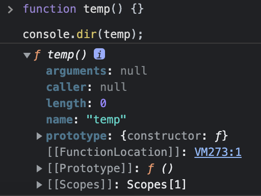

# 2022/08/16

## 오늘 공부한 내용

## 프로퍼티 어트리뷰트

## 내부 슬롯과 내부 메서드

- 자바스크립트의 내부 슬롯(internal slot)과 내부 메서드(internal method)는 **자바스크립트의 엔진의 알고리즘을 설명하기 위해** ECMAScript에서 사용하는 의사 프로퍼티(pseudo property)와 의사 메서드(pseudo method)이다.
- 이는 ECMAScript에 이중 대괄호(`[[…]]`)로 감싸서 표현되며 엔진에서 실제로 동작하지만 개발자가 접근할 수 있도록 외부에 공개된 것은 아니다.
- 원칙적으로 접근하거나 호출할 방법이 제공되지 않으나 일부 내부 슬롯, 내부 메서드의 한하여 간접적으로 접근할 수 있는 수단을 제공한다.

## 프로퍼티 어트리뷰트와 프로퍼티 디스크립터 객체

- 자바스크립트 엔진은 프로퍼티를 생성할 때 프로퍼티의 상태를 나타내는 프로퍼티 어트리뷰트를 기본값으로 자동 정의 한다
- 프로퍼티 어트리뷰트는 내부 상태 값인 내부 슬롯이기 때문에 직접 접근할 수 없고`Object.getOwnPropertyDescriptor` 메서드를 사용하여 간접적으로 확인할 수 있다.
- 프로퍼티는 **데이터 프로퍼티**와 **접근자 프로퍼티**로 구분할 수 있다.

### **공유 프로퍼티**

데이터 프로퍼티와 접근자 프로퍼티는 다음의 두 가지 키를 공유한다.

| 프로퍼티 어트리뷰트 | 디스크립터 객체 프로퍼티 | 설명                                  |
| ------------------- | ------------------------ | ------------------------------------- |
| `[[Configurable]]`  | configurable             | 프로퍼티 재정의 가능 여부를 나타낸다. |
| `[[Enumerable]]`    | enumerable               | 프로퍼티 열거 가능 여부를 나타낸다.   |

### 데이터 프로퍼티

| 프로퍼티 어트리뷰트 | 디스크립터 객체 프로퍼티 | 설명                                       |
| ------------------- | ------------------------ | ------------------------------------------ |
| `[[Value]]`         | value                    | 프로퍼티 키를 통해 값에 접근하면 반환된 값 |
| `[[Writable]]`      | writable                 | 프로퍼티 값의 변경 가능 여부를 나타낸다.   |

- 프로퍼티가 생성될 때 `[[value]]` 값은 **프로퍼티 값으로 초기화 된다**
- 프로퍼티가 생성될 때 `[[Writable]]`, `[[Enumerable]]`, `[[Configurable]]` 의 값은 `true`**로 초기화 된다.**

### 접근자 프로퍼티

| 프로퍼티 어트리뷰트 | 디스크립터 객체 프로퍼티 | 설명                                                                         |
| ------------------- | ------------------------ | ---------------------------------------------------------------------------- |
| `[[Get]]`           | get                      | 접근자 프로퍼티를 통해 데이터 프로퍼티의 값을 읽을 때 호출되는 접근자 함수   |
| `[[Set]]`           | set                      | 접근자 프로퍼티를 통해 데이터 프로퍼티의 값을 저장할 때 호출되는 접근자 함수 |

- 접근자 프로퍼티는 자체적으로는 값을 갖지 않고 다른 데이터 프로퍼티의 값을 읽거나 저장할 때 사용하는 접근자 함수로 구성된 프로퍼티다.
- 접근자 함수는 `getter / setter` 함수라고도 부른다.
- gette와 setter 함수 모두 정의할 수도 있고 하나만 정의할 수도 있다.
- 메서드 앞에 get, set이 붙은 메서드가 `getter / setter` 함수이고, `getter / setter` 함수 이름 `fullName`이 접근자 프로퍼티다.
- 접근자 프로퍼티는 자체적으로 값을 가지지 않으며 데이터의 프로퍼티 값을 읽거나(get) 저장할 때(set) 관여할 뿐이다.
- 내부 슬롯/메서드 관점에서 접근자 프로퍼티 fullName으로 프로퍼티 값에 접근하면 내부적으로 `[[Get]]` 내부 메서드가 호출되어 다음과 같이 동작한다.
  1. 프로퍼티 키가 유효한지 확인 (프로퍼티 키는 문자열 또는 심벌이어야 한다)
  2. 프로토타입 체인에서 프로퍼티를 검색한다.
  3. 검색된 프로퍼티가 데이터 프로퍼티인지 접근자 프로퍼티인지 확인한다.
  4. 접근자 프로퍼티 fullName의 프로퍼티 어트리뷰트 [[Get]]의 값, 즉 getter 함수를 호출하여 그 결과를 반환한다.
- 장점
  - 함수로 접근(`()`)로 호출하는 것이 아닌 프로퍼티로 접근하기에 더 간단한 구문
  - 더 나은 데이터 품질을 보장한다 (사용자가 값을 잘못입력하는 것을 방지해주거나 대문자로 변경하는 것 등의 작업을 해줄 수 있음)

> **프로토타입(prototype)이란?**
> 프로토타입은 어떤 객체의 상위(부모) 객체의 역할을 하는 객체다.
> 프로토타입은 하위(자식) 객체에게 자신은 프로퍼티와 메서드를 상속한다.
> 프로토타입 객체의 프로퍼티나 메서드를 상속받은 하위 객체는 자신의 프로퍼티 또는 메서드인 것처럼 자유롭게 사용할 수 있다.

프로토타입 체인은 프로토타입이 단방향 링크드 리스트 형태로 연결되어 있는 상속 구조를 말한다.
객체의 프로퍼티나 메서드에 접근하려고 할 때, 해당 객체에 접근하려는 프로퍼티 또는 메서드가 없다면 프로토타입 체인을 따라 검색한다.

>

### 접근자 프로퍼티와 데이터 프로퍼티 구별

```jsx
// 일반 객체의 __proto__는 접근자 프로퍼티다.
Object.getOwnPropertyDescriptor(Object.prototype, "__proto__");
// {get: f, set: f, enumerable: false, configurable: true}

// 함수 객체의 prototype은 데이터 프로퍼티다
Object.getOwnPropertyDescriptor(function () {}, "prototype");
// {value: {...}, writable: true, enumerable: false, configurable: false}
```

## 프로퍼티 정의

- 프로퍼티 어트리뷰트는 새로운 프로퍼티를 정의할 때 명시적으로 정의하거나, 기존 프로퍼티의 값을 재정의할 수 있다.
- `Object.defineProperty`, `Object.defineProperties` 메서드를 사용하여 정의한다.
- 만약 생략한다면 다음과 같은 기본값을 가진다.
  | 프로퍼티 어트리뷰트 | 디스크립터 객체 프로퍼티 | 기본값 |
  | ------------------- | ------------------------ | --------- |
  | `[[Configurable]]` | configurable | false |
  | `[[Enumerable]]` | enumerable | false |
  | `[[Value]]` | value | undefined |
  | `[[Writable]]` | writable | false |
  | `[[Get]]` | get | undefined |
  | `[[Set]]` | set | undefined |
- `Object.getOwnpropertyDescriptor**s**`와 같이 `Object.defineProperty**s**`를 통해 여러 개의 프로퍼티를 한 번에 정의할 수 있다.

## 객체 변경 방지

| 구분                     | 추가 | 삭제 | 읽기 | 쓰기 | 재정의 |
| ------------------------ | ---- | ---- | ---- | ---- | ------ |
| Object.preventExtensions | X    | O    | O    | O    | O      |
| Object.seal              | X    | X    | O    | O    | X      |
| Object.freeze            | X    | X    | O    | X    | X      |

- 직속 프로퍼티만 변경이 방지되고 중첩 객체까지는 영향을 주지 못한다!

### 객체 확장 금지 (`Object.preventExtensions`)

- 새로운 프로퍼티가 객체에 추가되는 것을 방지한다. 즉, 장래의 확장을 방지한다. (삭제는 가능)
- 프로퍼티는 동적 추가와 `ObjectdefineProperty` 메서드로 추가할 수 있는데 이 두 가지가 모두 금지된다.
- 객체가 확장 가능 객체인지 여부는 `Object.isExtensible` 메서드로 확인할 수 있다.

### 객체 밀봉 (`Object.seal`)

- 객체를 밀봉한다. 즉, 프로퍼티 추가 및 삭제와 프로퍼티 어트리뷰트 재정의 금지를 의미한다
- **밀봉된 객체는 읽기와 쓰기만 가능하다.**
- 밀봉된 객체인지 여부는 `Object.isSealed` 메서드로 확인할 수 있다.

### 불변 객체 (`Object.freeze`)

- 객체를 동결한다. 동결된 객체는 모든 것이 금지되고 읽기만 가능하다.
- 객체의 동결 여부는 `Object.isFrozen` 메서드로 확인할 수 있다

---

- \***\*지금까지 살펴본 변경 방지 메서드들은 얕은 변경 방지로 직속 프로퍼티만 변경이 방지되고 중첩 객체까지는 영향을 주지 못한다. 따라서\*\*** `Object.freeze` \***\*메서드로 객체를 동결하여도 중첩 객체까지 동결할 수 없다.\*\***
- 객체의 중첩 객체까지 동결하여 변경이 불가능한 읽기 전용의 불변 객체를 구현하려면 **객체를 값으로 갖는** **모든 프로퍼티에 대해** **재귀적으로** `Object.freeze` **메서드를 호출해야 한다.**

## 생성자 함수에 의한 객체 생성

## Object 생성자 함수

- 생성자 함수란 new 연산자와 함께 호출하여 객체(인스턴스)를 생성하는 함수를 말한다.
- 생성자 함수를 사용하여 생성된 객체를 인스턴스라고 한다.
- 자바스크립트에는 Object 생성자 함수 이외에 String, Number, Boolean, Function, Array 등의 빌트인 생성자 함수를 제공한다.
- 사실 객체를 생성하는 방법은 생성자 함수보다 객체 리터럴을 사용하는 것이 더 간편하지만 문제점이 존재한다

## 생성자 함수

### 객체 리터럴에 의한 객체 생성 방식의 문제점

- 객체 리터럴은 직관적이고 간편하지만 **여러 개의 객체를 생성해야 하는 경우 매번 같은 코드를 기술해야 한다.**
- 만약 상당히 많은 수의 동일한 객체를 생성해야 한다면 위와 같은 방식은 문제가 될 수 있다.

### 생성자 함수에 의한 객체 생성 방식의 장점

- 생성자 함수를 객체를 생성하기 위한 템플릿처럼 사용하여 프로퍼티 구조가 동일한 객체를 간편하게 생성할 수 있다.
- 생성자 함수는 말 그대로 함수이며 **new 연산자와 함께 호출하면 생성자 함수로 동작**한다.
- 만약 new 연산자를 사용하지 않으면 일반 함수로 동작한다.

> **this란?**
> this는 객체 자신의 프로퍼티나 메서드를 참조하기 위한 **자기 참조 변수(self-referencing variable)**다. this가 가리키는 값, 즉 this 바인딩은 함수 호출 방식에 따라 동적으로 결정된다.
>
> ```jsx
> // 함수는 다양한 방식으로 호출될 수 있다.
> function foo() {
>   console.log(this);
> }
>
> // 일반적인 함수로서 호출
> // 전역 객체는 브라우저 환경에서는 window, Node.js 환경에서는 global을 가리킨다.
> foo(); // window
>
> // 메서드로서 호출
> const obj = { foo }; // ES6 프로퍼티 축약 표현
> obj.foo(); // obj => {foo: f}
>
> // 생성자 함수로서 호출
> const inst = new foo(); // inst => foo {}
> ```
>
> | 함수 호출 방식       | this가 가리키는 값(this 바인딩)        |
> | -------------------- | -------------------------------------- |
> | 일반 함수로서 호출   | 전역 객체                              |
> | 메서드로서 호출      | 메서드를 호출한 객체(마침표 앞의 객체) |
> | 생성자 함수로서 호출 | 생성자 함수가 생성할 인스턴스          |

### 생성자 함수의 인스턴스 생성 과정

생성자 함수는 다음과 같은 과정을 통해 객체를 생성한다.

1. 인스턴스 생성 및 this 바인딩
   - 생성자 함수를 실행하면 암묵적으로 빈 객체가 생성되며 생성된 빈 객체는 this에 바인딩 된다.
   - 이 처리는 함수 몸체의 코드가 한 줄씩 실행되는 런타임 이전에 실행된다.
2. 인스턴스 초기화
   - 생성자 함수 내부의 코드를 실행하여 this에 바인딩 돼 있는 객체를 초기화한다.
   - 인스턴스에 프로퍼티나 메서드를 추가하고 생성자 함수가 인수로 전달받은 초기값을 할당한다.
3. 인스턴스 반환
   - 생성자 함수 내부의 모든 처리가 끝나면 객체가 반환된다.
   - 만약 다른 객체를 명시적으로 반환하면(`return`) this가 아닌 해당 객체가 반환된다.

### 내부 메서드 `[[Call]]`과 `[[Construct]]`

- 함수는 객체지만 일반 객체와 다르게 호출이 가능하다.
- 따라서, 함수는 일반 객체가 가지고 있는 내부 슬롯, 내부 메서드 뿐만 아니라 함수 객체만 가지는 내부 슬롯과 내부 메서드를 가지고 있다.
  - 함수를 일반 함수로서 호출하면 내부 메서드 `[[Call]]`이 호출되고
  - new 연산자와 함께 생성자 함수로서 호출되면 내부 메서드 `[[Constructor]]`가 호출된다.
- 내부 메서드 [[Call]]을 갖는 함수를 callable이라고 하며, 내부 메서드 [[Constructor]]를 갖는 함수를 constructor, 그렇지 않은 함수를 non-constructor라고 한다.
- 모든 함수 객체는 호출할 수 있기 때문에 항상 [[Call]]을 갖고 있지만 모든 함수 객체가 생성자로서 호출될 수는 없기 때문에 constructor일 수도 non-constructor일 수도 있다.

### **constructor, non-constructor 구분**

- 자바스크립트 엔진은 함수의 정의를 평가하여 constructor와 non-constructor를 구분한다.
  - constructor: 함수 선언문, 함수 표현식, 클래스
  - non-constructor: ES6 메서드 축약표 표현, 화살표 함수

### **new 연산자**

- 일반 함수와 생성자 함수의 형식 차이는 존재하지 않지만 구분을 위해 생성자 함수는 일반적으로 첫 문자를 대문자(Pascal Case)로 기술한다.
- 일반 함수와 생성자 함수는 호출 시 `[[Call]]`을 호출하는지 `[[Constructor]]`를 호출하는지의 차이가 있을 뿐이다.
- constructor를 new 연산자와 함꼐 호출하면 생성자 함수로 호출(`[[Constructor]]`)되고, new 연산자 없이 호출하면 일반 함수로 호출(`[[Call]]`)된다.
- 반대로 일반 함수로 호출된 함수의 this는 전역 객체 window를 가리킨다. 따라서 해당 함수의 프로퍼티와 메서드는 전역 객체 window의 프로퍼티와 메서드가 된다.

### new.target

- 생성자 함수가 new 연산자 없이 호출되는 것을 방지하기 위해 첫 문자를 대문자로 기술한다. 하지만 실수는 언제나 발생할 수 있고 **이를 방지하기 위해** `new.target`**을 사용한다.**
- new.target은 생성자 함수가 호출되면 함수 내부에서 함수 자신을 가리킨다.
- 만약 new 연산자 없이 일반 함수로 호출되면 `new.target`은 `undefined`이다.
- IE에서는 `new.target`을 지원하지 않는다. `new.target`을 사용할 수 없는 상황이라면 **스코프 세이프 생성자 패턴(scope-safe constructor pattern)**을 사용할 수 있습니다. (`instanceof` 연산자 활용)
- 대부분의 빌트인 생성자 함수는 new 연산자와 함께 호출되었는지 확인 후 적절한 값을 반환한다.
- 단, String, Number, Boolean 생성자 함수는 new 연산자와 함께 호출하면 해당 객체를 그렇지 않으면 해당 데이터 타입의 값을 반환한다.

## 함수와 일급 객체

## 일급 객체

> 일급 객체란 다른 객체들에 일반적으로 적용 가능한 연산을 모두 지원하는 객체를 가리킨다.

- 이를 조건으로 나열하면 다음과 같다
  1. 무명의 리터럴로 생성할 수 있다. 즉, 런타임에 생성이 가능하다.
  2. 변수나 자료구조(객체, 배열 등)에 저장할 수 있다.
  3. 함수의 매개변수에 전달할 수 있다.
  4. 함수의 반환값으로 사용할 수 있다.
- **자바스크립트의 함수는 위의 조건을 모두 만족하므로 일급 객체이다.**
- 함수는 값을 사용할 수 있는 곳이라면 **어디서든지 리터럴로 정의할 수 있으며 런타임에 함수 객체로 평가된다.**
- 이는 함수형 프로그래밍을 가능케 하는 자바스크립트의 장점 중 하나이다.
- 함수는 호출 가능하다는 점에서 일반 객체와의 차이점을 가진다.

## 함수 객체의 프로퍼티

- 함수는 객체다. 즉, 함수는 프로퍼티를 가질 수 있다.
- 크롬 브라우저에서 함수 내부를 확인하면 다음과 같다

    

- 또한, 해당 함수를 `Object.getOwnPropertyDescriptors` 메서드로 확인하면 다음과 같다.

    

  - 위에서 확인할 수 있듯 arguments, caller, length, name, prototype 프로퍼티는 함수 객체 고유의 데이터 프로퍼티이다.
    

  - `[[Prototype]]`은 접근자 프로퍼티로 함수 객체 고유의 프로퍼티가 아니라 `Object.prototype` 객체의 프로퍼티를 상속받은 것이다.

### arguments 프로퍼티

- arguments 객체는 함수의 프로퍼티로 호출하는 것은 ES3부터 표준에서 제거되었고 strict mode에서 에러를 발생시킨다.
- arguments 프로퍼티의 값은 arguments 프로퍼티 객체이다.
- 명확히는 유사 배열 객체로 length 속성을 가지고 있고 순회가 가능하지만, Array의 내장 메서드는 가지고 있지 않다.
- arguments 객체는 함수 내부에서 이용 가능한 지역 변수로 함수 내의 인수를 참조할 수 있다.
- 자바스크립트는 함수의 매개변수와 인수의 개수가 일치하는지 확인하지 않는다.(일치 하지 않아도 에러 발생하지 않는다)
  

- 프로퍼티 키는 인수의 순서를 나타낸다(`0: 1`, `1: 2`, `2: 3`)
- `callee`프로퍼티는 `arguments`객체를 생성한 함수, 즉 함수 자신을 가리킨다.
- `length`프로퍼티는 인수의 개수를 가리킨다.

> **arguments 객체의 `Symbol(Symbol.iterator)`프로퍼티란?** > `Symbol(Symbol.iterator)`프로퍼티는 `arguments`객체를 순회 가능한 자료구조인 이터러블(`iterable`)로 만들어 주는 프로퍼티다.
> 자세한 내용은 34장. 이터러블에서….

- arguments 객체는 매개변수 개수를 확정할 수 없는 **가변 인자 함수를 구현할 때 유용**하다.

> **유사 배열 객체와 이터러블
> ES6에 도입된 이터레이션 프로토콜을 준수하면 순회 가능한 자료구조인 이터러블이 된다.**
> 이터러블의 개념이 없었던 ES6에서 arguments객체는 유사 배열 객체로 구분되었다.
> ES6부터 arguments객체는 유사 배열 객체이면서 동시에 이터러블(iterable)이다.
> iterable객체는 `for...in`, `for...of`문을 사용할 수 있다.

- 유사 배열 객체는 배열이 아니기에 배열 메서드를 사용할 수 없다.
- 배열 메서드를 사용하기 위해서는 `Function.prototype.call`, `Function.prototype.apply`를 사용해 간접 호출해야 한다.

### caller 프로퍼티

- ECMAScript 사양에 포함되지 않은 비표준 프로퍼티이다.
- 함수 객체의 `caller`프로퍼티는 함수 자신을 호출한 함수를 가리킨다.
- 중요하지 않으니 넘어가도 된다.

### length 프로퍼티

- 함수 객체의 `length`프로퍼티는 함수를 정의할 때 선언한 **매개변수의 개수**를 가리킨다.

### **name 프로퍼티**

- 함수 객체의 `name`프로퍼티는 함수 이름을 나타낸다.
- 익명 함수 표현식의 경우 ES5에서는 빈 문자열을 값으로 갖고, ES6에서는 함수 객체를 가리키는 식별자를 값으로 갖는다.

### **proto 접근자 프로퍼티**

- 모든 객체는 `[[Prototype]]` 이라는 내부 슬롯을 갖는다.
- `[[Prototype]]` 내부 슬롯은 상속을 구현하는 **프로토타입 객체**를 가리킨다.
- `__proto__` 프로퍼티는 `[[Prototype]]` 내부 슬롯이 가리키는 프로토타입 객체에 접근하기 위해 사용하는 접근자 프로퍼티다. (내부슬롯에 직접 접근할 수 없어 간접적으로 접근하기 위한 프로퍼티이다.)

### prototype 프로퍼티

- `prototype` 프로퍼티는 생성자 함수로 호출할 수 있는 **함수 객체.** 즉 `constructor` 만이 소유하는 프로퍼티다.
- 일반 객체와 생성자 함수로 호출할 수 없는 `non-constructor`에는 `prototype` 프로퍼티가 없다.
- `prototype` 프로퍼티는 생성자 함수로 호출될 때 생성자 함수가 생성할 **인스턴스의 프로토타입 객체를 가리킨다.**

  ```jsx
  function Person() {}
  var person1 = new Person();

  // Person 함수 객체의 prototype과 인스턴스의 프로토타입 객체는 같다.
  Person.prototype === person1.__proto__; // true
  ```

## 수업 내용

- 이 책에서 가장 중요한 부분 1st. for문(반복문), 2nd 렉시컬 스코프
- 함수 선언문은 런타임 이전에 함수 객체가 만들어진다
- `()` : 호출 연산자 (피연산자가 필요)
- 프로그래밍에서 lazy는 좋은 의미이다 (ex. lazy loading)
- 함수 내부에 오류가 있더라도 이 오류는 호출할 때 발생한다
  ```jsx
  function foo() {
    return x + 1;
  } // undefine
  foo(); // Error
  ```
- 함수 호출문은 제어문이다
  - 제어문이 없으면 코드는 위에서 아래로 흐르기만 한다
  - 함수가 호출되면 다시 위에 있는 함수 정의로 올라간다
- 함수는 객체로서 만들어지는데 그 객체로 되는 시점은 함수 정의가 평가되는 시점(런타임 이전) 이 것은 함수가 어떻게 만들어졌느냐에 따라 다르다
  - 함수 호출문은 런타임 이전일 것이고, 함수 표현식이였으면 런타임 때 평가되었을 것이다.
- object 란 subject가 인식할 수 있는 모든 것 (여기서 subject는 개발자)
- 객체란 프로퍼티(속성)들로 이루어져있다.
- 객체 지향은 무조건 좋다? X 상속은 무조건 좋다? X
- `[[Environment]]`: 상위 스코프에 대한 참조값. 함수객체만 가지고 있다.
- `[[Prototype]]`: 모든 객체가 가지고 있다.
- arguments 가 왜 있지? 존재 이유 ?
  - 매개변수를 선언 못하는 경우
  - 가변인자를 위해서 (예를들어 내가 작성한 숫자를 모두 더해라)
- node.js와 browser의 출력방식이 다른이유? browser는 ECMAscript를 따르지 않기 때문이다
- 유사배열?
  - length가 프로퍼티가 존재해야한다.
  - 프로퍼티 키가 0, 1, 2, 3, 4 처럼 인덱스처럼 생긴 ‘문자열‘이다.
- enumerable false인 애들은 브라우저에서 연한 글씨, true인 애들은 굵은 글씨
- 열거와 순회 차이? 순서가 의미있느냐(순회) 없느냐(열거)의 차이
  - 배열은 순서의 의미가 강하다 (index) ⇒ 순회
  - 배열은 순서의 의미가 없고 이름에 의미가 있다 (값을 가지고 오는 key) ⇒ 열거
- 화살표 함수는 arguments 객체가 없다
- arguments객체는 ES6부터 사용안하는 것을 권장
  - 스프레드를 사용하여 arguments를 배열로 쉽게 만들 수 있다 `[…arguments]`
  - rest parameter도 사용할 수 있다 `(…arg)`
  - document.querySelectorAll() 도 유사배열객체를 반환하는데 이것도 배열로 바꿔서 코딩하는 것이 더 좋다
- 유사 배열 객체 만든이유 순회를 하면서 자유자재로 메서드를 추가하기 위해서
  - 하지만 배열에는 충분히 좋은 메서드가 많아서 설계 오류인 듯 하다
- 생성자함수 쓰는 이유
  - 생성자 함수는 프로퍼티 구조가 동일한 객체를 여러개 생성할 때 유리하다. 라는 것 하나 밖에 없다.
- this에는 할당 못한다.
- 할당과 바인딩 차이?
  - 식별자와 값을 이어주는걸로, 거의 비슷한 개념.
  - this는 할당이 불가능하기 때문에 바인딩이라는 용어를 사용한다.
- 생성자 함수는 인스턴스를 여러개 찍어내는 만큼, 메서드도 여러번 생성이 됨.
  - 생성자 함수가 호출될 때마다 함수객체가 만들어짐.
  - 메모리가 낭비되고, 객체를 만드는것도 공짜가 아님. 시간복잡도와 공간복잡도 측면에서 다 마이너스.
  - 메서드를 한번만 만들어서 모든 인스턴스가 다 사용할 수 있도록 공유해서 쓰고싶다 → 프로토타입
- 상속의 필요? 함수의 재사용을 위해서..! 그 객체를 프로토타입이라 한다.
- 상속을 하는 이유는 재사용성때문인데, 함수를 상속하면 불필요한 인스턴스가 낭비된다. 인스턴스낭비를 막기 위해서, 부모의 프로토타입을 사용한다
- 상속은 상위에서 하위로는 되지만 반대로는 되지 않는다.
- this는 3가지 방식(일단 암기)
  - 일반 함수의 경우 전역 객체를 가리킴
  - 생성자 함수의 경우 생성될 인스턴스를 가리킴
  - 메서드의 경우 이 메서드를 호출한 객체를 가리킴(`.`앞에 있는 객체)

```jsx
function Person(name) {
  this.name = name;

  Person.prototype.sayHi = function () {
    console.log(`Hi! my name is ${this.name}.`);
    // 이러면 new 할때마다 이 메서드가 계속 생긴다.
  };
}

Person.prototype.sayHi = function () {
  console.log(`Hi! my name is ${this.name}.`);
  // 이렇게 해야 하나만 생성.
  // 근데 가독성의 측면에서 생성자 함수랑 같이있어야 된다.
  // 지금은 바로밑에 있지만 이거랑 위에 생성자함수 사이에 1000줄 코드 있으면?
  // 가독성 엄청나쁨. 그래서 두개모으고싶거든?
  // 이 두개를 딱 묶여있으면 좋겠다.

  // 즉시 실행 함수로 감싸면 묶을 수 있음.
};

const Person2 = (function () {
  function Person2(name) {
    this.name = name;
  }
  Person2.prototype.sayHi = function () {
    console.log(`Hi! my name is ${this.name}.`);
  };

  return Person2;
})();

const me = new Person2("Lee");
// 이렇게 하면 캡슐화가 된다. 그래도 아쉽다
// 그래서 클래스가 나온다.
```

- 함수는 인스턴스마다 달라지지 않기 때문에 올려야 하지만 프로퍼티 값은 각자 다르기 때문에 인스턴스가 각자 가져야 한다

## 느낀점

- 이 책에서 가장 중요한 첫번째가 for 반복문이고 두번째가 렉시컬 스코프라고 하셨다. 처음에는 왜 for문이 제일 중요한지 몰랐고 강사님은 for문을 거의 사용하지 않는다고 하셨는데, 수업을 듣고 생각해볼수록 for문은 변수 할당이 많이 일어나는 등의 비효율적이였고, 지금까지 for 반복문 대체할 수 있는 방법을 알고는 있었지만 일단 편하니까 for 문부터 사용해왔지 않나 반성이 되었다. 이는 코딩테스트 연습을 하며 생긴 나쁜 습관이기도 한데 어떻게 하면 코드를 ‘잘' 짤 수 있는지에 대해 생각해보아야겠다.
- 두번째로 중요한 렉시컬 스코프에 대해서도 또 얘기가 나왔는데 한 번 더 듣게되니 저번주에 렉시컬 스코프에 대해서 공부한 것에 이어서 확실히 정리가 되었다.
- 또한 기억에 남는 점은 유사 배열 객체 였는데, 배열이면 배열이지 유사 배열 객체는 뭐야..? 라고 생각이 되었지만 index순서와 length가 존재해서 배열의 메서드를 가지진 않았지만 순회가 가능하다는 점에서 그렇게 불렸다. 처음엔 이 유사 배열 객체가 신박하다고 생각이 되었지만 사실 배열의 메서드는 추가적으로 메서드를 만들지 않아도 될 정도로 훌륭한 메서드들이 많이 존재해서, 스프레드 등을 이용하여 배열로 바꿔서 사용하는 것을 보면 그닥 좋은 구조가 아닌 것이였다..
- 오늘은 내일 배울 프로토타입을 위한 기반을 배우게 되었는데 솔직히 어려웠지만 나만 그런 것이 아니라 모두 다 어려워하는 것이니 좌절하지말고 같이 공부하는 수강생들과 으쌰으쌰하며 열심히 공부해야겠다는 생각이 들었다!

## 참고사항

- [ASTexplorer](https://astexplorer.net/)
