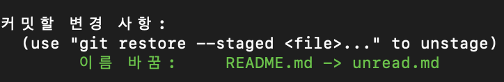

# 2022/08/17

## 오늘 공부한 내용

### [프로토타입](https://github.com/SleeplessN/TIL/blob/main/Javascript/Javascript%20DeepDive/19%EC%9E%A5%20%ED%94%84%EB%A1%9C%ED%86%A0%ED%83%80%EC%9E%85.md)

## 수업 내용

### Git

- 지난 팀프로젝트 회고 (3L 전략)
  - liked : issue를 통해 내가 정확히 무엇을 해야하고 PR을 통해 코드 리뷰를 하여 체계적이고 안전하게 협업하는 부분이 좋았습니다.
  - Learned : 실제 프로젝트를 통해 git flow을 실제로 경험해보았습니다.
  - Lacked : 아직까진 경험이 부족하여 미숙한데 많은 연습이 필요한 것 같습니다.

### 파일 이름을 바꾸는 경우

```jsx
$ mv {기존 파일명} {바꾸려는 파일명}
// ex
$ mv README.md unread.md
```

- 기존의 `README.md` 가 삭제 되고 `unread.md`가 새로 생성된 걸로 인식이 된다
- 이렇게 되면 **연속성**이 떨어지게 된다

```jsx
$ git mv {기존 파일명} {바꾸려는 파일명}
// ex
$ git mv README.md unread.md
```



- 보면 `git add`도 같이 적용이 된다
- 파일 위치를 변경하는 경우에도 마찬가지이다

### 최신 커밋으로 돌아가기

- 구 시대의 문법
  ```jsx
  $ git checkout -- {filename}
  // ex
  $ git checkout -- unread.md
  ```
  - `checkout`이 두 가지 역할을 했었기 때문에 `switch`와 `restore`으로 나뉘어졌다. 이제는 `switch`와 `restore`을 사용하도록하자!
- 요즘 문법
  ```jsx
  // unread.md 파일을 최신으로 돌리기
  $ git restore {filename}

  // ex
  $ git restore unread.md

  // 현재 디렉토리의 모든 파일을 최신으로 돌리기
  $ git restore .
  ```

### Unstage 하기 (git add 로 올린 파일 내리기)

```jsx
$ git reset HEAD {filename}

$ git restore --staged {filename}
```

- HEAD는 **해당 브랜치의 마지막 커밋**을 뜻한다
- **커밋을 할 때는 작업단위로 구분해야 한다!**

### 직전의 commit 수정

```jsx
$ git commit --amend
```

- 그 전의 commit 수정은 git rebase를 통해 하는데 안쓰는 것을 권장한다
  - git flow 방식에 맞지 않다 (merge conflict를 계속 겪게 된다)

### 직전의 commit 삭제

1. **worst case : `reset`**

- 지양한다.

1. **best case : `revert`**

```jsx
$ git revert --no-commit HEAD~{되돌아갈갯수}..
```

- 예를 들어, 다음과 같은 3가지 커밋을 무효하고 feat: Create source files 로 되돌아 가고 싶다면?


```jsx
$ git revert --no-commit HEAD~3..
```

- 단, 이 방법은 내역이 사라지진 않는다


> git revert를 또 잘못했다?
> `$ git revert --abort` : revert 작업 취소

---

**만약, merge commit을 되돌릴 땐?**

```jsx
$ git revert -m {1 or 2} {merge commit id}
```

- 잘 사용하진 않고 정확한건 reference 참고

---

## 느낀점

- 프로토타입 부분을 공부했는데 비슷한 내용이 반복되서 개념이 하나로 이어지는듯 하다가도 추상연산 OrdinaryObjectCreate 부분 같이 명확하게 이해가 되지 않는 부분도 존재했다. 자바스크립트의 주요한 특징인 상속을 위한 부분인만큼 러버덕과 반복적인 학습으로 확실히 이해할 필요가 있다.
- 3L(Liked, Learned, Lacked) 전략을 알게되었는데, 이를 이용하니 작은 프로젝트를 하고나서라도 그냥 넘어가지말고 거기서 어떤 점이 좋았으며, 어떤 점을 배웠고, 어떤 점이 부족하였는지가 정리가 되었다. 그리고 오늘은 실수를 바로잡는 revert 부분을 알게되었는데, 여러 방법을 알게되었지만 실수를 했을 경우 그것을 덮으려 좋지 않은 방법(reset)을 사용하는 것 보다는 차라리 이러이러한 점을 실수하였다고 사과를 하는 것과 혼자 힘으로 힘들 경우에는 악화시키기보다는 도움을 청해라 라는 부분이 가장 인상 깊었다.
