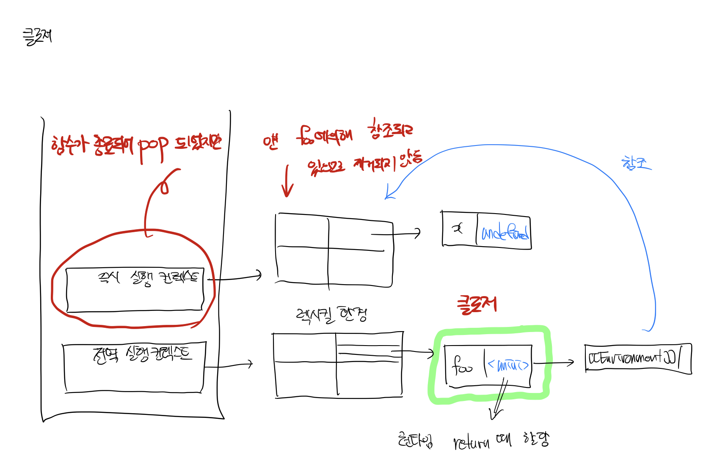

# 2022/08/22

## 오늘 공부한 내용

### [실행 컨텍스트](https://github.com/SleeplessN/TIL/blob/main/Javascript/Javascript%20DeepDive/23%EC%9E%A5%20%EC%8B%A4%ED%96%89%20%EC%BB%A8%ED%85%8D%EC%8A%A4%ED%8A%B8.md)

### [클로저](https://github.com/SleeplessN/TIL/blob/main/Javascript/Javascript%20DeepDive/24%EC%9E%A5%20%ED%81%B4%EB%A1%9C%EC%A0%80.md)

## 수업 내용

- 실행 컨텍스트 스택이 비워져있으면 이벤트 핸들러에서 접근했을 때 접근하지 못해야 하는데 접근할 수 있다.
  - 이는 클로저 때문에 그렇다
- 비동기 처리도 실행 컨텍스트와 관련이 있다
  - `call stack`이 비어야 비동기 처리가 호출된다.
- 다음 코드의 실행 컨텍스트는 어떻게 생길까?

  ```jsx
  var x = 1;
  const y = 2;

  function foo(a) {
    var x = 3;
    const y = 4;

    function bar(b) {
      const z = 5;
      console.log(a + b + x + y + z);
    }
    bar(10);
  }

  foo(20);
  ```

  - 변수 선언이란 변수 식별자의 존재를 자바스크립트 엔진에게 알린다.
    - 식별자의 존재 유무를 안다.
    - 어딘가에 이를 적어놔야 하는데 이 곳이 실행 컨텍스트이다
  - 실행 컨텍스트는 평가 단계에서 만들어진다
    - 식별자가 평가 단계에서 만들어지기 때문에
  - 실행 컨텍스트 스택 (Call Stack)
    - 실행 컨텍스트 상 맨 위에 있는 실행 컨텍스트를 `실행 중인 실행 컨텍스트` 라 한다.
    - 또한 코드에서 현재 실행중인 곳을 의미한다.
    - 실행 컨텍스트 스택으로 실행 순서를 결정한다.
  - 실행 컨텍스트는 객체이다.
    - 실행 컨텍스트는 `LexicalEnvironment`와 `variableEnvironment` 를 가진 객체이다.
      - 두 개 이지만 그냥 `LexicalEnvironment`만 바라본다고 생각하자.
    - 자바스크립트 엔진을 자바스크립트로 만들었나? 다른 언어로 만들었다
      - 대부분의 언어는 속도가 빠르기 때문에 C++로 만들었다. (대신 코드는 지저분함)
      - C++이 객체 지향이기 때문에 실행 컨텍스트도 객체라 봐도 무방하다
  - 현재 실행중인 실행 컨텍스트의 환경이 곧 그 함수의 상위 스코프이다.
  - `this`는 원래 렉시컬 환경에 존재했지만 환경 레코드의 내부슬롯으로 가지도록 바뀌었다.(별로 안 중요함)
  - 왜 평가 단계와 실행 단계로 나뉘나?
    - 평가 단계는 실행 단계를 위한 준비
    - 평가 단계는 식별자 위주로 본다. 또한, 스코프를 생성한다.
    - 렉시컬 환경이 `this`를 가지고 있기 때문에 렉시컬 환경이 스코프이다.
  - `this` 는 키워드라 생각하면 되고 식별자 역할을 한다고 보면된다.
  - `foo(20);` 때 3가지 단계가 필요하다
    - 첫번째 : `foo`를 찾아야 한다. 현재 실행중인 실행 컨텍스트에서부터 찾는다.
    - 두번째: (20)값을 읽는다.
    - 세번째: 매개변수 20값을 넣고 함수를 호출하여 제어권을 넘긴다
  - 매개변수도 변수이다
    - `function foo(a)`에서 매개변수 `a`에는 마치 `var`가 생략된것처럼 동작한다.
  - 환경레코드에 있는 것만 식별자이다.
    - 식별자 명명규칙
      - 처음에 특수문자(`_`, `$`)만 올 수 있다.
      - 처음에 숫자가 못 온다 (두번째부턴 올 수 있다.)
      - 이를 지키지 않으면 `[""]` 로 접근해야해서 매우 불편하다.

- 중첩함수가 있고 외부함수가 있을때 중첩함수가 외부함수보다 오래 살아있을 때 `클로저(Closure)`
  - 외부함수가 중첩함수를 return 하는 경우이다.
- **클로저**란?

  > MDN에서는 **클로저란 함수와 그 함수가 선언된 렉시컬 환경과의 조합**이다.
  > (이 정도는 외우자. 생각해보면 제일 와닿는 정의이다.)

  
    
    - 중첩함수는 자신의 스코프만 기억하는 것이 아니라 자신의 상위 스코프 함수를 기억하고 있다.
    - 실행 컨텍스트는 pop되어 사라졌지만 렉시컬 환경은 참조에 의해 사라지지 않는 현상
    - **역할**
        - **상태를 안전하게 변경하고 유지하기 위해 사용**
            - 전역변수는 위험하다. (어디에서든 접근 가능해서 예측이 불가능해진다)
            - 그렇기 때문에 해당 변수에 대한 변경 권한을 해당 함수에만 제공해야 한다.
    - 자바스크립트 함수는 이론적으로 다 클로저이다. (자신의 상위 스코프를 기억하면 클로저이기 때문)
        - 하지만, 통상 모두를 클로저라 부르지 않고 다음의 조건을 만족할 때 클로저라 한다
            - **내부 함수가 외부 함수보다 더 오래 살아남아야 한다.** (이를 위해 내부 함수를 return 한다)
            - **내부 함수가 외부 함수의 식별자를 한 개 이상을 참조한다.**
    - 기억될 필요 없는 변수 값을 지우는 것은 ECMAScript 사양에 나온 것이 아니라 `브라우저`가 날려버린다
    - count 예제를 기억해두면 좋다
        
        ```jsx
        <!DOCTYPE html>
        <html lang="ko-KR">
          <head>
            <meta charset="UTF-8" />
            <meta http-equiv="X-UA-Compatible" content="IE=edge" />
            <meta name="viewport" content="width=device-width, initial-scale=1.0" />
            <title>Document</title>
          </head>
          <body>
            <pre>0</pre>
            <button class="increase">+</button>
            <button class="decrease">-</button>
            <script>
              const counter = (() => {
                let count = 0;
        
                const render = () => {
                  document.querySelector("pre").textContent = count;
                };
        
                return {
                  increase() {
                    count += 1;
                    render();
                  },
                  decrease() {
                    count -= 1;
                    render();
                  },
                };
              })();
              document.querySelector(".increase").addEventListener("click", counter.increase);
              document.querySelector(".decrease").addEventListener("click", counter.decrease);
            </script>
          </body>
        </html>
        ```
        
    - 클로저는 함수형 프로그래밍 언어에서 사용되는 중요한 언어이다. 왜?
        - 함수가 일급 객체이다
            - 값으로 사용할 수 있다. 즉, 함수가 함수를 리턴할 수 있다.
        - 이 특성을 이용하여 외부에서는 접근할 수 없는 변수를 만들어서 클로저를 만들 수 있다.
        - 이를 이용하여 함수형 프로그래밍을 구현한다.
    - 모듈은 클로저이다
        - 실행 컨텍스트를 만드는 4가지 소스코드는 실행 컨텍스트를 만든다⇒ 각자의 렉시컬 환경을 만든다 ⇒ 결국 스코프를 만든다.
    - 클로저는 오늘로 끝난게 아니라 계속해서 생각해야 한다. 또한 계속해서 머릿속으로 실행 컨텍스트를 그려봐야 한다
    - 면접 때 클로저 나올 확률 매우 높다.
        - 면접 때 너무 착하면 안되고 어느정도 뻔뻔해야 한다. 모르면 모른다 하고
        - 알고는 있지만 생각보다 얘기가 나오지 않는다. 어떻게든 문자를 만들고 끝내라. 이게 생각보다 힘드니 러버덕을 통해 이를 극복하자

- 캡슐화란?
  - 객체의 속성(property)과 행위(methods)를 하나로 묶는다.
  - 실제 구현 내용 일부를 내부에 감추어 은닉한다.
    - 객체는 보이지만, 안의 내용 (프로퍼티, 메서드)는 볼 수 없게 감춘다.
    - 이를 감추지 않으면 다른 곳에서 사용될 수 있다.
    - 외부에 공개할 필요만 있는 것만 공개해야 하고, 공개할 필요없는 것은 최대한 공개하지 않아야 한다.
    - 코드는 오해하지 않도록 사용해야 한다.
      - 실수하지 않도록 사용해야 한다.
      - 어떠한 오류의 가능성을 제공하지 않는 것이 좋은 코드이다.
      - 이러한 습관이 모여서 좋은 코드가 만들어진다.
  - 인스턴스를 여러개 만드는 경우에는 정보은닉이 안된다.
    - 인스턴스를 여러개 만드는 경우에는 Class의 private를 사용해야 한다.
    - 이를 위해 Class의 활용법을 익힐 필요가 있다.
