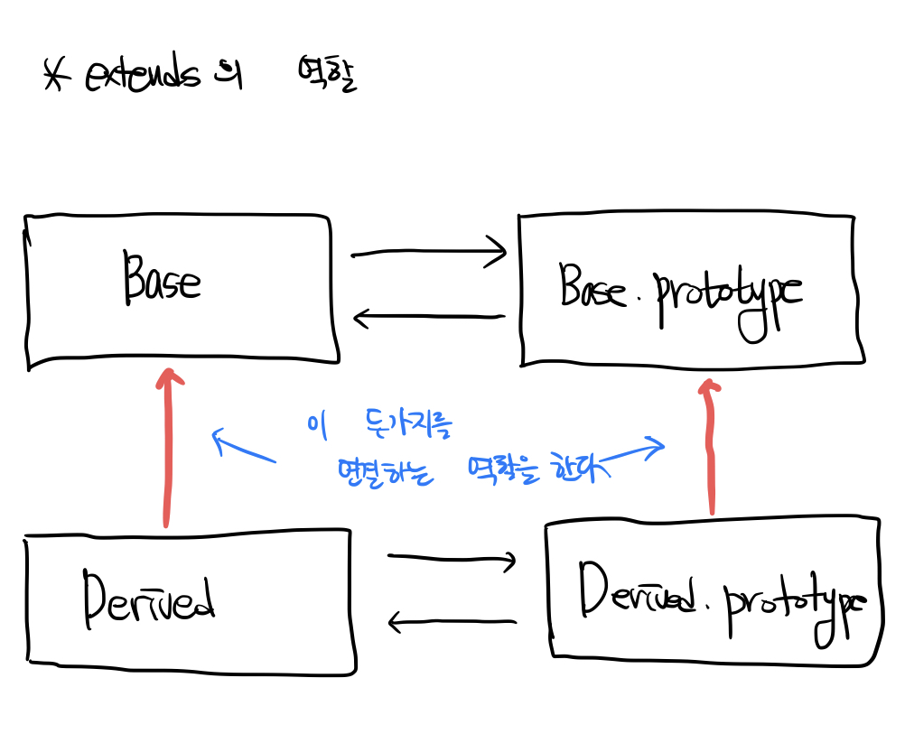

# 2022/08/23

## 오늘 공부한 내용

### [클래스](https://github.com/SleeplessN/TIL/blob/main/Javascript/Javascript%20DeepDive/25%EC%9E%A5%20%ED%81%B4%EB%9E%98%EC%8A%A4.md)

## 수업 내용

- 문법적 설탕이란 **`동일한 동작`**을 하되, 사용하는 방식이 다른 것이다.
  - 생성자 함수와 클래스의 내부 동작은 같다. (동일한 동작을 한다)
- 클래스가 더 엄격(내가 원하는 바대로 동작)하기 때문에 생성자 함수보다 더 좋다
- 클래스가 더 좋아서 클래스를 사용하는데 생성자 함수는 왜 배웠나?
  - **여러 가지를 배워야 코드를 작성할때 적절한 것을 선택하여 사용할 수 있다.** 가치 판단이 된다. 코드 한줄을 짜더라도 그에 대한 이유가 생긴다.
  - 클래스와 생성자 함수의 차이만 보아도 왜 클래스를 사용하는지 이유가 보인다.
- 클래스는 어디 사용되나?
  - 자료구조를 만드는데 많이 사용된다.
- 상속(`extends`, `super`)을 할 일이 많진 않다. (많아봐야 한 번?)
- 관련성 있는 메서드를 모아놓은 것을 네임스페이스라 한다.
  - Math, JSON는 생성자 역할은 하지 않고 네임스페이스 역할만 한다.
- 프로토타입 메서드와 정적 메서드를 어떻게 해야 잘 사용할 수 있을까?
  - 인스턴스를 생성(this를 사용)하여 그 값을 참조해야 하는 경우에는 프로토타입 메서드를 사용한다.
  - 인스턴스와 관련없는 메서드의 경우 정적 메서드를 사용한다.
- 다음 예시를 보자
  ```jsx
  class Base {
    constructor(a, b) {
      this.a = a;
      this.b = b;
    }
  }

  class Derived extends Base {
    constructor(a, b, c) {
      super(a, b, c);
      this.c = c;
    }
  }

  const derived = new Derived(1, 2, 3); // Derived
  ```
  - 사실은 Base가 만들어서 전달해준건데 new 다음에 Derived 이기 때문에 Derived로 나온다
- 그래서 `extends`의 역할이 뭐냐
  

## 실제 구현

### [클래스를 사용하여 Stack 구현](https://github.com/SleeplessN/TIL/blob/main/DataStructure/Linear/Stack/Stack%20by%20class.js)

### [클래스를 사용하여 Queue 구현](https://github.com/SleeplessN/TIL/blob/main/DataStructure/Linear/Queue/Queue%20by%20class.js)

## 느낀점

- 클래스는 생성자 함수와 동작 방식은 동일하지만 애초에 인스턴스 생성을 위해서 나온 문법이기 때문에 생성자 함수에 비해 가독성이 좋고 안정적이였다. 그래서 클래스를 배우고보니 결국 클래스가 생성자 함수에 비해서 기본적으로 `strict mode`를 제공하여 내가 원하는 대로 동작되서 안정적인 면에 있어서도, 따로 상속을 위한 `extends`나 `super` 도 제공하는 부분에 있어서도, 결국 인스턴스를 생성하기 위해서는 생성자 함수보단 클래스를 사용할 것 같아 처음에는 ‘이럴꺼면 생성자 함수는 왜 배웠지?’라는 생각이 들었다. 하지만 결국 같은 동작 방식이라도 클래스가 생성자 함수에 비해 앞에서 말한 장점들을 가지는데, 이는 곧 내가 코드를 작성하는데 있어서 생성자 함수가 아닌 클래스를 사용한 근거가 된다는 것을 깨달았다. 즉, 내가 코드를 한줄 한줄 작성하는데 있어서 그냥 동작하도록 만드는 것은 쉽지만 다른 방식도 있는데 **그 방식을 왜? 사용하였는지** 설명할 수 있어야 하기 때문에, 앞으로도 같은 동작 방식 중 최선의 방법을 고민하여 선택하고 그 최선의 방법을 선택한 이유를 말할 수 있고, 이를 통해서 좋은 코드를 작성할 수 있도록 노력해야겠다.
