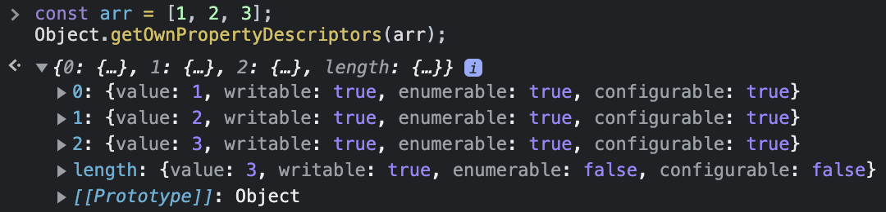

# 2022/08/25

## 오늘 공부한 내용

### [Date](https://github.com/SleeplessN/TIL/blob/main/Javascript/Javascript%20DeepDive/30%EC%9E%A5%20Date.md)

### [RegExp](https://github.com/SleeplessN/TIL/blob/main/Javascript/Javascript%20DeepDive/31%EC%9E%A5%20RegExp.md)

### [String](https://github.com/SleeplessN/TIL/blob/main/Javascript/Javascript%20DeepDive/32%EC%9E%A5%20String.md)

### [7번째 데이터 타입 Symbol](https://github.com/SleeplessN/TIL/blob/main/Javascript/Javascript%20DeepDive/33%EC%9E%A5%207%EB%B2%88%EC%A7%B8%20%EB%8D%B0%EC%9D%B4%ED%84%B0%20%ED%83%80%EC%9E%85%20Symbol.md)

## 수업 내용

### 화살표 함수

- ES6에서 메서드가 나온 이유? ES5의 메서드는 메서드가 아니였다.

  ```jsx
  // ES5
  const o = {
  	foo function(){};
  }

  new o foo() // 메서드는 constructor가 존재하지 않음에도 가능했다

  // ES6 (메서드 축약 표현)
  const o = {
  	foo() {};
  }
  ```

  - **특정 목적에 맞는 함수를 특정 목적에만 사용하기 위해서** ES6에서 메서드와 화살표 함수가 생겼다.

- **어떤 경우에 화살표 함수**를 사용하는 것이 좋은가?

  - 콜백 함수에 유용하다. (**콜백함수와 그 중첩함수의 `this`의 불일치 문제 해결**)
  - 화살표 함수는 constructor가 없어 생성자 함수로 사용하면 안된다.
  - **가독성**이 좋다.
  - `this`는 메서드 내에서만 의미가 있다.
    - 메서드 내부에서 화살표 함수는 써도 되지만, 메서드를 화살표 함수를 사용하면 안된다.
    - `this`와 `super` 둘 다 메서드 내부에서 의미가 있기에 존재하지 않는다.
  - 화살표 중첩함수

    ```jsx
    () => () => console.log(this);

    // 다음과 같다
    function foo() {
      return function () {
        return console.log(this);
      };
    }
    ```

- 다음 `this`의 상위스코프는?

  ```jsx
  const x = 10;

  class Foo {
    bar = () => console.log(x);

    constructor() {
      const x = 1;
    }
  }

  // bar의 상위 스코프는 전역이다
  new Foo().bar(); // 10
  ```

- **화살표 함수에는 `arguments` 를 사용하는 것이 아니다.**
  - 일반 함수에서 사용하는 것이다.

### Rest 파라미터

- Rest 파라미터는 배열이고, `arguments`는 유사 배열 객체이다.
- ES6부터는 유사 배열 객체를 안쓰는 추세이다. 자바스크립트는 객체 아니면 배열이라 보면된다.
  - **순회**(순서대로)를 할꺼면 배열을 사용한다.

### 배열

- **배열**이란?
  - **동일한 크기 요소가 밀집된 데이터를 가진 자료구조**
  - **장점**
    - **임의** **접근에 최적화** (`선두주소 + (dataSize * index)`)
      - 시간복잡도 `O(1)`
  - **단점**
    - **데이터 추가, 삭제시 영향이 크다**
      - 시간복잡도 `O(n)`
  - 그러므로, **데이터 접근을 많이 하고 데이터 추가와 삭제가 적은 데이터 구조에 적합**하다.
- **자바스크립트 배열은 객체이다.**
  
  - 객체 형태이다. 프로퍼티다
    - 객체로 한 이유는 일반 배열의 장점인 임의 접근을 포기하고 데이터 추가와 삭제를 선택한 것으로 보인다.
  - 배열은 `[1, 2, 3]` 이런 것을 만들어야지 `[1, ‘2’, true]`와 같이 만들면 안된다.
- 원본배열 손상시키지 않고 유지시키려고 해야 한다.
  - 예를 들어, `arr.push(4)` 보다 `arr = […arr, 4]`와 같이 작성하는 것
- 배열에서 고차함수를 사용해야 한다.
  - 그 중에서 **가장 중요한 메서드는 `.map` 이다.** `reduce`는 가독성이 좋지 않고, 위험하다.
- **`map`** 메서드

  - `map`은 원본과 다른 주소의 새로운 배열을 만들어서 반환한다.
  - 즉, `map`을 사용하면 원본을 변환하지 않는데 사실 시간복잡도, 공간복잡도 부분에 있어서는 원본을 변환하는 것이 훨씬 빠르다
    - 하지만, 원본에 영향을 주는 것은 전형적인 비순수 함수가 된다. (사용을 지양)
  - 맵의 콜백함수는 반드시 리턴값이 존재해야 한다
  - 함수에서 매개변수가 중요하다.

    ```jsx
    const orig = [1, 2, 3];

    const res = orig.map((v) => v * 2); // [2, 4, 6]
    ```

    - element인 v만 작성하면 element 만 넘어오나?
      - 아니다 어쨋든 (`element`, `index`, `array`) 3**개 다 넘어오지만, 현재는 element만 사용할 것이기 때문에 한개만 작성한 것**

- 어떤 고차 함수를 사용할까?

  - `원본 요소의 개수 === 반환할 요소의 개수` ⇒ `map`
  - `원본 요소의 개수 >= 반환할 요소의 개수` ⇒ `filter`
  - 누산되어 **하나의 값**으로 반환 ⇒ `reduce`

- 이제부터 일반 함수 선언시 화살표 함수를 사용해보자 (함수를 짧게 만드는 연습을 해야한다)
- 왜 이런 질문을 했을지, 무슨 대답을 원하는지 알아 차려야 한다.

## 느낀점

- 어제 조원들과의 러버덕을 통해서 화살표 함수가 단순히 가독성만을 위해서 생성된 것이 아닌, 콜백함수와 중첩함수의 this 불일치 문제를 해결하기 위해서까지만 알았다. 그러나 오늘 추가적으로 ES6에서 메서드와 화살표 함수 자체가 나온 이유가 일반 함수에는 여러 호출 방식이 존재하기 때문에 결국에는 실수를 유발할 수 있어서 특정 목적에 맞는 함수를 특정 목적에만 사용하기 위해서 생겨났다는 것을 알게되었다.
- ‘자바스크립트의 배열은 배열은 아니다’ 라는 말이 지금까지는 단순히 자바스크립트에서의 배열은 객체이기 때문이라고만 받아들였지만, 사실 진짜 배열은 **동일한 크기 요소가 밀집된 데이터를 가진 자료구조**를 뜻하는 것을 비롯해 왜 자바스크립트의 배열은 배열이 아닌지 알게되었다.
- 그리고 배열의 메서드 중 원본을 수정하지 않음으로서 비순수를 지양하는 것과 todoList 실습을 통해서 배열 고차함수를 사용하는 방식에 대해서 알게되었다.
- 마지막으로, 면접 질문을 받았을 때 면접관이 왜 이런 질문을 했을지, 어떤 대답을 원하는지에 대해서 알기 위해서 러버덕 포함하여 제대로 알도록 노력해야겠다.
