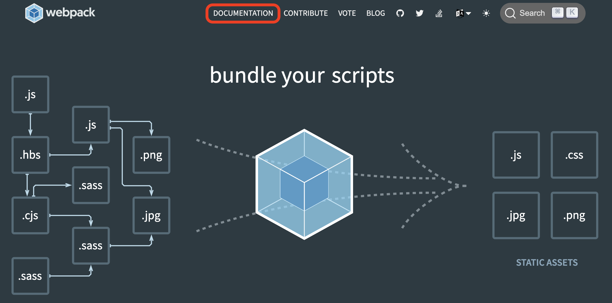
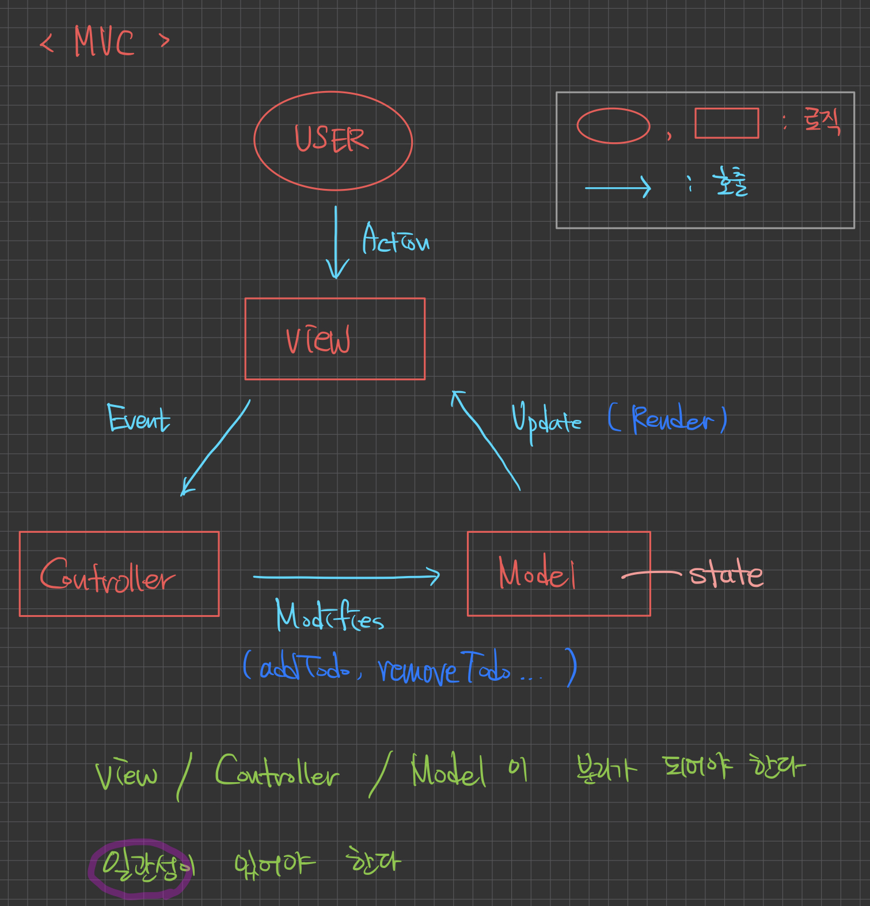

# 2022/09/02

## 오늘 공부한 내용

### [에러처리](https://github.com/SleeplessN/TIL/blob/main/Javascript/Javascript%20DeepDive/47%EC%9E%A5%20%EC%97%90%EB%9F%AC%EC%B2%98%EB%A6%AC.md)

### [모듈](https://github.com/SleeplessN/TIL/blob/main/Javascript/Javascript%20DeepDive/48%EC%9E%A5%20%EB%AA%A8%EB%93%88.md)

### [CORS](https://github.com/SleeplessN/TIL/blob/main/Web/CORS/CORS.md)

## 수업 내용

- 에러와 예외는 다르다
  - 에러란?
  - 예외란? 나의 의도와는 다르게 동작하는 것
- 변수를 지정할 때 타입이라는 것이 있는 (정적타입)은 NaN이 있을 수 없다.
  - 동적 타입이기 때문에 NaN이 존재한다. (ex. 1 \* n )
  - 재할당을 하면서 이런 문제가 대부분 발생한다.
- 에러는 caller 방향으로 전파된다
  - try … catch를 사용해야한다.
    - 이를 위해서는 async / await 를 사용해야 한다!
- 에러 객체를 만들어서 던진다
  - ‘어떤’ 에러가 ‘어디서’ 발생했는지 던져(throw)줘야한다. 그걸 catch 한다
- 자바스크립트는 애초에 웹사이트의 보조적인 용도로 생겨났다.
  - 그래서 ES5까지는 모듈이라는 기능이 제공되지 않았다
  - 애플리케이션 용도로 사용하기 위해서는 모듈이 필요하다.
  - 파일을 어떻게 쪼갤까? 정답이 없다.
  - 폴더 관리를 잘 해야한다 (폴더 이름도 식별자, 파일 이름도 식별자이니 신경쓰자)
  - 폴더 관리 크게 2가지 : 기능별로, 화면별로
- 모듈
  - export 해주면 import 해서 사용한다
  - 모듈 방식 2가지
    - default - export default / import `…` from `…`.js
    - named
  - 어떤걸 사용하나?
    - 일반적으로 default 방식을 사용하고 여러가지 할 경우 named 방식 사용
- Babel
  - Babel은 준 표준이다
  - 사용이유 : 최신 문법(브라우저가 자체적으로 허용한 문법 포함)을 사용하고 싶은데 지원하지않는 브라우저가 존재하기 때문에 최신 문법을 구형 문법으로 변경해주는 역할
  - 폴리필(Polyfill)은 최신 ECMAScript 환경을 만들어 준다.
    - Promise와 같이 ES5에서 변환할 수 있는 대상이 없는 경우 에러가 발생하는데 이를 해결해준다
  - babel에서 플러그인이란 정식 지원하지 않는 문법을 추가적으로 등록하는 것
- Webpack
  - 웹팩은 번들러이다
  - 빌드라는 과정을 통해 하나의 파일로 만들어준다.
- 빠른 학습 능력이 필요하다

  - 탄탄한 기본기를 바탕으로 폭 넓게 배워야할 필요가 있다.
  - 새로운 것(툴)을 배울 때 DOCUMENTATION(공식문서)을 읽어야 한다!

    

  - 이부분을 잘 읽자!

    

- CORS 에러는 Server측에서 해결해줘야한다.
- MVC

  

  - 왜 필요하나?
    - 코드를 잘 짜기위해
  - 화면 그리기 (View) - 이벤트 핸들러
  - 비즈니스 로직 (Model) - todo 데이터
  - 화면 그리기와 비즈니스 로직을 연결해주는 것 (Controller) - render 함수
  - state가 view를 업데이트 한다
  - 여기서 MVC에서 아이디어를 따왔고 표준화하는 것이 중요하다
    - MVC에 너무 집착 X
    - 통일성있게 돌아갔으면 좋겠다
    - 가독성이 좋다는 것은 유지보수가 좋다는 것까지 이어진다
    - 생산성이 좋아야 협업이다. (협업의 방식 중 하나라 할 수 있겠다.)
  - 함수를 API라 한다
  - state(model)는 View에 영향을 주는 것
    - 반대로 View에 영향을 주지 않으면 state가 아니다.
