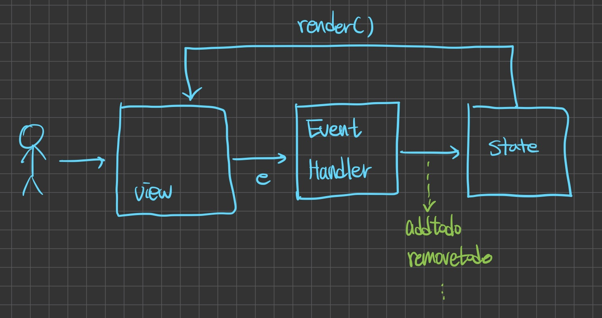

# 2022/09/03

## 수업 내용

- 좋은 코드란?
  - 요구 사항대로 돌아가는 코드
  - 성능
  - 가독성
    - 가독성이 좋은 글을 쓸려면 다른 사람이 적은 글을 읽어보아야 한다.
    - 가독성이 좋은지 안좋은지 나만의 구별법이 있어야한다.
    - 깔끔하게 코드를 짜자!
    - 코드를 성의있게 쓰자!
      1. 좋은 이름 (이름 잘 짓기) - 특히 함수형에서 매개변수의 이름
      2. indent, 띄워쓰기 잘하기 (`i=0` X , `i = 0` O)
      3. 함수를 어떻게 만들까 (꼭 재사용만을 위해서 만드는 것은 아니다)
    - 책을 배운 이유?
      - 상황에 맞춰 좋은 리소스를 뽑아내기 위해서
      - 어떤 방법을 사용할까 고민하는 자체가 좋은 것 이다.
      - 코드 한 줄 한 줄에 이유가 있어야 한다.
      - 이유가 없으면 고칠 수가 없다.
- 순서
  - 일단 돌아가도록 한 파일로 만든다
  - 코드가 돌아가면 끝이 아니라 이제 시작이다.

```jsx
// get은 이미 존재하는 것을 가져오는 것이고
const getNextId;
// create는 새로 생성한다는 뜻이므로 구별하여 사용
const createNextId;
```

- `forEach`는 순수하게 for문의 대체 ⇒ `undefined`를 반환한다
- `reduce`는 지양하는 것이 좋다.
- 핸들러 함수는 무조건 비순수 함수이다.
  - 재할당은 순수한 것이 아니다.
  - 일부만이라도 순수하게 못 만들까?
  - 어떤 함수를 순수하게 만들 수 있을까? 에 대한 고민
- 자료구조와 자료구조를 수정하는 함수들의 집합 - Model
- State란
  - 변하는 데이터로서 렌더링에 영향을 주는 요소
- MVC 구조 숙지

  

## 오늘 풀어본 알고리즘 문제

### [같은 숫자는 싫어](https://github.com/SleeplessN/problem-solving/blob/main/programmers/%EA%B0%99%EC%9D%80%20%EC%88%AB%EC%9E%90%EB%8A%94%20%EC%8B%AB%EC%96%B4.js)

### [멀쩡한 사각형](https://github.com/SleeplessN/problem-solving/blob/main/programmers/%EB%A9%80%EC%A9%A1%ED%95%9C%20%EC%82%AC%EA%B0%81%ED%98%95.js)

### [조이스틱](https://github.com/SleeplessN/problem-solving/blob/main/programmers/%EC%A1%B0%EC%9D%B4%EC%8A%A4%ED%8B%B1.js)

## 느낀점

- 좋은 코드란 무엇인가에 대해서 생각해보게 되었는데, 첫번째는 요구사항 이하도 이상도 아니도록 딱 요구사항에 맞도록 동작하는 것이였다. 그리고 변수나 함수의 이름을 잘 짓는 것도 상당히 중요하면서도 정말 기본적인 것인데 이전의 코드를 되돌아보며 반성하게 되었다. 또한 예전에는 코드 사이에 엔터가 많아지면 코드가 길어지고 남들 보기에 좋지 않다 생각하였는데, 오히려 코드들이 붙어있으면 가독성이 좋지 않을 수 있다는 것을 알게 되었다. 투두 리스트 실습을 하면서 코드 한 줄 한 줄 고민해보는 것이 사실 쉽지는 않았지만 꾸준히 고민해보고 습관이 되도록 노력해야겠다.
