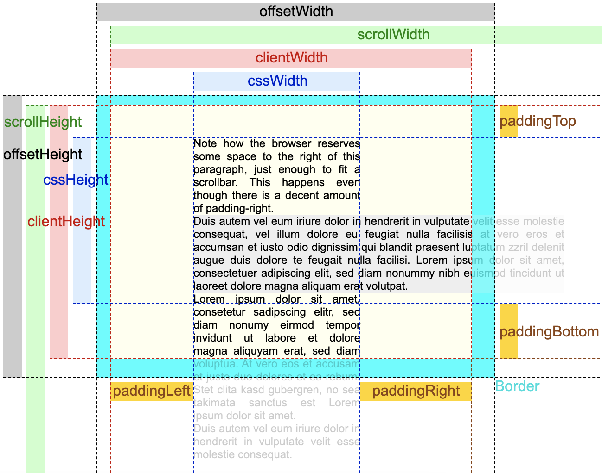

# 2022/09/15

## 오늘 공부한 내용

### lodash debounce 사용

```jsx
// 작동 X
$searchInput.addEventListener("keyup", () => {
  _.debounce(() => {
    setState({ inputValue: $searchInput.value });
  }, 500);
});

// 작동 O
$searchInput.addEventListener(
  "keyup",
  _.debounce(() => {
    setState({ inputValue: $searchInput.value });
  }, 500)
);
```

### **엘리먼트의 크기 가져오기 (offsetWidth, clientWidth, scrollWidth)**



- `offsetWidth`

  - 일반적으로 엘리먼트의 전체 크기를 알고 싶을 경우에 사용
  - 이 속성은 엘리먼트의 padding과 border, Scroll bar의 사이즈를 포함한 값을 리턴한다.

- `clientWidth`

  - 실제로 보여지고 있는 컨텐츠가 얼마만큼의 공간을 차지하고 있는지 알고 싶을 경우에 사용
  - border와 Scroll bar의 크기를 제외한 실제 컨텐츠의 크기를 리턴한다. (padding은 포함)

- `scrollWidth`
  - 보이는 것과 상관 없이 실제 컨텐츠 영역이 얼마만큼의 크기를 갖고 있는지 알고 싶을 경우에 사용
  - 전체 Scroll bar를 사용하게 되어 숨겨진 영역까지 포함한 크기를 리턴한다.

### 정규 표현식에 템플릿 리터럴 사용

- String의 내용 중에 `checkStr` 부분을 `<replaceStr>`으로 바꾸어주려고 할 때,
  - `/ /` 내부에 템플릿 리터럴을 사용하면 안된다.
  ```jsx
  // 동작 X
  String.replace(/${checkStr}/i, <replaceStr>);
  ```
  - 정규 표현식 생성자 함수를 사용하여 이를 해결할 수 있다.
  ```jsx
  // 동작 O
  const regExp = new RegExp(`${checkStr}`, 'i');
  String.replace(regExp, <replaceStr>)
  ```
