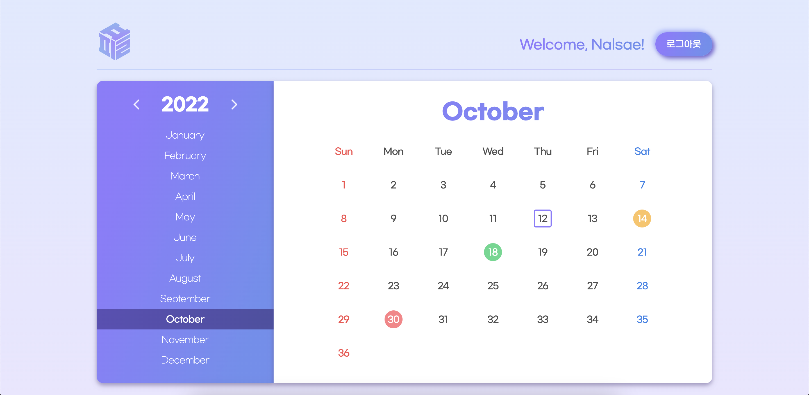

# 2022/10/12

## 미니 프로젝트 2일차

### 달력 마크업 및 CSS 완성



- 어제 만들어진 피그마를 바탕으로 담당 파트인 달력 마크업 및 CSS를 완성하였다.

### git flow

- 다음의 git flow 전략을 통하여 각자의 파트를 진행하였다.

```
### 협업 git-flow

- fork and merge
    - fork : 관리자 급의 레포를 포크를 떠서 사본을 만들고 로컬에서 작업
    - merge : 작업이 끝나면 사본에 푸시하고 그것을 원본에 pull request 요청

팀장이 있는 팀의 협업의 흐름 [https://www.youtube.com/watch?v=j6lWqXoyBUA](https://www.youtube.com/watch?v=j6lWqXoyBUA)(참고)

팀장 레포 생성 →

팀장 레포 클론 후 git flow init →

develop에서 프로젝트의 큰 맥락의 파일 생성 →

git push -u origin develop으로 리모트 저장소에도 develop 생성(팀원들 풀리퀘스트 담당) →

팀장의 레포에서 issues 를 활용하여 해야할 일을 리스트업

(할 일과 간단한 설명 ##tasks -[] ex 1 -[] ex2 -[] ex3 업무 과정 작성) →

포크를 뜬다 (나에게 사본 레포 추가 copy to main branch only 체크 해제) →

포크해온 사본을 나의 로컬에서 클론 →

git flow init →

git flow의  feature start 작업 진행 →

feature를 finish 하고 git push -u origin develop (사본의 디벨롭 브랜치로) →

pull request로 사본의 develop 에서 팀장의 develop으로 요청(제목이 릴리즈 태그의 내용으로 들어간다. (커밋 메세지 내부에 resolve #1, fixes #1, close #1) 을 이용해 issues와 연결 가능 ) →

팀장은 요청 확인 후 리뷰, 리뷰 후 변경 요구가 있을 경우 팀원에게 리뷰에 남김 →

팀원은 리뷰를 확인하고 해당 요구사항을 develop 브랜치 자체에서 처리 (요구단위로 커밋 남기기) →

git push origin develop으로 변경사항 push (바로 pull request로 반영) 팀장급의 관리 필요 →

다른 팀원들의 정보를 반영하기 위해 git remote add upstream [원본의 주소] 로  원본 등록 →

git pull upstream develop으로 원본의 develop 내용으로 업데이트 ( 충돌 해결 후 push )
```

## 느낀점

- HTML/CSS 강의가 끝나고 javascript 공부를 한지 약 두 달이 지나고 나니 마크업과 CSS를 처음부터 하려하니 어려움이 느껴졌다. 지금 공부하는 javascript도 중요하지만 그것의 근간이 되는 HTML 및 CSS도 소홀히 하지 말아야 겠다는 것을 느꼈다. g
