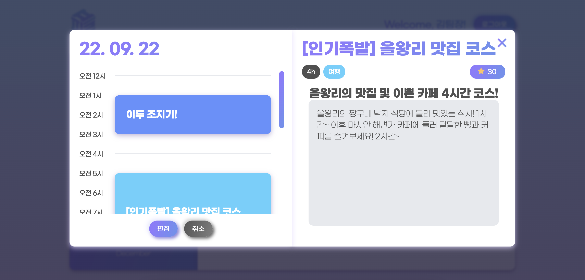

# 2022/10/14

## 미니 프로젝트 4일차

### 오전 회의

**🔸 JS 구현 방식 논의**

- 클래스형 컴포넌트 방식으로 구현
  - 각각의 컴포넌트(클래스) 생성 시 반환하는 값은 DOM 요소(문자열)
  - `eventHolder` 배열 사용하여 이벤트 등록 중복 방지
  - Modal 컴포넌트의 경우 다른 상위 컴포넌트에 포함되는 하위 컴포넌트이므로 최종적으로는 포함하는 상위 컴포넌트에 이벤트 등록 위임
  - 일단 테스트 구현 시에는 Modal 컴포넌트에 자체적으로 이벤트 등록
    - 각각 담당한 페이지(컴포넌트)를 최상위 컴포넌트인 `App`으로 생각하고 구현
  - 세부적인 버튼, 피스 등까지 컴포넌트화시키지는 않기로 합의
    - 각 컴포넌트별로 다른 페이지(컴포넌트)로 이동 시 Route 변경하여 렌더링

### 오늘 결과 화면



- 캘린더의 각 날짜를 클릭하였을 때 모달창이 뜨도록 캘린더 컴포넌트 안에 모달 컴포넌트를 추가해주었다.
- 아직 세부적으로 완성은 되지 않았다!

### 고민한 부분

- 날짜 클릭시 데이터 가공 위치
  - Modal의 props로 선택한 Date 값(ex. `2022-10-14`)을 넘겨주어 Modal에서 서버로부터 데이터를 받아와서 넘겨준 Date 값으로 filter 메서드를 사용하여 데이터를 가공하여 모달에 띄워주었다.
  - 하지만 이는 상위 컴포넌트인 캘린더에서 해야할 일이라고 생각하여, calendar에서 선택한 Date값으로 데이터를 가공하여 그 데이터를 Modal의 props로 전달해주었다.
  - 두번째 방식으로 했을 때, 이제 Modal으로 Date 값을 넘겨줄 필요가 없다고 생각했는데, 모달창 왼쪽 위에 뜨는 날짜를 표현하기 위해서는 결국 Date 값을 넘겨주어야 했다.

### 해야할 일

- 달력과 모달간의 blur 관련 CSS 작업
- 각각 일자 표시 관련 CSS 작업
- Calendar 내부의 임시 Mock plans 데이터 대신 models의 plans로 부터 데이터를 가져오기
- Modal detail을 위한 targetPiece 데이터를 어떻게 전달할지 고민
- nav logo 클릭시 selectedDate 값 초기화해주기 (현재 logo 클릭시 모달 창이 나온다)
- 다음 함수는 `-schedule` 부분이 중복되기에 충분히 temperal literal으로 대체 가능할 것 같아 수정 예정
  ```
  // 카테고리를 받아 해당 함수명으로 반환하는 함수
  getCategoryClass(category) {
    // eslint-disable-next-line default-case
    switch (category) {
      case 'exercise':
        return 'exercise-schedule';
      case 'study':
        return 'study-schedule';
      case 'date':
        return 'date-schedule';
      case 'trip':
        return 'trip-schedule';
      case 'art':
        return 'art-schedule';
      case 'play':
        return 'play-schedule';
      case 'rest':
        return 'rest-schedule';
      case 'work':
        return 'work-schedule';
      case 'parenting':
        return 'parenting-schedule';
    }
  }
  ```
