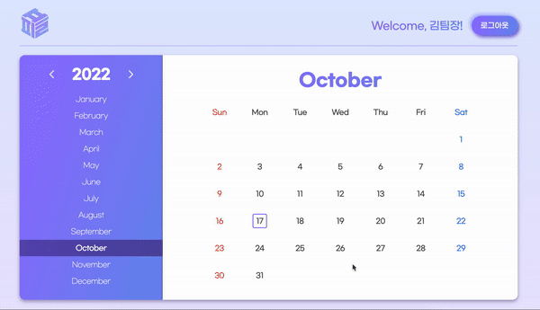

# 2022/10/17

## 미니 프로젝트 7일차

### 오전 회의

## 🔸 김은우

- 캘린더 편집 화면 넘어갈 때 상태(날짜)가 초기 값으로 고정되는 부분 해결 필요
- 제목 최대 글자 수 문제 논의 필요
- 컴포넌트가 제대로 역할을 할 수 있게끔 이벤트 등록이 적절한 컴포넌트에 위치하는지 확인 필요
- 새로고침 시 경로가 `/어쩌고`까지는 새로고침이 제대로 동작, `/plan/213123`와 같은 형식을 새로고침 동작 X

: 원인은 express 서버에 있음, express.stactic 활용하면 해결할 수 있을 듯

→ 정적 파일 경로를 임의로 지정할 수 있음

⇒ 원래는 `public`이라고만 지정이 되어 있어서 오류 발생

<aside>
💡 `app.use('/plan', express.static('public'))`

: 첫 번째 매개변수로 임의의 경로 설정 가능
: 두 번째 매개변수는 첫 번째 매개변수로 전달한 경로가 들어왔을 때 찾아줄 기본 경로 지정
→ 원래는 `/` 요청으로만 처리했었음

</aside>

→ GET, POST 요청에 대한 경로는 따로 처리해주어야 함

<aside>
💡 루트 요청은 정상 작동하는 이유

: `*`로 GET 요청을 보내기 때문

</aside>

- 하위 컴포넌트에서 상태를 관리해줄 수 없기 때문에 발생하는 문제(`this`, 이벤트 등) 발생

: React가 짱..!

→ 클래스형 컴포넌트의 한계

## 🔸 김현진

- 기존 render 함수의 문제

: 메인 > 로그인 이동 시 이벤트 잘 동작, but 뒤로 가기 눌렀다가 로그인 다시 누르면 이벤트 동작하지 않는 이슈

: 뒤로 가기를 했다가 다시 이동할 때 새로 그려지는 인스턴스와 원래 인스턴스의 분기점이 달라지기 때문에 새로 그려지는 인스턴스에는 이벤트 등록이 되지 않음
→ 로직 변경하여 해결

```jsx
if (!components[_path]) components[_path] = new CurrentComponent();

if (prevPath !== _path) components[_path].state = new CurrentComponent().state;

prevPath = _path;
```

- 로그인 / 회원가입 컴포넌트 문제

: 로그인 입력 값과 회원가입 입력 값 유지 문제(어트리뷰트와 프로퍼티 문제)

→ diff 알고리즘, value 전달하는 로직 변경 해결

```
app.get('*', (req, res) => {
  res.sendFile(path.join(__dirname, 'public/index.html'));
});
```

## 🔸 전희준, 김민석

- 날짜 클릭했을 때 바깥까지 backgroud 속성 적용 안 되는 오류 해결

: 가상 요소로 했을 때 문제 해결 제대로 되지 않아서, `div` 요소를 하나 추가함

→ 현재는 각각 사용자 정의 속성 적용해놓는 방식으로 임시 해결

⇒ `closest` 사용하여 해결 가능할 듯

- `switch` 조건문 로직 삭제

: 템플릿 리터럴로 변경

- 로고 클릭 시 모달 컴포넌트 렌더링 되는 오류 해결

: `selectedDate` 값이 초기화되지 않아서 발생하는 오류

: 근본적인 원인은 잘못된 `this` 바인딩에 있었음

→ `this` 바인딩 변경 및 값 초기화 후 해결

- 다른 날짜 클릭 시 모달 컴포넌트 상태가 유지되는 오류 해결

: `selectedDate` 값이 초기화되지 않아서 발생하는 오류

: 근본적인 원인은 잘못된 `this` 바인딩에 있었음

→ `this` 바인딩 변경 및 값 초기화 후 해결

- 모달 컴포넌트 피스 클릭 시 렌더링되지 않는 오류 해결

: 근본적인 원인은 잘못된 `this` 바인딩에 있었음

→ 모달 컴포넌트에 있는 로직을 캘린더 컴포넌트로 옮겨서 `this` 바인딩을 변경하는 방식으로 해결

- CSS 변수 변경, 말줄임 및 줄바꿈 관련 속성 추가

### 오늘 결과 화면



### 작업 내용

- [x] 각각 일자 표시 관련 CSS 작업
  - 임시로 태그 안에 실제 날짜를 담는 태그을 또 만들어서 이를 해결했다.
- [x] Calendar 내부의 임시 Mock plans 데이터 대신 models의 plans로 부터 데이터를 가져오기
  - planClassNames 함수에 get 요청으로 받아온 data의 plans를 넘겨주어 알맞은 planClass를 주도록 하여 해결하였다
- [x] logo 클릭시 모달 나오는 문제 해결
- [x] getCategoryClass 함수 수정
  ```
  // 카테고리를 받아 해당 함수명으로 반환하는 함수
  getCategoryClass(category) {
    // eslint-disable-next-line default-case
    switch (category) {
      case 'exercise':
        return 'exercise-schedule';
      case 'study':
        return 'study-schedule';
      case 'date':
        return 'date-schedule';
      case 'trip':
        return 'trip-schedule';
      case 'art':
        return 'art-schedule';
      case 'play':
        return 'play-schedule';
      case 'rest':
        return 'rest-schedule';
      case 'work':
        return 'work-schedule';
      case 'parenting':
        return 'parenting-schedule';
    }
  }
  ```
  - 처음에는 조건문이 들어있는 함수를 통해 카테고리 별로 해당 카테고리 클래스명을 반환해 주었다.
  - 하지만 나중에 보니 결국 카테고리이름 뒤에 `-schedule`이 붙는 통일성이 존재했다.
    - 템퍼럴 리터럴을 통해( `${*plan*.pieces[0].category}-schedule`) 이를 해결했다.
- [x] monthList 및 dayList 위치 변경
  - monthList와 dayList는 변하지 않는 고정된 값이기 때문에 render()가 호출될 때마다 선언될 필요없이 최초에 인스턴스를 만들었을 경우에만 선언되면 되기 때문에 기존 render()함수에서 constructor()로 위치를 옮겨주었다.
- [x] 적절한 메서드 사용
  ```jsx
  // 이전
  const [filteredPlan] = data.plans.filter(
    ({ date }) => date === this.state.selectedDate
  );

  // 이후
  const filteredPlan = data.plans.find(
    ({ date }) => date === this.state.selectedDate
  );
  ```
  - 기존에는 filter 메서드를 이용하여 배열 형태로 값을 가져왔다.
  - 이후에는 find 메서드를 이용하여 바로 값을 가져왔다.

### 고민한 부분

- [x] 각각 일자 표시 관련 CSS 작업
  - 임시로 태그 안에 실제 날짜를 담는 태그을 또 만들어서 이를 해결했다.
  - 하지만 밖의 태그과 안의 태그 둘 다 클릭 시 이벤트가 발생해야 하기에, 밖의 블록에 이벤트 위임을 걸어주었지만, 이벤트 함수 내용 중에 data-date를 넘겨주는 부분이 존재했다. 하지만 밖의 태그에만 data-date가 존재했는데 이를 위해서 임시로 내부의 태그에도 data-date를 주었다. 하지만 두 태그 다 data-date를 가지는 것은 이상하다고 생각이 든다. 조금 더 생각해보아야 할 것 같다.
  - closest를 이용하여 이를 해결하였다. (내부의 태그에 data-date X)
    ```jsx
    selectDate(e) {
    	// 이전
      if (!e.target.matches('.date') && !e.target.matches('.date-day')) return;

      this.setState({ selectedDate: e.target.dataset.date });

    	// 이후
      if (!e.target.closest('.date')) return;

      this.setState({ selectedDate: e.target.closest('.date').dataset.date });
    }
    ```
- [x] logo 클릭시 모달 나오는 문제 해결
  - 각 dateSelect 이벤트 이 후(this.state의 selectedDate가 해당 날짜 값을 가지면) logo를 누르면 모달 창이 뜨는 문제가 존재한다. 이는 모달창이 꺼지면 selectedDate가 초기화 되는 것이 아닌 selectedDate의 값을 여전히 가진채로 class hidden을 이용하여 숨기는 것이기 때문에 logo 클릭시 이 selectedDate를 기반으로 다시 렌더링 하기때문에 모달창이 다시 화면에 보이는 문제가 존재한다.
  - 모달창을 껏을 경우에 calendar에서 this 바인딩을 이용하여 calendar의 this.state가 변경되도록 모달에 resetModalData라는 이벤트를 제공해주었다.

### 해야할 일

- jwt을 이용한 로그인 구현
  - 현재 정상적으로 cookie가 생성되지 않는 이슈 존재
