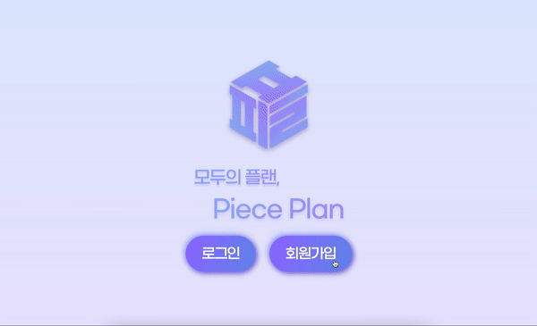
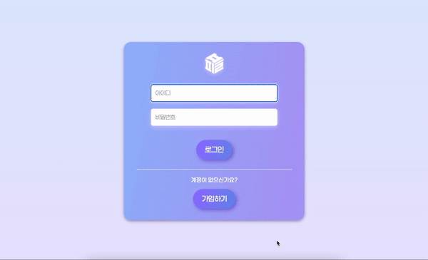
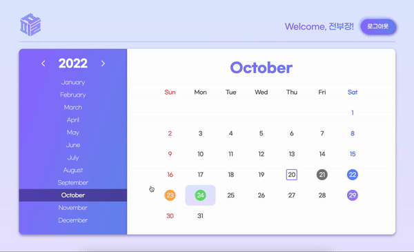
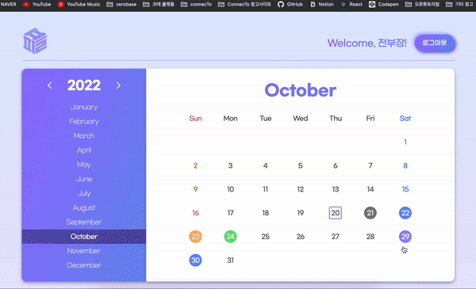
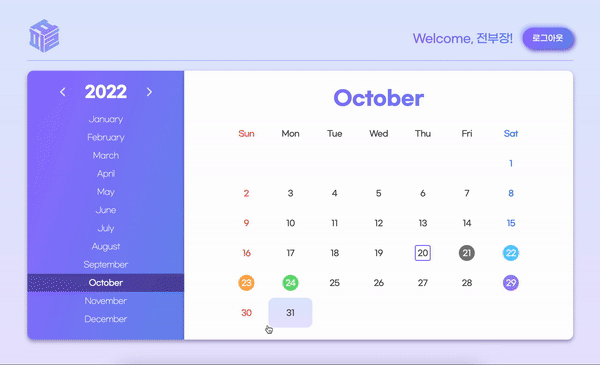

# 2022/10/20

## 프로젝트 10일차

### 발표 전 최종 정리

- 파일 구조 재정비 및 기타 CSS 문제 해결

### 결과 화면

- 회원가입

- 로그인

- 전체 캘린더

- 일정 삭제 및 추가

- 일정 필터 및 검색

## 배포 일지

## 🔸 배포

### 🔹 Heroku를 활용한 시도

- 과정

: Heroku를 활용하여 배포를 시도하였고, 결국 성공했지만 Heroku의 서버가 해외에 있다는 특징 때문에 최초 렌더링 속도와 페이지 이동 시의 렌더링 속도가 굉장히 느리다는 이슈가 발생했음

: 결과적으로 Heroku 외에 다른 배포 플랫폼을 사용하여 배포하기로 협의

- 결과

: 성공

### 🔹 Netlify를 활용한 시도

- 과정

: Netlify를 활용하여 배포를 시도하였고, 관련 자료를 구글링해보았으나 대부분 React와 Next.js를 활용한 프로젝트인 경우에 적용할 수 있는 방법들이었음

: 추측하건대 서버를 켠 후 추가적인 작업을 진행해야 정상적인 배포가 진행되는 것 같지만, 현재 프로젝트에서는 express 모듈을 사용하여 서버를 켜는 CLI 명령어만 추가했고 사용했기 때문에 Netlify를 사용하여 배포를 시도할 때 서버를 켠 이후에 추가적인 배포 작업 진행이 정상적으로 이루어지지 않았음

- 결과

: 실패

### 🔹 Google Cloud Platform을 활용한 시도

- 과정

  - Netlify를 활용한 배포 시도가 실패한 시점에서 AWS나 GCP를 활용하여 배포를 시도하기로 결정, 처음에는 AWS를 사용해보려고 했으나 프로젝트 마감까지 남아 있는 시간에 비해 러닝 커브가 매우 높다고 판단하여 GCP를 이용해보기로 결정

  - 관련 링크를 참고하여 성공적으로 배포를 마무리할 수 있었고, 결과적으로 기존 Heroku를 활용한 배포보다 훨씬 빠른 렌더링 속도를 도출할 수 있었음

  - 그러나 로컬에 존재하는 프로젝트 폴더를 기준으로 배포가 완료되었기 때문에 GitHub와 GCP를 연동하는 방법을 찾아보고 시도해보았으나 실패, GitHub와 연동하여 push가 이루어질 때마다 자동으로 배포가 빌드될 수 있도록 후속 조치가 필요할 듯함

- 결과

  - 성공, **[piece-plan.du.r.appspot.com/](https://piece-plan.du.r.appspot.com/)**

- 참고 링크

  - [https://codingapple.com/unit/nodejs-deployment-googlecloud/](https://codingapple.com/unit/nodejs-deployment-googlecloud/)

## 🔸 폴더 구조 수정

- `assets` 폴더 안의 이미지 리소스들을 하위에 `img` 폴더 생성한 후정리
- 웹 폰트 방식으로는 폰트가 적용되지 않는 이슈가 발생하여 `assets` 하위에 `fonts` 폴더를 생성하여 ‘woff2’ 형식의 폰트 파일을 사용하는 방식으로 변경

## 🔸 이슈 해결

- 회원가입 기능 중 이미 가입된 사용자인지 판별하는 로직이 정상적으로 동작하지 않는 이슈

  - `users` 데이터 파일 안에 존재하는 중복된 사용자를 판단하는 함수가 정상적으로 동작하지 않아서 이를 수정

  - 애초에 닉네임이 아니라 ID만으로만 유효성 검사를 수행하면 되기 때문에 기존에 ID와 닉네임까지 전부 http 요청에 담아 전송하던 부분을 ID만 전송하게끔 수정

- 새로 가입한 사용자들의 피스 관련 State가 공유되는 이슈

  - 처음에는 회원가입 진행 시 생성하는 `uuid`가 정상적으로 동작하지 않는 데 원인이 있는 줄 알았으나 사용자가 입력한 정보를 전달하는 과정에서 매개변수 이름을 잘못 지정한 데 그 원인이 있었음, 매개변수를 잘못 전달했기 때문에 `undefined` 값이 전달되어 `uuid`가 정상적으로 생성되지 않았던 것임

  - 전달하는 매개변수 이름을 정상적으로 수정하여 이슈 해결

### 느낀점

- 미니 프로젝트 마지막 날, 아직도 자잘한 CSS 적인 문제 등이 존재하였다. 이러한 경험을 하면서 정말 한 애플리케이션을 배포하기 위해서는 정말 신중하고 많은 노력이 든다는 것을 깨닫게 되었다. 2주도 안되는 시간으로 인해서, 많은 기능을 넣은 것은 아니지만, 첫 미니 프로젝트에서 우리가 생각한 것을 실제로 구현했다는 점에 있어서 너무 뿌듯했다. 나중에 리액트를 배우게 되면 이를 리액트로 만들어보고 적용하지 못한 기능(에디터 기능, 계획 알고리즘 등등)들도 넣어 더 완성적인 애플리케이션을 만들면 더 재밌고 뿌듯하겠다는 생각이 들었다.
