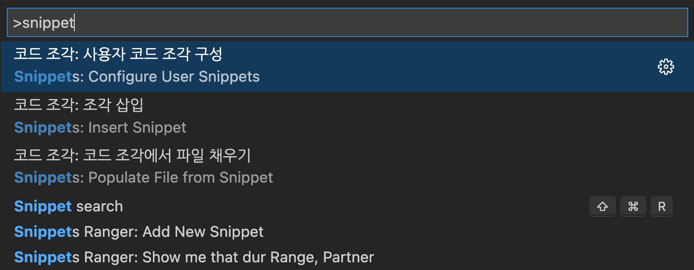

# 2022/10/25

## 오늘 공부한 내용

- 리액트 컨셉 3가지, 웹팩 컨셉 4가지 정도는 알아야 한다. (배울 예정)
- 컴포넌트 주도 개발(CBD방식)을 할 예정

- IIFE 사용 이유
    - 모듈
    - return 하여 필요한 것만 보여줄 수 있다.
    
- `<noscript></noscript>`는 script가 동작하지 않는 곳의 대체 텍스트 역할
- IE 조건부 주석문

```html
<!--[if IE]>
...
<![endif]-->
```

- BEM 방식(ex.`notice--fixed-top`)은 CSS에서는 scope가 없기 때문이다.

- 내가 만드는 환경이 IE를 고려한다면 ?
    
    ```html
    <meta http-equiv="X-UA-Compatible" content="IE=edge" />
    ```
    
    - X - 비표준
    - UA - Usual Agent
    - Compatible - 호환성
    - IE=edge (IE의 최신버전)

- snippets
    - 자주 사용되는 코드 블록을 손쉽게 재사용 하고자 할 경우, 스니펫을 만들어 등록하면 편리하다.
    - 자신만의 스니펫 등록
        
        
    - 스니펫 관리 (snippet ranger 익스텐션 이용)
        
         
        
- 설치안하고 라이브 서버실행
    
    ```bash
    npx live-server public --host=localhost --port=8000 --no-browser
    ```
    
- node:path에서 join, resolve 차이
    
    ```jsx
    const { join, resolve } = require('node:path');
    
    console.log(join('public/scripts/app.js'))
    // 출력 : public/scripts/app.js
    
    console.log(resolve('public/scripts/app.js'))
    // 출력 : /Users/heejun/Desktop/connecToData/React/public/scripts/app.js
    
    console.log(join(process.cwd(), 'public/scripts/app.js'))
    // 출력 : /Users/heejun/Desktop/connecToData/React/public/scripts/app.js
    ```
    
    - 윈도우 맥 환경의 파일 경로를 같게 해주기 위함
    - 결국 process.cwd() 사용하지 않으려 resolve 사용

- 삼항 연산자 ternary operator / 이항 연산자 binary operator

## 느낀점

- 리액트 전 환경설정만 하더라도 정말 할게 많고 낯설었다. 우리가 서버쪽은 깊게 알 필요는 없지만, 백엔드와의 소통을 위해서는 어느정도 알아야 한다는 것을 느꼇다. 아직 많이 낯설고 어렵지만 여러번의 반복과 복습을 통해서 익숙해지도록 노력해얗