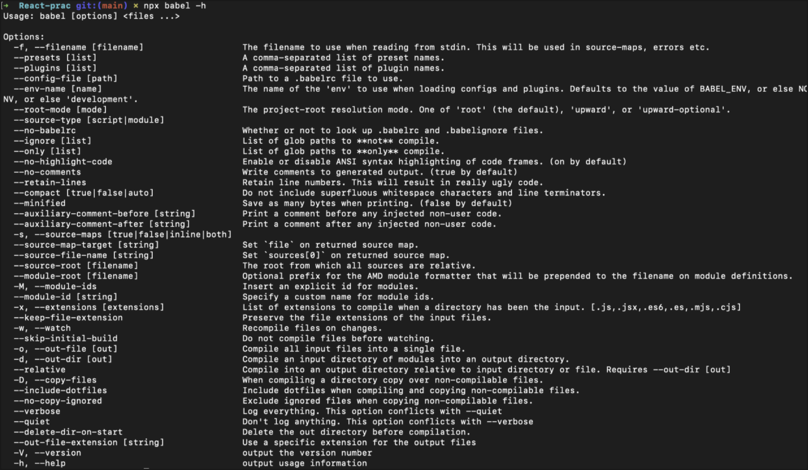
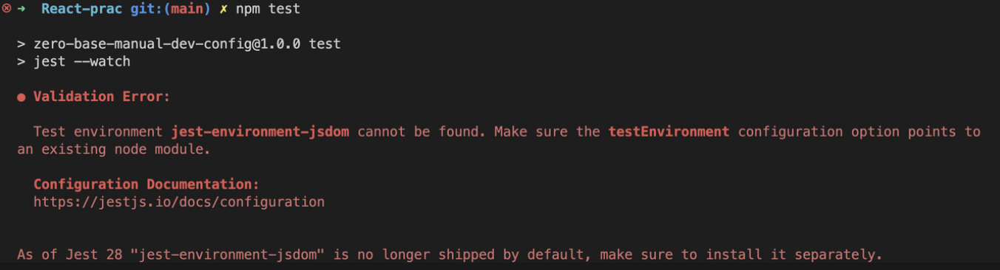

# 2022/10/26

## 오늘 공부한 내용

## Babel

> Babel은 Javascript **컴파일러(Complier)**이다. (Transplier가 아닌 Complier이다.)

- 차세대 Javascript 문법을 사용하도록 브라우저 호환 문제를 해결해준다.

### Babel이 하는 일

1. 구문 변환
2. 대상 환경에 누락된 폴리필 기능 (core-js@3 폴리필 사용)

> 🤔 **폴리필이란?**
> 변경된 표준을 준수할 수 있게 기존 함수의 동작 방식을 수정하거나, 새롭게 구현한 함수의 스크립트

3. 소스 코드 변환 (codemods)

---

💡 **CDN(Content Delivery Network)란?**

- 네트워크를 통해 데이터를 전송하는 기술
- 장점
  - 사용자 위치에서 가장 가까운 데이터를 가져온다.
  - 동일한 리소스에 대해서 캐싱된 데이터를 사용한다.

---

### 설치

```bash
npm i -D @babel/core @babel/cli @babel/preset-env
```

- @babel/core : 바벨의 기본적인 기능을 담은 코어
- @babel/cli : 바벨의 command-line interface
- @babel/preset-env : 최신 플러그인까지 담고있는 플러그인 모음

---

👍 유용한 확장 프로그램

- hide node modules : node_modules 파일을 제외 유/무를 토글하는 기능
- Search node_modules : node_modules 내에 검색할 수 있는 기능

---

> 🤔 package.json의 scripts 명령어에 npx 붙이는 경우?
> npx의 경우 먼저 해당 파일이 깔려있는지부터 확인하는데,
> 깔려있다면 npx를 생략해도 되고, 깔려있지 않다면 npx명령어가 필수이기 때문에 붙여주어야 한다.

### 명령어

- `npx babel -h` : 바벨 도움말 보기

  

---

💡 `globalThis` 란?

- 예를 들어, 브라우저는 전역으로 접근할 때, window, this, self를 사용할 수 있지만 global로 접근할 수 없다. 하지만 node.js에서는 global로 접근할 수 있다.
- 이를 통일해주기 위해서 `globalThis` 라는 표현으로 전역으로 접근한다.

---

### 설정

```jsx
// babel.config.js 파일 내에서의 설정

module.exports = {
  preset: [
    [
      "@babel/preset-env",
      {
        // targets의 범주내가 되도록 babel이 complie 한다.
        targets: "> 0.25% in KR, last 2 versions, node > 16, ie 9-11",
      },
    ],
  ],
};
```

- 위와 같이 Babel 구성 파일에 targets 설정을 사용해 지원 대상 환경(웹 브라우저, Node, 일렉트론 등)을 설정할 수 있지만 [Browserslist](https://browsersl.ist/) 구성 파일을 별도로 만들어 관리하는 것이 권장된다.

  ```jsx
  // .browserslistrc

  > 0.25% in KR // 한국에서 점유율이 0.25% 넘는 것만
  last 2 versions // 가장 최신에서 2 버전까지
  node > 16 // node 16버전 이상
  ie 9-11 // IE 9-11
  ```

- 다음 명령어를 사용하면 해당되는 브라우저 리스트를 볼 수 있다.
  ```jsx
  npx browserslist ">0.25% in KR, last 2 versions, node > 16,  not dead, ie 9-11"
  ```
- 다음 사이트를 이용하면 내가 설정한 지원 대상 환경을 시각적으로 볼 수 있다.
  [Browserslist](https://browserslist.dev/?q=bGFzdCAyIHZlcnNpb25zLCBub2RlID4gMTYsIG5vdCBkZWFkLCBpZSA5LTEx)

```jsx
module.exports = {
  comments: false,
  presets: [
    [
      "@babel/preset-env",
      {
        modules: false,
        useBuiltIns: "usage",
        corejs: "3.26.0",
      },
    ],
  ],
};
```

- 컴파일시 주석을 포함하기 싫다면 `comments: false` 를 해준다.
- `modules: false`로 하여 required가 아닌 import로 변환 되도록 한다.
  - required는 브라우저에서 referenceError가 뜨기 때문
- `useBuiltIns`의 디폴트 값은 false이므로 사용해주기 위해서는 usage로 작성
- corejs는 해당 디렉토리에서 `npm show core-js version` 를 사용하여 마지막 버전을 확인한 후 버전을 명시해준다. (`npm show core-js versions` 사용 시 버전 목록들을 배열로 반환한다)

## Jest

> 테스트 주도 개발(TDD, Test Driven Development)을 위한 환경을 구성한다.

### 설치

- 패키지 설치

  ```bash
  npm i -D jest
  ```

- Jest 구성 파일을 생성하는 초기화 명령을 실행(jest.config.js 파일이 생성된다)

  ```bash
  npx jest --init
  ```

  ```bash
  # 다음 질문은 Jest가 프로젝트에 적합한 구성을 만드는 데 도움이 됩니다.
  The following questions will help Jest to create
  a suitable configuration for your project

  # "package.json"에서 "test" 스크립트를 실행할 때 Jest를 사용하시겠습니까?
  ✔ Would you like to use Jest when running "test" script in "package.json"?
  … yes

  # 구성 파일에 Typescript를 사용하시겠습니까?
  ✔ Would you like to use Typescript for the configuration file?
  … no

  # 테스트에 사용할 테스트 환경 선택
  ✔ Choose the test environment that will be used for testing
  › jsdom (browser-like)

  # Jest가 커버리지 보고서를 추가하기를 원하십니까?
  Do you want Jest to add coverage reports?
  … no

  # 커버리지 목적으로 코드를 계측하려면 어떤 공급자를 사용해야 합니까?
  Which provider should be used to instrument code for coverage?
  › babel

  # 모든 테스트 전에 모의 호출, 인스턴스, 컨텍스트 및 결과를 자동으로 지우시겠습니까?
  Automatically clear mock calls, instances, contexts & results before every test?
  … no
  ```

  - package.json의 scripts에 `"test": "jest"`가 자동으로 추가된다.
    - `"test": "jest --watch"` 시 계속해서 확인한다.

- 여기서 그냥 npm test를 해버리면 다음과 같은 오류가 뜬다

  

  - jest-environment-jsdom가 필요하다고 하니 설치해주도록 한다.

  ```bash
  npm i -D jest-environment-jsdom
  ```

---

**💡 모듈 방식 (commonJS vs ESM)**

- Node.js는 기본적으로 CommonJS 모듈 방식을 지원
- import를 쓸 수 있는 상황에서는 import 사용
- ESM은 Javascript 표준이고, CommonJS는 Node.js가 채택한 기본값
- 문법

1. commonJS

```jsx
// 내보내기
module.exports = { getRandom, getRandomMinMax };

// 가져오기
const { getRandom, getRandomMinMax } = require("./getRandom");
```

2. ESM

```jsx
// 내보내기 (앞에 export)
export const getRandom = (n) => Math.round(Math.random() * n);
export const getRandomMinMax = (min = 0, max = 100) =>
  getRandom(max - min) + min;

// 가져오기
import { getRandom, getRandomMinMax } from "./getRandom.js";
```

---

### 설정

- jest.config.js

```jsx
// **jest.config.js**

module.exports = {
	testEnvironment: 'jsdom',
	transform: {
    **'\\.js$': 'babel-jest',**
  },
	testPathIgnorePatterns: ['/node_modules/'],
	setupFilesAfterEnv: ['./jest.setup.js'],
}
```

- jest.setup.js

```jsx
// 1. jest.setup.js 파일을 만든다
// 2. jest.config.js의 설정 중 setupFilesAfterEnv: ['./jest.setup.js']와 연결된다.

import "regenerator-runtime";
```

- eslintrc.yml

```yaml
// eslintrc.yml
// 굵은 글씨 부분 추가

env:
  browser: true
  commonjs: true
  es2021: true
  node: true
  **jest/globals: true**
extends:
  - eslint:recommended
  **- plugin:jest/recommended**
  - prettier
parserOptions:
  ecmaVersion: latest
  **sourceType: module**
**plugins:
  - jest**
rules: { no-unused-vars: warn }
```

## DOM 테스트 코드 작성

### 설치

```bash
npm i -D @testing-library/jest-dom
```

### 설정

- **jest.setup.js**

```jsx
// jest.setup.js (굵은 글씨)

import "regenerator-runtime";
import "@testing-library/jest-dom";
```

## 느낀점

- 오늘은 Babel과 Jest에 대해서 배웠는데, 이전에는 Babel은 그냥 호환성 문제를 해결하기 위한 것으로만 알고 매뉴얼대로 설치하고 넘어갔지만, 이번에는 각각 설정들이 무엇을 뜻하고 어떠한 역할을 하는지 알고 설치하였다. 또한 이전에 Jest를 사용하였을 때도 있는 test 코드를 가져다가 사용했는데, 이 test 코드를 작성하는 것도 만만치 않다는 생각이 들었다. 또한 과연 TDD를 위해서 정말 다양한 경우의 test를 작성할 수 있을까라는 생각도 들었다. 어제에 이어 환경설정에 대해서 배우는데, React 하나를 사용하기 위해서 정말로 많고 다양한 설정들이 얽혀 준비되어야 한다는 것을 알게되었다. 그리고 느끼는 점은 하나하나 설치할 때마다 사람들이 느끼는 불편함은 같고 이를 해결하기 위한 extension과 설정들이 이미 존재하는 것을 보고 놀라웠다. 이를 보고 나도 사람들이 불편함을 느낄 부분을 해결하기 위해서 extension을 만들어 보면 어떨까라는 생각도 들었다.
