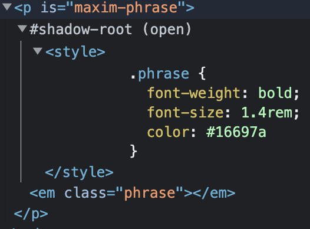

# 2022/10/28

## 오늘 공부한 내용

## 웹 컴포넌트

> 웹 컴포넌트([Web Components](https://developer.mozilla.org/en-US/docs/Web/Web_Components))는 웹 사이트, 웹 앱에서 사용할 새로운 사용자 정의 요소(custom element)를 생성하는 웹 플랫폼 API 세트

- 사용자가 정의한 HTML 구조, CSS 스타일, JavaScript 로직 등을 설계하고 등록하면 웹 애플리케이션에서 커스텀 요소를 사용할 수 있다.
- youtube에서는 이를 적극 활용한다.

### 커스텀 요소 정의

- 자체 속성(메서드 포함) 및 이벤트 등을 사용해 클래스에 기술된 커스텀 요소를 만들 수 있다.

```jsx
/* define custom element */
export default class SupportIE extends HTMLElement {
  constructor() {
    super();

    // console.log(this); // host object => <support-ie></support-ie>
    this.innerHTML = `
      <noscript>이 사이트를 이용하려면? 사용 중인 웹 브라우저에서 JavaScript를 활성화 해야 합니다.</noscript>
        
      <!--[if IE lt 9]>
      <div class="notice notice--fixed-top">
        <h1>서비스를 정상적으로 이용할 수 없습니다.</h1>
        <p>
          사용 중인 오래된 웹 브라우저를 사용하면 서비스를 정상적으로 이용할 수 없습니다. 안전하고 빠른 서비스 이용을 위해
          <a href="https://browsehappy.com/?locale=ko_KR" target="_blank" rel="noopener noreferrer">
            구형 웹 브라우저를 최신 브라우저로 업그레이드 하세요<span style="font-style: italic">!</span>
          </a>
        </p>
      </div>
      <![endif]-->
    `;
  }
}

/* Component extends HTMLElement */
// customElements.define(name, constructor);
customElements.define("support-ie", SupportIE);

/* Component extends HTMLParagraphElement */
```

- 사용자 정의 요소 반응
  | Name | Called when |
  | -------------------------------------------------- | --------------------------------------------------------------------------------------------------------------------------------------------- |
  | constructor | 요소의 인스턴스가 생성되거나 업그레이드된다. 상태 초기화, 이벤트 리스너 설정 또는 쉐도우 DOM 생성에 유용하다 |
  | connectedCallback | 요소가 DOM에 삽입될 때마다 호출된다. 리소스 가져오기 또는 렌더링과 같은 설정 코드를 실행하는 데 유용하다. |
  | disconnectedCallback | DOM에서 요소가 제거될 때마다 호출됩니다. 정리 코드를 실행하는 데 유용합니다. |
  | attributeChangedCallback(attrName, oldVal, newVal) | 관련된 속성이 추가, 제거, 업데이트 또는 교체 되었을 때 호출된다 . 파서에 의해 요소가 생성되거나 업그레이드 될 때 초기 값에 대해서도 호출된다. |
  | adoptedCallback | 사용자 정의 요소가 새 요소로 이동되었다. (ex. document.adoptNode(el)) |
  - connectCallback() 말고도 observe를 이용하는 방법도 존재한다.

### HTML 빌트인 요소 확장

- 커스텀 요소를 구현하는 또 다른 방법은 빌트인 HTML 요소를 확장하는 것이다.

```jsx
// a 태그에 target과 rel 설정해주기
export default class ExternalLink extends HTMLAnchorElement {
  constructor() {
    super();
    let href = this.getAttribute("href");

    if (href?.startsWith("http")) {
      this.setAttribute("target", "_blank");
      this.setAttribute("rel", "noopenner noreferrer");
    }
  }
}

customElements.define("external-link", ExternalLink, { extends: "a" });
```

```html
<!-- 사용시 다음과 같이 is 뒤에 등록되어 있는 커스텀 요소 이름을 붙여주어야 한다.-->
<a is="external-link" href="https://euid.dev">이듬</a>
```

### 프로퍼티

- 컴포넌트 전용 속성(properties)을 구성해 관리할 수 있다.

```jsx
// 격언 문구(maxim phrase) 커스텀 요소를 생성하는 웹 컴포넌트

export default class MaximPhrase extends HTMLParagraphElement {
  #phrase = "";

  constructor() {
    super();

    this.innerHTML = `
      <em class="phrase"></em>
    `;

    this.phraseElement = this.querySelector(".phrase");
  }

  get phrase() {
    return this.#phrase;
  }

  set phrase(newPhrase) {
    this.#phrase = newPhrase;
    this.phraseElement.textContent = this.phrase;
  }
}

customElements.define("maxim-phrase", MaximPhrase, { extends: "p" });
```

```html
<p is="maxim-phrase"></p>
```

- 커스텀 요소를 탐색해 프로퍼티를 변경하면 뷰(view)가 즉시 업데이트 된다.

```jsx
const maxim = document.querySelector('[is="maxim-phrase"]');
maxim.phrase = "시간은 변하고, 우리도 변한다.";
```

### 애트리뷰트

- 커스텀 요소의 애트리뷰트를 사용하면 커스텀 요소를 통해 직접 값을 설정할 수 있다.

### 쉐도우 DOM

- 실제 DOM이랑 분리
- 기존 CSS는 전역인데 캡슐화가 가능하다. (독립적인 스타일 적용 가능)

```jsx
connectedCallback() {
		// mode open 시 쉐도우 DOM 생성된다.
    this.attachShadow({ mode: 'open' });

    this.shadowRoot.innerHTML = `
      <style>
        .phrase {
          font-weight: bold;
          font-size: 1.4rem;
          color: #16697a
        }
      </style>
    `;

    this.innerHTML = `
      <em class="phrase"></em>
    `;

    this.phraseElement = this.querySelector('.phrase');
  }
```



- 스타일 캡슐화 가능 (**shadowRoot 내부에 작성된 스타일 코드는 로컬 스코프를 가지며, 글로벌 스타일은 반영되지 않는다.)**
- style 경로

```jsx
<style>@import "${new URL("style.css", import.meta.url)}"</style>
```

- 컴포넌트 외부에서 컴포넌트 내부의 요소를 스타일링하고자 한다면? `::part` 가상(유사) 요소를 사용한다.

### template

1. HTML 방식

```html
<!-- template.html -->

<template>
  <!-- <style>
    @import "${new URL('style.css', import.meta.url)}";
  </style> -->
  <em class="phrase" part="emphasis"></em>
</template>
```

- `${}`을 못 쓰는 한계 존재

1. Javascript 방식

```jsx
// template.js

const template = document.createElement("template");

template.innerHTML = `
  <style>
    @import "${new URL("style.css", import.meta.url)}";
  </style>
  <em class="phrase" part="emphasis"></em>
`;

export default template;
```

### 슬롯

- 템플릿을 사용하면 컴포넌트 내부에 캡슐화 된 마크업을 재사용할 수 있지만, 외부에서 사용자가 커스터마이징 할 수 없어 유연하지 않다.
- 템플릿을 유연하게 사용할 수 있게 하려면 슬롯(slot)을 사용해 외부에서 특정 마크업 조각을 끼워 넣을 수 있도록 구성한다.
- childList : 자식까지
- subTree : 그 아래 자식까지 싹 다
