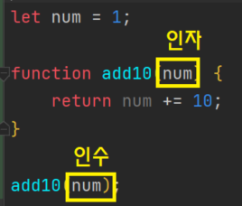

# 2022/11/04

# 오늘 공부한 내용

## 자바스크립트 복습 (아침 스터디 마인드맵 그리기)

- 즉시 실행 함수 표현에는 (function(){})(); 표현만 있는 것으로 알고 있었지만, 다음과 같이 그룹 연산자 이외의 연산자를 사용하는 방법도 존재한다는 것을 알게되었다.

```json
(function () {
	// ...
}());

(function () {
	// ...
})();

!function () {
	// ...
}();

+function () {
	// ...
}();
```

- 그 동안 인수와 인자에 대한 구분을 잘 하지 못했는데, 오늘 제대로 구분하게 되었다.
  - **인수는 함수를 호출할 때 건네주는 변수**
  - **인자(=매개변수, 파라미터)는 함수에서 정의 되어 사용되는 변수**
  
    

## 리액트 ToolChain 구성 요약해보기

### 1. 구성 시작

1. 디렉토리 생성
2. 버전 관리 초기화 및 `.gitignore` 추가
3. 패키지 매니저 초기화

### 2. Webpack 명령어 환경

> Webpack 모듈 번들러를 명령어 환경에서 사용하기 위함

1. [webpack](https://www.npmjs.com/package/webpack), [webpack-cli](https://www.npmjs.com/package/webpack-cli) 패키지 설치
2. 번들(bundle) 명령 등록
3. Webpack 타겟 설정
   - `.browserslistrc` 파일 생성
4. 빌드(build) 명령 - 번들링된 파일을 최적화 하기 위함

### 3. Webpack 개발, 빌드 구성

> Webpack 명령어 환경은 기본적인 구성을 사용하여 번들링 수행하기에는 용이하지만, 보다 복잡한 구성을 하기에는 적합하지 않다. 그러므로 구성 파일을 별도로 작성하여 관리하는 것이 좋다.

1. Webpack 구성 파일
   - 공통 구성 파일 (`webpack/common.js`)
   - 개발 구성 파일 (`webpack/dev.js`)
   - 빌드 구성 파일 (`webpack/prod.js)`
2. 개발, 빌드 명령 구성

### 4. Webpack 서버 구성

> Webpack 전용 개발 서버를 구동하기 위함.

1. [webpack-dev-sever](https://www.npmjs.com/package/webpack-dev-server) 패키지 설치
2. 서버 구성 (`webpack/server.js`) - Webpack 개발 서버에 필요한 구성 관리 용도
3. 서버 구성 설정
   - `dev.js` 파일에 개발 서버 구성 파일을 불러와 `devServer` 구성 추가
4. 서버 구동 명령어 등록
5. HTML 엔트리 수정
   - 서버 구동 시, 번들링 된 파일이 HTML 엔트리 파일에 연결될 수 있도록 script 태그 추가

### 5. React 모듈 구성

> React를 프로젝트에서 사용하기 위함

1. [react](https://www.npmjs.com/package/react), [react-dom](https://npmjs.com/package/react-dom) 패키지 설치
2. HTML 엔트리 수정
   - React 애플리케이션이 렌더링 될 컨테이너 요소 추가
3. React API 활용
   - React, ReactDOM API를 사용해 애플리케이션이 렌더링 되도록 `main.js` 파일에 코드 작성
4. JSX 활용
   - React 컴포넌트 App, JSX를 활용하도록 `main.js` 파일의 코드 변경
   - 파일 이름은 명확하게 알 수 있도록 `main.jsx`로 변경
   - `**.jsx` 확장자 없이도 불러올 수 있도록 Webpack 공통 파일(`webpack/common.js`) 수정\*\*

> 🖐 하지만 JSX는 Webpack 번들링 과정에서 컴파일되지 않아 해석되지 않으므로 오류(Module parse failed: Unexpected token)가 발생한다.

### 6. Babel 로더 구성

> Webpack은 기본적으로 JavaScript와 JSON 파일만 해석할 수 있다.
> 하지만 로더(loaders)를 사용하면 다른 타입의 파일을 처리하거나, 유효한 모듈로 변환 하여 애플리케이션에서 사용할 수 있다.

1. Babel 로더 패키지 설치
   - JSX, ECMAScript 구문을 해석하는데 필요한 코어, 프리셋 패키지, Webpack 로더를 프로젝트에 설치
2. Babel 구성 파일 설정 (`babel.config.js`)
   - 프로젝트 루트에 Babel 구성 파일을 추가한 후, 프리셋을 활용(옵션 설정 등)하도록 코드를 작성
3. Babel 로더 설정 (`webpack/common.js`**)**
   - `babel-loader` 로더를 사용하도록 코드를 작성

### 7. TypeScript 로더 구성

> TypeScript를 활용하기 위함

1. TypeScript 관련 패키지 설치
2. TypeScript 구성 파일 생성 (`tsconfig.json`)
   - `tsc` 명령 사용하여 TypeScript 구성 파일 생성
3. TypeScript 로더 설정 (`webpack/common.js`) - TypeScript 파일을 Webpack에서 읽고 해석하기 위함

> 💡 만약 `tsconfig.json` 파일과 Babel 구성 파일 사이의 문제가 발생했다면?
> : `tsconfig.json` 파일에 `noEmit` 설정 값을 `true`로 설정해 해결할 수 있다.

🖐 하지만, 이 후 Webpack 개발 서버를 구동하면 모듈 빌드에 실패했다는 오류 메시지를 볼 수 있다.
: 로더 구성에 `options` 항목을 설정(`noEmit : false`)하면 모듈이 방출(emit)되므로 Webpack이 정상 구동된다.

>

### 8. Prettier 구성

> 코드 포멧터를 프로젝트에서 활용하기 위함

1. Prettier 패키지 설치
2. Prettier 구성 파일 (`.prettierrc.cjs`) 규칙 작성
3. Prettier 포멧팅 제외 파일 (`.prettierignore`) 작성

### 9. ESLint 구성

> ESLint 린팅 도구를 프로젝트에 활용하기 위함

1. ESLint 패키지 설치 및 구성 파일 초기화

   > 🖐 ESLint가 활성화되면 `main.tsx` 파일에 작성한 코드에 문제가 있음을 분석한 결과가 출력된다.
   > : 이 린팅 오류는 `extends`, `settings`, `rules` 설정하여 해결할 수 있다

2. ESLint 플러그인 확장 - React 개발에 필요한 패키지와 Prettier 구성을 통합하기 위함
   - 구성 통합을 위한 패치지 설치
   - ESLint 구성 파일(`.eslintrc.cjs`)에 확장 규칙 추가 및 플러그인 설정
3. ESLint 린팅 제외 파일 (`.eslintignore`) 작성

### 10. Style, CSS 로더 구성

> 일반적인 웹 개발 환경에서는 HTML 파일에서 CSS 파일을 불러와 스타일을 적용하지만, Webpack 환경에서는 스크립트 엔트리 파일에서 스타일을 불러와 적용한다.

1. 로더 패키지 설치
2. 로더 설정 (`webpack/common.js`**)**
3. 스타일 소스맵 설정 (`webpack/common.js`)

### 11. PostCSS 로더 구성

> PostCSS로 CSS를 보다 편리하게 사용하기 위함

1. PostCSS 패키지 및 로더, 프리셋 설치
2. 구성 파일 (`postcss.config.js`) 작성
3. 로더 설정 (`webpack/common.js`)

### 12. CSS 모듈 구성

> CSS 모듈을 사용하면 글로벌 CSS와 달리 고유한 이름을 설정하므로 CSS 모듈 파일을 불러오는 컴포넌트에만 고유한 스타일이 적용되도록 하기 위함

1. 로더 설정 (`webpack/common.js`)
2. 컴포넌트에서 CSS 모듈 파일을 불러와styles 모듈을 JSX에 바인딩 (`app/App.jsx`)

> 🖐 TypeScript를 사용하는 컴포넌트에서 CSS 모듈을 불러올 경우 타입 선언을 찾을 수 없다는 오류가 출력된다.
> : 이 오류는 TypeScript가 CSS 모듈 파일을 알 수 없어 발생한 문제로 해당 모듈에 대한 타입을 정의하면 해결할 수 있다.
> CSS 모듈 파일의 타입을 정의하는 `style.d.ts` 파일을 작성한다.
> 선언된 타입을 TypeScript가 인식하도록 TypeScript 구성 파일에 `typeRoots` 설정을 추가한다.

### 13. Sass 로더 구성

> Sass를 사용하여 CSS 보다 강력하게 사용하기 위함

1. Sass 패키지 및 로더 설치
2. 로더 구성 (`webpack/common.js`)

> 💡 Sass 모듈 파일을 TypeScript 환경에서 사용할 경우, 발생하는 타입 오류는 CSS 모듈에서 다뤘던 것과 동일한 방법으로 해결할 수 있다.

### 14. Assets 로더 구성

> 에셋(assets：이미지, 폰트 등)을 JavaScript 파일에서 모듈로 호출하기 위함

1. 로더 구성 (`webpack/common.js`)

> 🖐 TypeScript 환경에서 이미지와 같은 에셋을 호출할 때 알 수 없는 타입이므로 오류가 출력됩니다.
> : 에셋 타입을 지정해야 한다. (`types/assets.d.ts`)

### 15. SVGR 로더 구성

> SVG를 React 컴포넌트로 활용하기 위함

1. svgr 패키지 설치
2. 로더 구성 (`webpack/dev.js`)

> 🖐 TypeScript 환경에서 SVGR을 사용할 때 선언된 타입이 ReactComponent 가져오기가 포함되어 있지 않아 오류가 발생한다.
> : SVG 모듈 코드(`types/assets.d.ts`)를 수정하여 해결할 수 있다.

### 16. 절대 경로 설정

1. 절대 경로 구성 - Webpack의 `resolve.alias` 구성을 사용해 `import`나 `require`로 호출하는 특정 모듈의 별칭을 만들기 위함
2. VS Code 확장 - Path Intellisense 확장을 사용하여 파일 경로 탐색을 편리하게 하기 위함

### 17. 테스트 환경 구성

> React 테스팅 라이브러리(RTL) 구성을 위함

1. 테스팅 라이브러리(RTL) 관련 패키지 설치
2. Jest 구성 파일 작성 (`jest.config.js`)
3. Jest 설정 파일 작성 (`jest.setup.js`)
   - jest-dom 확장 코드 작성
4. Babel · TypeScript 프리셋 구성 (`babel.config.js`)
5. ESLint · Jest 플러그인 구성
6. 스타일, 파일, SVG 모의 구성

### 18. 환경 변수 구성

> `.env` 환경 변수는 일반적으로 서버 환경에서 사용되지만, 클라이언트 환경에서도 환경 변수를 사용하기 위함

1. [dotenv-webpack](https://www.npmjs.com/package/dotenv-webpack) 패키지 설치
2. 플러그인 래퍼 함수
   - 플러그인 생성 유틸리티 함수를 작성 (`webpack/plugins/createDotEnvPlugin.js`) - DotEnv 플러그인 래핑
3. 플러그인 구성 (`webpack/common.js`)

# 느낀점

- 아직까지도 툴체인 구성에 하나하나가 추가될수록 트러블 슈팅하는 부분이 어렵게 느껴졌다. 툴체인이 변경되도 유연하게 사용할 수 있도록 배우고는 있지만 아직까지도 과연 내가 이것을 활용할 수 있을까라는 생각이 들지만, 복습해보니 로더 구성같이 공통적인 부분이 보이기도 하였다.
- 지금까지 환경설정이 끝나고 다음 주 부터 React를 실제로 사용하는 것을 배우게 되는데, 바닐라 자바스크립트에서 하기 어려웠던 작업(하위 컴포넌트에서 상태 전달 등)을 React에서는 어떻게 해결했을지 궁금하고 기대가 된다.
