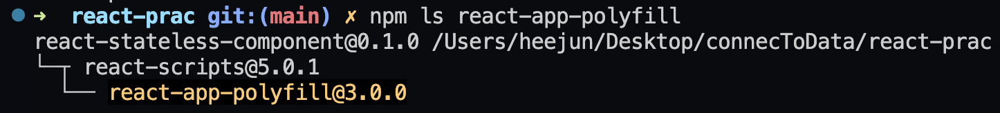

# 2022/11/07

# 오늘 수업 내용 정리

## Create React App

### 특징

1. 덜 배워도 된다.
   - 기본적인 툴체인이 구성되어있다.
   - react reactDom react-scripts(webpack 등의 구성내용 패키징)
2. 종속성이 있다.
   - 장점 : 유지보수가 좋다. (알아서 업데이트 되기 때문에)
   - 단점 : 원하는대로 설정하기 힘들다..?
3. 그렇다고 잠겨있진 않다. “eject” 명령어를 사용하여 설정할 수는 있다.

### 버전

- v18

```jsx
import { StrictMode } from "react";
import { createRoot } from "react-dom";
...

// v18
const root = createRoot(document.getElementById("root"));
root.render(
  <StrictMode>
    <App />
  </StrictMode>
);
```

- v17 (IE 허용)

```jsx
import { StrictMode } from "react";
import { render } from "react-dom";

// v17
render(
  <StrictMode>
    <App />
  </StrictMode>,
  document.getElementById("root")
);
```

- ie11 고려하는 경우

  - polyfill은 CRA에서는 이미 깔려있다.

    

    - 그러므로, polyfill의 경우 다른 코드보다 먼저 해석되어야 하기에 엔트리 파일(ex. src/index.jsx)의 최상단에 다음과 같이 작성해야한다.

    ```jsx
    import "react-app-polyfill/ie11";
    import "react-app-polyfill/stable";
    ```

### 설정

- .env 파일 (환경변수 재활용을 위함)

  - `REACT_APP_` 접두사가 붙은 경우에만 client가 접근 가능 (`process.env`를 통해)

    

    

    - 아닌 경우, server 측에서만 접근 가능

- WebVitals

  - 필요한 부분에서 required를 이용(CASE 1)하여 사용할 수도 있지만, ESM (import 방식) 통일성을 위해서 CASE 2와 같이 import 사용 가능하다.

  ```jsx
  // CASE 1.
  // const reportWebVitals = require('./reportWebVitals);

  // CASE 2.
  import("./reportWebVitals").then(({ default: reportWebVitals }) =>
    reportWebVitals(console.table)
  );
  ```

- postcss에서는 normalize.css가 내장되어있기 때문에 global.css 상단에 다음과 같이 작성해주면 된다.

```css
@import-normalize;
```

### react-app-rewired

> webpack 설정 덮어쓰기 위함

but, 이 방식은 위험하다. (차라리 next.js 사용을 권장)

1. package.json 명령 변경 (`react-scripts` ⇒ `react-app-rewired`)

   ```json
   "scripts": {
     // "start": "react-scripts start",
   	"start": "react-app-rewired start",
   	// "dev": "BROWSER=none react-scripts start",
     "dev": "BROWSER=none react-app-rewired start",
   	// "build": "react-scripts build",
     "build": "react-app-rewired build",
   	// "test": "react-scripts test",
     "test": "react-app-rewired test",
   },
   ```

2. root 폴더에 `config-overrides.js` 구성

   ```jsx
   const path = require('path');

   module.exports = {
   	// Webpack 구성
     webpack(config, env) {
   	...
   	}

   	// Jest 구성
     jest(config) {
   	...
   	}

   	// 개발 서버 구성
     devServer(configFunction) {
   	...
   	}

     // 경로(paths) 구성
     paths(paths, env) {
   	...
   	}
   }
   ```

   - [https://github.com/arackaf/customize-cra/blob/master/api.md](https://github.com/arackaf/customize-cra/blob/master/api.md) 의 api들을 참조하여 설정

## RTL(React Testing Library)

> TDD (Test Driven Develop) 주도 개발을 하기 위함

### 장점

- 버그 확인
- 애플리케이션 신뢰 향상
- 질문/답변 시간 축소
- 문서 역할

### 사용

- RTL은 [jest-dom](https://testing-library.com/docs/ecosystem-jest-dom/) 매처 함수를 사용한다.
- 기본적으로 이 부분은 가져온다
  ```jsx
  import { render, screen } from "@testing-library/react";
  ```
- 다음 test는 밑의 expect 부분이 실패로 뜨는데, onText는 현재 문서 내에 존재하지 않기 때문이다.

  

  - 문서에 존재하는 내용을 찾을 경우 ⇒ `getByText`
  - 문서에 존재하거나 존재하지 않는 내용도 찾을 경우 ⇒ `queryByText`

- 오류 디버깅 하고 싶을 때, 다음 코드를 추가하면 어떻게 출력되었는지 보인다.
  ```jsx
  screen.debug();
  ```

# 오늘 공부한 내용

## classNames utils 함수 만들기

> `classnames` 모듈은 여러 클래스를 추가할 때 뿐만 아니라, 특정 값이 true/false임에 따라 클래스명을 추가하거나, 추가하지 않도록 하는 것을 간단히 구현할 수 있게 해준다.

### 테스트 목록

- [ ] classNames('a', 'b', 'c') → 'a b c' 입니다.
- [ ] classNames({ a: false }) → '' 입니다.
- [ ] classNames({ a: true, b: false, c: true }) → 'a c' 입니다.
- [ ] classNames('a', { 'b': true, 'c': false }, 'd') → 'a b d' 입니다.
- [ ] classNames({ a: true, b: false }, { c: true }) → ‘a c’ 입니다.
- [ ] classNames(null, false, 'a', undefined, 0, 1, { b: null }, '') → 'a 1' 입니다.
- [ ] classNames('a', ['b', { c: true, d: false }]) → 'a b c' 입니다.

### 구현 과정

1. 먼저 파라미터로 받은 classes들 내부의 반복문을 돌고 값을 반환하기 위해 Array.map을 사용하였다.
2. class에 올 수 있는 유효한 타입은 string, number, array, object 4가지가 존재했다.
3. 조건문(if)를 이용하여 제일먼저 ‘’, undefined, null 과 같은 값을 걸러주었고, 각 타입을 검사해 타입 별로 반환하는 값을 바꿔주었다.
4. 배열 같은 경우에는 배열 안에 또 배열이 올 수 있기 때문에, 재귀를 사용해 주었다.
5. 마지막으로 값을 합쳐주었다.

```jsx
export const classNames = (...classes) =>
  classes
    .map((className) => {
      if (!className) return "";
      if (typeof className === "string") return className;
      if (typeof className === "number") return className.toString();
      if (Array.isArray(className))
        return className
          .map((name) => classNames(name))
          .join(" ")
          .trim();
      if (typeof className === "object")
        return Object.entries(className)
          .filter(([_, value]) => value)
          .map(([key, _]) => key)
          .join(" ")
          .trim();

      return "";
    })
    .join(" ")
    .trim();
```

### 새로 알게된 사실

> 🖐 하지만, 위와 같이 테스트한 경우 테스트 케이스 중
>
> [classNames(null, false, 'a', undefined, 0, 1, { b: null }, '') → 'a 1' 입니다.] 에서 실패했다.

- 이유

  - 최종 배열이 `["", "", "a", "", "", "1", ""]` 와 같은 경우 합친다면 `trim()`으로 인해 앞뒤 공백은 사라지지만 사이의 공백은 사라지지 않아 결과값이 `"a 1"` 이 아닌 `"a 1"` 로 나오기 때문이였다.

- 해결
  - `join(" ").trim()`전에 `filter(Boolean)` ( `===` `filter(item => Boolean(item)`)을 추가해줌으로서 이를 해결할 수 있었다.
  - `filter(Boolean)`단계는 다음을 수행한다.
    1. 배열의 각 항목을 `Boolean()`개체 에 전달한다.
    2. `Boolean()` 는 각 항목이 참인지 거짓인지에 따라 `true`, `false`를 반환하여 `true`인 경우만 저장한다.
  - 위의 경우에서는 이를 통해 빈값(`""`)을 제거해주었다.

# 느낀점

- React의 대표적인 툴체인인 CRA(Create React App)을 배웠는데, 확실히 이를 이용한다면 쉽게 react에 접근할 수 있다는 것을 느꼈다. 이 전의 직접 툴체인을 짜보는 과정으로 인해 많은 자신감을 잃었지만, 이를 미리 배우고 나니 CRA의 이해는 없이 구현에만 급급한것이 아닌 CRA이 어떻게 동작하는지(명령어 등)를 이해하면서 넘어갈 수 있었다.
- TDD 주도 개발을 위해서 CRA에는 Jest-dom 매처 함수를 기반으로한 RTL을 사용하는데, 전보단 나아졌지만 테스트 코드를 짜는데 아직까지 익숙치 않았다. 그래서 과연 실제 프로젝트에서도 잘 활용할 수 있을지 걱정이 되었지만, 여러가지 test 코드를 짜보며 이를 극복해야겠다는 생각이 들었다.
- TDD의 장점에는 단지 버그 확인만이 있는줄로만 알았지만, 애플리케이션 신뢰 향상, 질문/답변 시간 축소, 문서 역할의 장점도 있다는 것도 알게되었다.
