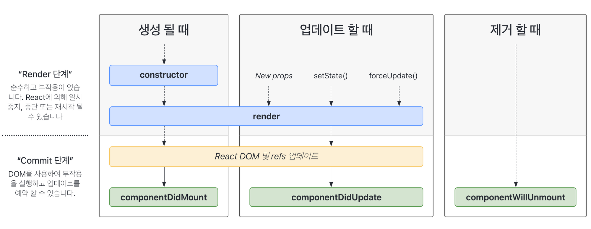

# 2022/11/10

# 오늘 수업 내용

## 라이프 사이클

### 필요한 이유

- React의 성능 최적화를 위한 목적 또는 React가 컨트롤 할 수 없는 사이드 이펙트(Side Effects, 부수 효과)를 처리하기 위함

> 💡 **대표적인 사이드 이펙트**

1. 네트워크 통신 (비동기 통신 요청/응답)
2. DOM 컨트롤 (실제 문서 객체 접근/조작)
3. 구독/취소 (예: 이벤트 핸들링 등)
4. 오류 감지 (예: ErrorBoundary 컴포넌트 등)
   >

### 자주 사용되는 라이프 사이클

- [constructor](https://ko.reactjs.org/docs/react-component.html#constructor) → 컴포넌트 생성 시점에 호출
- [render](https://ko.reactjs.org/docs/react-component.html#render) → 컴포넌트 렌더링 시점에 호출
- [componentDidMount](https://ko.reactjs.org/docs/react-component.html#componentdidmount) → DOM에 마운트 된 이후 시점에 호출
- [componentDidUpdate](https://ko.reactjs.org/docs/react-component.html#componentdidupdate) → 컴포넌트 업데이트 이후 시점에 호출
- [componentWillUnmount](https://ko.reactjs.org/docs/react-component.html#componentwillunmount) → 컴포넌트 제거 예정 시점에 호출



- `render` 부분은 실제 DOM에 그려지는 것이 아니다.
  (단지 react.CreateElement를 이용하여 요소를 만들어 주는 것이다.)
- 실제 rendering은 ReactDOM에서 그려준다. (`ReactDOM.render()`)
- `ReactDOM 및 refs 업데이트` 부분에서 실제 DOM과 가상 DOM을 비교하여 렌더링한다.

### 자주 사용되지 않는 라이프 사이클

- [getDerivedStateFromProps](https://ko.reactjs.org/docs/react-component.html#static-getderivedstatefromprops) → 전달된 상태 및 속성을 가져와 설정하는 시점에 호출 (업데이트)
  - getDerivedStateFromProps 애서 반환되는 객체 또한 state를 변경할 수 있다.
- [shouldComponentUpdate](https://ko.reactjs.org/docs/react-component.html#shouldcomponentupdate) → 컴포넌트 업데이트 예정 시점에 호출 (랜더링 하거나, 안 하거나)
  - 오직 성능 최적화 용도 (이전 props vs 이후 props 비교하여 동일하면 렌더링 할 필요없다.)
  ```jsx
  shouldComponentUpdate(nextProps, nextState){
  	if(this.state.data === next.state.data) return false;
  	return true;
  }
  ```
- [getSnapshotBeforeUpdate](https://ko.reactjs.org/docs/react-component.html#getsnapshotbeforeupdate) → 컴포넌트 업데이트 전 스냅샷 가져오는 시점에 호출
  - 마운트 이전 매끄럽지 않은 UI가 발생한 경우 (리액트는 애니매이션 부분은 좋지않다.)
  - 스냅샷 (정보: 데이터) 반환하는데 이를 Commit 단계의 ComponentDidUpdate가 세번째 매개변수로 받는다.


> 💡 라이프 사이클 몇 단계가 있고 각 단계에서 무슨 일이 일어나고 각 단계마다 연관성을 떠올릴 수 있어야 한다.

### 파생 상태

- 파생 상태 생성이 필요한 경우
  1. props를 통해 state 업데이트
  2. props와 state 비교 후, 일치하지 않을 경우 state 업데이트
- 파생 상태 만드는 법

  1. getDerivedStateFromProps
  2. 고유한 key 값을 넘겨주어 key 값을 바탕으로 초기화

     ```jsx
     // 2번 예제
     <EmailInput
       defaultEmail={this.props.user.email}
       key={this.props.user.id}
     />
     ```

### 기타

- 클래스와 달리 함수의 경우 this를 가지지 않는데, 라이프 사이클 비슷한 흉내를 내는 것이다.
- 리스트 렌더링에서 key값보다 고유한 id 값을 이용하는 것이 좋다
- 가상노드의 경우 this 바인딩이 필요하다. (class 외부에 메서드가 있는 경우)
  하지만, 접두사가 handle인 경우 클래스 필드에서 화살표 함수로 작성하면 this바인딩이 필요가 없다
- 컴포넌트의 오류가 특정 영역에서 발생한 것을 감지
  - `static getDerivedStateFromError(error)` - static method
  - `componentDidCatch(error, errorInfo)` - instant method (`this` 사용가능)
- 반복되는 테스트 케이스를 해결하기 위해 유틸리티 함수를 작성하여 재사용할 수 있지만, 이 경우 only 기능을 사용못하는데 jest-in-case 패키지를 사용하여 이를 해결할 수 있다.

## Flux 아키텍처 : 단방향 데이터 흐름

- Facebook측은 전통적인 디자인 패턴인 MVC 소규모 애플리케이션에 적합하지만, 시스템에 많은 모델과 뷰가 추가되면 복잡성이 폭발적으로 증가한다고 주장했다.

    

- 초기의 MVC 패턴(apple MVC 패턴 X)은 Model과 View가 서로 영향을 줄 수 있는 양방향 데이터 흐름을 가지고 있다.
- 시스템의 복잡성은 코드를 "깨지기 쉽고 예측할 수 없게 만든다" 이 문제를 해결 하려면 "예측 가능한 방식으로 코드를 구성" 해야 함을 강조했다.
- 대신 [Flux 패턴을 도입](https://youtu.be/nYkdrAPrdcw?t=1196) 사용 했음을 발표했다.

> **[Flux](https://haruair.github.io/flux/)**는 **앱의 단방향 데이터 흐름을 촉진하는 시스템 아키텍처**를 말한다.

- 오직 Dispatcher에 의해서만 Model이 변경되어 단방향 데이터 흐름을 가진다.


### 액션(Action)

- 사용자의 요청
- 객체 형태이며 사용자의 요청 타입(type)과 데이터인 페이로드(payload)를 가진다.
- 액션 크리에에터(Action Creator) 함수를 사용해 디스패처로 전달

### 디스패처(Dispatcher)

- 디스패처는 중앙에서 데이터 흐름을 관리
- 디스패처에는 스토어에 등록된 액션 타입마다 콜백되는 함수가 존재
- 콜백에 연결된 액션이 전달되면 해당 콜백이 실행
- 스토어 데이터 변경은 오직 디스패처를 통해서만 가능하다.
- 스토어 간 의존된 상황에서도 의존 순서에 맞게 순차적으로 콜백되도록 관리한

### 모델(Model)

- 데이터(data)이다.
- 스토어는 상태(Model)를 관리하는 저장소이며, 상태를 변경할 수 있는 콜백을 가진다.
- 각 액션을 처리하는 콜백 함수는 디스패처에 등록 ⇒ 디스패처에 등록된 콜백 함수가 실행 ⇒ 스토어의 상태가 변경 ⇒ 뷰에 데이터가 변경되었음을 알린다.

### 뷰(View)

- 사용자와 상호작용하는 컴포넌트
- 스토어에서 상태가 변경되었다는 알림이 오면 뷰는 업데이트(리렌더링) 된다.
- 사용자는 뷰를 조작할 수 있으며 상태 변경을 요청하는 액션을 생성할 수 있다.
- 생성된 액션은 디스패처에 전달 ⇒ 디스패처는 해당 액션에 연결된 콜백을 실행 ⇒ 스토어의 모델을 변경 ⇒ 모델이 변경되었음을 스토어가 뷰에 알림 ⇒ 뷰 업데이트


- Flux를 구성하는 각 요소들은 단방향 데이터 흐름에 따라 순차적으로 역할을 수행하며 이 흐름은 애플리케이션이 구동 중인 상황에서 반복
- 데이터 흐름이 한 방향으로만 흐르기 때문에 변경을 예측하기 쉽고, 디버깅 하기 용이해지는 장점을 가진다.

# 오늘 공부한 내용

- 라이프 사이클 호출 순서 정리

```jsx
[라이프 사이클 메서드]
constructor
static getDerivedStateFromProps
shouldComponentUpdate
render
---------------------------------------
getSnapshotBeforeUpdate
---------------------------------------
- 실제 DOM 렌더링/업데이트 수행
---------------------------------------
componentDidMount
componentDidUpdate
componentWillUnmount
---------------------------------------
컴포넌트의 오류가 특정 영역에서 발생한 것을 감지
---------------------------------------
static getDerivedStateFromError
componentDidCatch
```

- 라이프 사이클 단계에 대해서 잘못 알고있었다.
  - 라이프 사이클 render 단계에서는 DOM에 render 되는 단계가 아니라, React에 의해서 요소들이 반환되는 단계였다.
  - 실제로 DOM에 렌더링 되는 것은 ReactDOM에 의해서 render되는 Commit 단계의 React DOM 및 refs 업데이트에서 이루어진다.
- Did 메서드들을 잘 모르고 있었는데 이해할 수 있었다.
  - 이처럼 DOM에 렌더링 된 후에 호출되는 것이 `componentDidMount`메서드이고,
  - state가 변경되고 컴포넌트가 업데이트될 시 호출되는 것이 `componentDidUpdate` 메서드이고,
  - 컴포넌트 제거 예정 시점에 호출되는 것이 `componentUnMount` 메서드이다.
- Javascript에서 배웠던 MVC 패턴을 복습하였고, MVC 패턴의 초기형태가 View와 Model의 양방향 데이터 흐름에 의해 흐름이 복잡해지는데 이를 예측 가능한 방식으로 코드를 구성하는 방식이 단방향 데이터 흐름인 Flux인 것을 알게되었다. 그리고 이 Flux는 상태 관리 라이브러리인 redux의 필수 개념이라고 한다.
