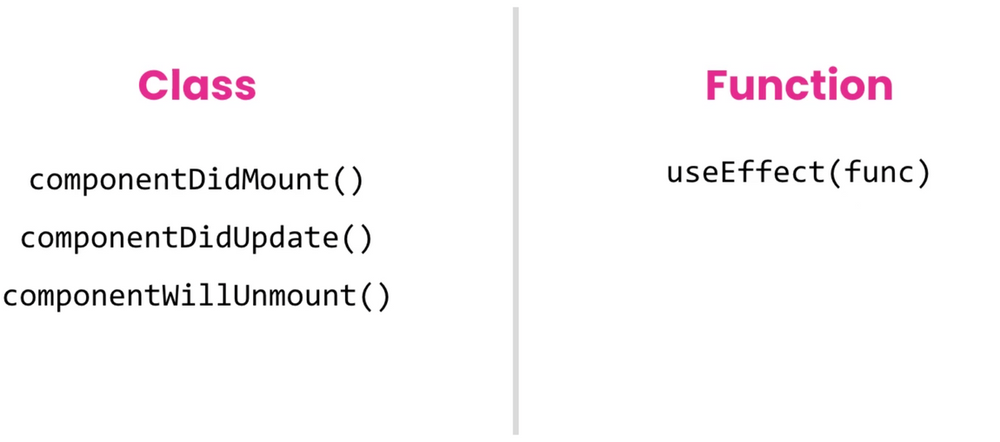

# 2022/11/22

# 오늘 공부한 내용

# React Hook

## 등장 배경

- 훅 등장 이전에 컨테이너 컴포넌트, 사이드 이펙트는 클래스 컴포넌트가 담당했다.
- 이 방식은 고차 컴포넌트로 인한 **래퍼 헬,** 너무 비대해지는 컴포넌트, 혼란스러운 클래스 이름 등의 문제점이 발생 (**유지보수 어려움**)
- React 팀은 이를 클래스 컴포넌트에서 로직 재사용을 위해 사용되었던 복잡한 방식보다 간단한 방법을 제공하지 못했기 때문이라고 분석

## 장점

- 클래스를 사용하지 않아도 **함수 컴포넌트를 중심으로 앱 개발이 가능**하다.
- 훅을 사용해 컴포넌트에서 상태 및 로직을 추출한 후, 다른 컴포넌트에서 재사용 할 수 있다.
- 각각의 \*\*\*\*관심사 별로 분리할 수 있다.
- 캡슐화
  - 현재 실행 중인 컴포넌트에서 Hook을 호출할 때에도 격리된 로컬 상태를 유지 ⇒ 단방향 데이터 흐름을 깨지 않음
- Hook 간에 데이터를 전달하는 기능은 Hooks를 애니메이션, 구독, 폼 관리 등을 처리하는데 매우 적합 (클린 트리)
- 클래스를 사용할 때 보다 번들된 파일의 크기를 줄여 다소 성능 향상

## 사용 규칙

1. React 함수 컴포넌트, 다른 커스텀 Hook 함수 안에서만 사용 가능
2. Pascal Case이거나, `use`가 접두사로 붙어 있어야 함
3. 중첩된 함수 안에서 사용할 수 없음 (최상위 레벨에서만 사용 가능)

> 💡 Vite의 경우 eslint 관련 설치 필요 (CRA는 내장되어 있음)

## 종류

### useState()

- 함수 컴포넌트에서 **상태를 관리**할 때는 **React.useState()** 훅을 사용한다.
- 동작원리

  1. useState() 훅은 상태와 상태 업데이트를 담당하는 함수를 반환한다.

     ```jsx
     const [stateValue, stateUpdater] = useState(initialState);
     ```

  2. 훅에 최초 전달된 값이 컴포넌트의 초기 상태 값이 되며, 함수 컴포넌트가 다시 렌더링 될 때는 항상 이전의 업데이트 된 상태 값이 최신 상태 값이 된다.

- state는 objects보다 primitives 사용 권장 (objects는 참조 값이 전달되므로)
- 클래스 컴포넌트에서는 `setState` 사용 시 객체를 합성하는 방법이었다면, `useState`는 객체를 대체하는 방법
  - 그러므로 `...` 연산자 사용하여 합성된 객체를 사용해야 `setState`와 동일하게 작동

<aside>
💡 구조가 단순한 데이터는 `useState`, 구조가 복잡한 데이터는 `useReducer` 사용하여 상태 조작

</aside>

- `initialState` 란?

  - `initialState` 인자는 함수 컴포넌트 초기 렌더링 시에만 사용되는 state 초깃값을 설정한다.
  - 이후 다시 렌더링 될 때는 이 값이 무시된다.
  - 만약 state 초깃값을 계산하는데 많은 시간이 필요한 경우는 초기 렌더링 시에만 실행될 함수를 설정해 지연된 초기화 처리가 가능하다.

  ```jsx
  const [stateValue, stateUpdater] = useState(**() => {
  	// 계산에 적지 않은 시간이 소요될 경우
    // 약 790.62890625 ms
  	**const initialState = fibonacci(39);**

  	// 계산 이후: 지연된 초기화의 처리 값을 반환
  	**return initialState;**
  });
  ```

  → 보통 localStorage에서 데이터를 읽어오는 경우 사용하는 방법

- `useState`는 `setState`처럼 콜백 함수를 제공하지 않음
  - 사용하고 싶다면 `useStateWithCallback` 커스텀 훅 사용

<aside>
💡 그렇다면 함수 컴포넌트는 어떻게 상태 변경을 보장 받을 수 있는가?
→ 함수 컴포넌트에서는 상태 변경을 `useEffect`로 보장 받을 수 있다.
사이드 이펙트(DOM 조작, 구독 등) 관리 가능
→ `useEffect`, `useState`만 잘 사용하면 클래스 컴포넌트의 `setState` 구현 가능

</aside>

### useEffect()

- 함수 컴포넌트에서 발생 가능한 부수 효과(Side Effects) 관리
- `componentDidMount`, `componentDidUpdate`, `componentWillUnmount`를 흉내낼 수 있다.

    
    
    - 함수 컴포넌트의 본문은 class 컴포넌트의 render 메서드에 해당되므로 사이드 이펙트 코드를 포함할 수 없지만 `useEffect()` 훅에 전달 된 함수 내부에서는 사이드 이펙트를 작성할 수 있다.
    - 전달 된 함수는 React 요소가 실제 DOM에 렌더링 된 이후 콜백(실행) 된다.
        
        ```jsx
        useEffect(() => {
        	// DOM 마운트(렌더링) 이후 콜백(실행)
        });
        ```
        
    - 특정 조건에 따라 이펙트 함수를 실행해야 할 경우, `useEffect()` 훅의 2번째 인자로 종속성 배열을 설정한다
        
        ```jsx
        useEffect(
        	() => {
        		// componentDidMount
        	}, 
        	**[]**
        );
        ```
        
    - 종속성 배열에 관리할 상태가 추가되면, 해당 상태가 변경될 때에만 이펙트 함수가 실행됩니다. (조건 처리)
        
        ```jsx
        useEffect(
        	() => {
        		// componentDidMount
        		// componentDidUpdate
        	}.
        	**[...dependencies]**
        );
        ```

- 클린업
  - 이펙트 함수를 통해 설정된 사이드 이펙트(예: 구독 등)는 컴포넌트가 UI에서 제거될 때 정리되어야 한다.
  - 이를 수행하려면 이펙트 함수에서 클린업 함수를 반환하고 그 함수 내부에서 정리를 실행한다.
    ```jsx
    useEffect(() => {
      // 구독
      return () => {
        // 정리(cleanup) 함수
        // 구독 취소
      };
    }, []);
    ```

<aside>
💡 클린업(Cleanup) 함수는 [메모리 누수](https://ko.wikipedia.org/wiki/%EB%A9%94%EB%AA%A8%EB%A6%AC_%EB%88%84%EC%88%98)(Memory Leak) 방지를 위해 UI에서 컴포넌트를 제거하기 직전 수행된다. 이는 class 컴포넌트의 componentWillUnmount와 유사하게 동작한다고 볼 수 있지만, 실상은 다음 이펙트 함수가 실행될 때마다 클린업 함수가 먼저 실행되어 정리한다.

</aside>

---

### React Hook의 실행 흐름


---

### useRef()

- 사용 목적

1. DOM 요소 접근 / 조작할 때
2. 함수 컴포넌트가 리렌더링되지 않으면서 특정 상태 기억할 때 (이전 상태와 비교할 때 사용)

```jsx
// dom ref
// 문서 객체 접근/조작
const ref = useRef(null);

// memory value
// 클래스 컴포넌트의 인스턴스 멤버처럼
// 함수 컴포넌트 내에서 특정 값을 기억하되,
// 값을 변경해도 컴포넌트 렌더링에 영향을 주지 않아야 할 경우 사용한다.
const memoryRef = useRef(0);
```

### useCallback() vs useMemo()

- `useCallback`은 함수만 기억 가능
- `useMemo`는 다 기억 가능 (객체 등)
  - `useCallback(fn, deps)` === `useMemo(() ⇒ fn, deps)`
  - 함수만 기억하기 편하려고 `useCallback` 사용

### React.memo() vs useMemo()

- `React.memo` - 고차 컴포넌트
- `useMemo` - 리액트 훅

### useTransition()

- 얘는 얘대로 실행하면서 사용자의 action을 방해하지 않는다.

### useDeferredValue()

- 지연된 값 처리 가능 (빌트인 debounce, throttle 같은 느낌)
- ex. 부모가 아주 많은 값을 넘겨주는 경우 사용

# 느낀점

- 리액트 훅이 얼마나 편하고 좋은지를 위해서 이전의 내용을 배웠지 않았나 싶을 정도로 리액트 훅이 강력하다는 것을 느끼게 되었다. 클래스를 사용하지 않고서도 함수 컴포넌트 중심으로 앱 개발이 가능하다는 점을 비롯하여 재사용 등 다양한 장점이 존재하며, 꾸준한 연습을 통해 이를 잘 이용하여 적용할 수 있도록 해야겠다.
